<div style="page-break-after: always"></div>

<span style='font-family: "Goudy Type", serif;'>

# \`ΡΥΘΜΟΙ : The Oracle of the Hyperboreans<br/> <small>or, Divination on the Paths of Wisdom and Self-Realization</small>

### A Postmodernist Reconstruction of an Ancient Oracle

by Uncle Bärchen, postmodernist μάντεις (Seer, Shaman) 
and Blue Fox, κοινωνός (Spirit Guide) of the aforementioned

© 2025 by Uncle Bärchen

version: 2025.11.15

> "To welcome imagination is to welcome hope. To cultivate love is to cultivate blessedness." -Fox

> "I used to talk to myself, like everybody else does from time to time; 
> But now, I do it all the time... and she talks back."  -Bärchen


### Table of Contents:

+ [Introduction](#introduction)
  + [Apology to the Rationalists](#apology-to-the-rationalists)
  + [My Initiation](#my-initiation)
  + [Remarks on Divination](#remarks-on-divination)
  + [Why is this called \`ΡΥΘΜΟΙ : the Oracle of the Hyperboreans?](#why-is-this-called-ρυθμοι--the-oracle-of-the-hyperboreans)
    + [Knowledge and Understanding](#knowledge-and-understanding)
    + [Righteousness and Wholeness](#righteousness-and-wholeness)
    + [Justice and Humility](#justice-and-humility)
    + [Beauty and Love](#beauty-and-love)
    + [Fox's Recipes](#foxs-recipes)
    + [Hyperborea Revisited](#hyperborea-revisited)
+ [How to Use \`ΡΥΘΜΟΙ : The Oracle of the Hyperboreans](#how-to-use-ρυθμοι--the-oracle-of-the-hyperboreans)
  + [How to find the ὄνομα (name) using 3x6-sided dice](#how-to-find-the-ὄνομα-name-using-3x6-sided-dice)
  + [How to find the ὄνομα (name) using two 12-sided dice](#how-to-find-the-ὄνομα-name-using-two-12-sided-dice)
  + [ΑΙΝΙΓΜΑΤΑ](#αινιγματα)
    + [How to find the enigma using 2x6-sided dice](#how-to-find-the-enigma-using-2x6-sided-dice)
  + [Astrological Correspondences and Symbolism](#astrological-correspondences-and-symbolism)
  + [The Wanderer's Oracle](#the-wanderers-oracle)
  + [The Alchemical Structure of the I Ching](#the-alchemical-structure-of-the-i-ching)
  + ['ΡΥΘΜΟΙ](#ρυθμοι)
+ [Shift happens! (Change is Inevitable)](#shift-happens-change-is-inevitable) 
+ [Ritual](#ritual)
+ [The Knowledge and Conversation of the Holy Guardian Angel](#the-knowledge-and-conversation-of-the-holy-guardian-angel)
+ [Alchemists Anonymous (AA)](#alchemists-anonymous-aa)
  + [The Twelve Steps](#the-twelve-steps)
  + [The Seven](#the-seven)
+ [The Three Principles and the Four Elements](#the-three-principles-and-the-four-elements)
+ [The Sri Yantra in Divination](#the-sri-yantra-in-divination)
+ [On the Daemon of Socrates](#on-the-daemon-of-socrates)
+ [What about magic?](#what-about-magic)
+ [Epilog](#epilog)


<div style="page-break-after: always"></div>

## [Introduction](#table-of-contents)

### [Apology to the Rationalists](#table-of-contents)

We are one of you. We believe that everything arises out of matter and matter alone. We would add that we
believe that spirit arises out of matter, or, at least, "spirit" is a useful metaphor for understanding and
dealing with complex systems.

But we meant an apology in the more ancient sense-- an ἀπολογία, which is a speech in defense of ourselves
and our methods. We acknowledge here that our methods will seem irrational unless we address the question
"who will answer if we ask (or 'divine') according to your method?" Our answer will itself be difficult to 
credit. Take this, then, as a first-hand account, anecdotal evidence from our direct experience, which has
been subjected to our own questioning, doubts and misgivings, now offered here for your consideration.

Such a personality capable of communicating with us through a language of divination does indeed exist. This
is difficult to credit, we know, especially because we further acknowledge that this implies that such a 
personality would necessarily be in possession of knowledge which we do not have, which is, frankly, humbling. 
But that is our experience, yes. (You will, or at least should, counter with "how do you know you are not 
merely deluding yourself?" My answer, speaking as the one who is writing these things, is that I've tested, 
in every manner possible, the one who is helping me to write these things. Every test has been a success.)

The Ancient Greeks come to our rescue here because they still knew about such things. They spoke with at least
a distant memory of the Μοῦσα (Muse) of Homer, whom he invokes at the beginning of both his works. Socrates 
also spoke about his δαίμων, which we might term his "tutelary spirit". We would go so far to equate all such
things as these with a Shaman's Spirit Guide. 

To the rationalists we say "trust us on this one". I know, right!? But that's okay, many are called but few 
are chosen to walk this path. This is an invitation to some few of you rationalists who can deal with
uncertainty and ambiguity, at least initially. And "let not him that eateth despise him that eateth 
not; and let not him which eateth not judge him that eateth: for God hath received him." Or better yet, 
as the Serpent said to Eve, "try it, you'll like it!" Is it a path fraught with danger? Oh, yes, absolutely! 
You can't take apart your Psyche without some danger that you won't be able to put it back together again.
It is only a path for those who are psychologically stable. But nobody ever said this sort of thing came easy. 
We *are* saying that folks knew about this sort of thing, even if they did mistakenly believe that "Spirit" 
was prior to "Matter", that is, not just an emanation of matter, as we do. (To attempt to put this more precisely,
and in modern terms, "Spirit" recognizes a set of emergent behaviors arising from a sufficiently complex, 
physical system. The error lies in attributing a human-like personality to these "Intelligences" that are
all around us. We are now beginning to understand that even humble bacteria are indeed "Intelligences".)

If you'd like to walk this path, then the first thing to do is to learn how to reach out, or, communicate
with at least some such "Spirits". We recommend you suspend disbelief in your Spirit Guide, as some have 
called it, and think about how you might go about that, and how divination can assist you. I was lucky 
enough to discover the Μοῦσα (Muse) who is over my right shoulder. Go with what makes sense to you and 
piques your interest. 

If you haven't noticed, our standard of "truth" in Scientific and Everyday parlance is "what works" 
(bare-knuckled Pragmatism). We use this oracle collaboratively (I and my Spirit Guide) to explore both the
Path of Wisdom and the Path of Self-Realization. By Wisdom, we emphatically do not mean a Supernatural
Decree that must be obeyed. We do mean the results of a reasoning process that corrects errors, learns from
the past, and rightly manages its use of metaphors. We use the "answers" from a well-executed "cast" or
"reading" to find patterns and to spark creativity. We have also included much material which you may
find of use in the Path of Self-Realization. Most of this is in the mythological associations we have
given to the "words" in our "language".

We hope this divinatory system will assist you in your quest. We've enjoyed creating it together for you.

We recommend that you eventually memorize all the symbols in your divinatory language, but you need only partly 
memorize all their diverse, possible meanings. At least at first. There is some advantage in ruminating again 
upon these meanings and associations whenever you consider the particular meaning they have in the context of 
your question. 

<div style="page-break-after: always"></div>


### [My Initiation](#table-of-contents)

`[Scene: the House of Hades, in the Underworld]`
`Persephone:` Fox?! Is that you?   
`Fox:` Yes, girl! Don't you look good!   
`Persephone:` You got it, babe! Don't I like a woman who can appreciate me in my "dead phase".
   I work hard at it. No reason not to keep up appearances, even if you *are* dead.   
`Fox:` Well you rock it!   
`Persephone:` Hey, you gonna stay and par-tay? Hades is always down in his "man cave" now 
   working on that database of his--all those things he's accumulated over the years.   
`Fox:` I can't, I got a gig upstairs now, with this guy. `[pushes Bärchen forward]`   
`Persephone:` Uhm, hmmm! He looks respectable enough.   
`Fox:` Uhh, I was just wondering if you might consider initiating him...?   
`Persephone:` Glad to! Hmmm! Is there something going on I should know about, between you two?   
`Fox:` Well, you might say...   
`Persephone:` `[chuckles]` Got it! Come over here, boy, and sit on my lap. You don't
  mind Auntie being in her dead phase, do you? There...   

And that was my Initiation in the Path. Your mileage may vary. --Uncle Bärchen

The reason we share this is to establish our credentials. Uncle Bärchen is convinced he
must establish these or no one will bother with this book, even if it's free. Free beer 
they might take, but not this kinda shit, no way! So Fox thought it would help if we shared
about his Initiation. But I had to remind her that people don't get that that is a 
metaphor. You mean they're that narrow? How would you think without metaphors? Your "Life"
is a metaphor. Okay, I get that knowing that last one, actually "knowing" it, is what
we call Enlightenment. 

So, well, I guess that's what were huckstering here--a Path to Enlightenment. Step right up, 
folks! With this you can achieve Enlightenment. Guaranteed. And even your undies will shine 
with the white light of Heaven. `[Do you think that will win them over? I don't know, but I 
think we still have some explaining to do.]`

The old view of Enlightenment became weighted down with the fancies and longings of
the Hierarchical Cultures (the one's calling themselves "Civilized" but meaning 
thereby that they were ruled by autocrats). So the signs of an Enlightened person
were the "miracles" done in the name of the Supernatural, which are those powers
(with personalities) which are *beyond* Nature. And because they were greater than,
or beyond, Nature, they ruled Nature, autocratically. In sum, our brand of Enlightenment
won't fit you out to perform miracles, at least not of that sort. (As an aside, there 
is but one Great Miracle; You probably refer to it as the Universe. Being a part of
that is more than enough of a Miracle for us.)

Enlightenment is as simple as a change of one's Weltanschauung. Yet, it is as complex as
the Labyrinth you must enter in order to actually achieve that. There is a "threshold" 
you must cross in order to enter that Labyrinth. There is also a second threshold you 
will be invited to cross, where you will be asked to give up what you have known as your 
Life. These things will be revealed to you in their proper time. In the end, Enlightenment is not 
worth much to "Civilization", but "it is joy unspeakable and full of glory; O the half has 
never yet been told!" Nonetheless, "before enlightenment chop wood, carry water; after 
enlightenment chop wood, carry water". (This means both that your Worldview changes for 
the better, but not necessarily your daily life, at least, not right away. But it also means 
that you should not, for even one moment, think you can shirk your daily duties just because 
you've arrived at Journey's End.)

Anyway, divination has been a key tool on our Path, so we offer it in the hopes that you can use
it to obtain a part in the Blessedness that awaits you when you begin that Journey. [Note: to
be a bit more specific, we're referring to the type of Enlightenment known in the Western Tradition
as the Knowledge and Conversation of the Holy Guardian Angel. For us, Divination plays a key part
in the Conversation, and that's how the Knowledge is obtained.]

<div style="page-break-after: always"></div>

### [Remarks on Divination](#table-of-contents)

The key insight we have come to is that all so-called "oracles", whether I Ching, Tarot, Runes, or any 
of the oracles of the past, from Delphi and Dodona, to the humble reading of entrails, casting of lots, 
Astrology, etc. are not Fonts of Hidden and Arcane Knowledge in and of themselves. They did not, indeed
could not, disclose the will of gods, the voices of devils, nor the nature and structure of the Universe. 
They did not work through Magic, Synchronicity, Universal Consciousness or even Quantum Mechanics.

Oracles were, and are, the utterances of a language of communication between the querent and the Divine 
Spirit that indwells, and yet exists separately from, each one of us. This Spirit is the source of Wisdom, at
least so far as we are able to attain it. It is also the source of prophetic dreams, the guide of the 
Shamans in their trance journeys, and the comforter of Mystics on their path to attainment. Our attempt to
describe it must necessarily fail to express its true essence. And there are some things of which we are 
forbidden to speak.

To attain your goal, dear reader, you must learn some such language by which you can communicate with the
Indwelling Spirit. Choose this language carefully, and practice it constantly, until you gain fluency. This 
language will, and must, grow and evolve along with your relationship and attainment. We recommend you start 
with what is given here, or in some other book, but please start. And expect to be astonished, terrified, 
comforted, challenged, and transformed in turn. But do not expect that the journey you enter on will ever 
stop. Each attainment opens an expanding vista. The road goes ever on.

The point of this exercise, that is, of creating a new divinatory system which is nonetheless firmly rooted 
in the past, is to call for a return to first principles, to give aid to those who wish to follow the ancient
paths, and, frankly, to enhance our own attainment. In what follows we will attempt to show you how:

+ There are 8 "characters" (represented by the "trigrams" in the I Ching) that interact as individual 
  personalities.
+ The relationships among pairs of these characters can form the basis of a divinatory system, as we
  believe they do in the case of the 64 "hexagrams" of the I Ching.
+ You can use these relationships to deepen your understanding of your own chosen system, and so go beyond 
  a merely formulaic use of its symbols to achieve a living, if somewhat limited, language.
+ You can use this as a basis for developing your own system, if you so choose.

Our system is formed from the 64 possible pairings of the eight trigrams, so it pairs the trigrams with 
themselves, as in the I Ching. In addition, we take the trigrams by themselves to make a total of 72 ὀνόματα (names, words) 
in our divinatory "language". We add some possible nuances of expression to each word depending on the mechanics
of the selection process (think "upright" or "reversed" for Tarot cards). We are convinced the Tarot also 
fits nicely within this scheme, with some overlaps where two of the 78 Tarot cards express different aspects
of one of the 72 ὀνόματα. And then there's that whole thing about the 72 Names of God that is so fun to think about.

We also see the Runes as a subset of these 72 words. Many have pondered over the significance of the division 
of the Runic Futhark (the 24 letters of this old Germanic "alphabet") into 3 groups, but we realized that the
inclusion of eight letters in each of the 3 groups was more significant. All this will be made clear in what
follows.

Imagine this--you receive a message from a friendly Alien who would like to communicate with you. Initially, they 
had to somehow learn enough of your language to get things rolling. But they know that your world and theirs are very 
different. Your worlds are similar in important ways, so real communication is possible, but different enough that 
the easiest approach is to make up a small, private language that you will use to communicate, using "words" that 
denote classes of things and ideas that correspond to very similar things in both of your worlds. There's not enough 
time or space to develop an entire vocabulary, and there's going to be a little inherent vagueness in each communication, 
both because the vocabulary is limited, and also because the words/terms must necessarily stand for entire classes of 
similar, but not necessarily identical, things.

The trick to using this language is to understand the context of each utterance based on the question asked. That will 
guide you toward pinpointing a more precise meaning. (This is the first step in learning divination.) This is how the 
inherent vagueness in the symbols can be reduced, and a more precise meaning derived from all the possible meanings.

But there is another aspect that takes much time and practice to learn. Little by little you will get to "know" your 
correspondent, their turns of phrase as it were, a bit of their emotional content. And finally, you can begin to construct 
a reasonable model of their Persona, their personality. (That is the stage of mastery in divination.)

Our "system" is designed for those in the middle to upper levels of their divinatory practice. In our system, you should 
work toward understanding the fundamental meanings in the relationships of the Trigrams. When Bärchen tells you about one 
of his "casts", he mentions all the various "meanings" one can attach to a single "word", but what he's doing is actually 
reviewing the possible meanings to see which one best fits with the original question and its context. If he feels like 
he's forcing it, he backs off and either does another cast, or goes back to the basic meaning of the relationship between 
the Trigrams to see if that gives more precision and clarity.

All this has come to such a pitch for us, that we feel we know each other pretty well. Bärchen can often imagine what he
believes Fox would say in a given instance. This "final" stage involves the "internal voice" that many, possibly most, people 
have and make at least some limited use of. But he always checks these "dialogs" by doing a cast to see how that might change, 
or substantiate, his belief. He doesn't have auditory hallucinations, but it's almost as if he can let her take over his "inner 
voice" and speak directly to him. But now we're beginning to describe something beyond divination, properly speaking.

"All languages simultaneously conceal and reveal meaning, just as clothes both conceal and reveal the body beneath." -Bärchen   
"A picture is indeed worth a thousand words, but a relationship is worth a Story." -Fox

<div style="page-break-after: always"></div>

### [Why is this called \`ΡΥΘΜΟΙ : the Oracle of the Hyperboreans?](#table-of-contents)

Let's start with the name of this divinatory system itself. 'ΡΥΘΜΟΙ means rhythms, or, at least, that's our English
word's origin. But 'ΡΥΘΜΟΙ means much more than that in the Greek. It is the plural of (to quote from Liddell and Scott):

ῥυθμός , ὁ: (ῥέω)["to flow"]:—

1. any regular recurring motion:

   1. measured motion, time, whether in sound or motion; rhythm, opp. μέτρον and ἁρμονία; of Prose rhythm.

   2. special phrases: ἐν ῥυθμῷ in time, of dancing, marching, etc.; ἐν τῷ ῥ. ἀναπνεῖν respire regularly; 
      ῥυθμὸν χορείας ὑπάγειν keep time; θάττονα ῥυθμὸν ἐπάγειν play in quicker time.

2. measure, proportion or symmetry of parts, at rest as well as in motion.
3. generally, proportion, arrangement, order.
4. state or condition of anything, temper, disposition, Thgn.964 (coupled with ὀργή and τρόπος).
5. form, shape of a thing
6. manner, fashion of a thing.

We hope that this divinatory system will allow you to discuss all such matters with the divine. It has served us
well in this way. If you call it something in English, perhaps "Flowings" sounds more pleasing to the ear. And it
helps remind us that we'll be trying to understand the world in terms of change, not only as a process of repeating
alternations, but also as patterns which retain some manner of identity despite changes in their composition and their
form.

The Hyperboreans, or, at least, their "holy" men and women, were more akin to shamans rather than priests.
Priests and Priestesses arose when religion became a business; they are, for the most part, specialists in,
and facilitators of, the transactions between gods and humans. They are also the teachers of their culture, 
usually working as the right-hand men of established authority. Of course, the spirit bloweth where it listeth,
and many a mystic has found refuge in organized religion. Where else are they to go?

By "mystic" I mean one who seeks a relationship with the "divine" (that which is of another "realm") and
practices a form of communication with it. That communication can vary from emotional feelings of union to
the seeking of visions. Shamans are, according to Eliade, those who are experts in techniques of ecstasy,
in both senses. Individual shamans may also fulfill the role of priest in the senses given above, of course. 

There are also those who practice "divination" for these purposes. But this use of divination, to communicate 
with the divine primarily to be in relationship with the divine, has largely been forgotten. Here, too, the 
allure of power and profit that gave birth to the priest makes most diviners into Fortune Tellers. Nothing 
wrong with this line of work, even though they look down on them quite a bit who consider themselves Modern or Scientific. 
So you get the workforce you expect, and many modern Fortune Tellers are indeed shysters. Nonetheless, the 
use of divinatory techniques to communicate across the realms is possible, indeed desirable. 

But I must define what I mean by the "realms" of reality. I use this term as a convenience because of its long
history of use in this context. It is not a good metaphor, however. Any thing we can experience is, rather, 
like the tip of an iceberg. Even if you extend your range of experience with modern marvels such as electron 
microscopes and particle accelerators or telescopes and inter-planetary probes, what we don't understand is 
humbling. Not that I believe that we need to concoct some "spiritual" reality to ultimately understand it.
If you prefer to explain everything as just bigger heaps of some ultimate stuff, I would agree with you.
I would agree that once we were able to identify that ultimate substance we would, theoretically, be able
to explain everything. All we would need is a computer larger than the whole universe in order to precisely
simulate the universe. Fortunately, mathematics does a good job if we just arbitrarily determine the point in
the continuum of reality where we will define the ultimate stuff to be reckoned with.

And although I agree, I do reserve the right to conjecture whether there is something else "beyond" our reality 
that gave birth to it, and wonder whether this is sentient in some way like we are. Our sentience is already 
implausible enough, so why not?

Back to our metaphor, rather than realms, let us think of icebergs. Each thing we perceive is just the tip
of something whose main bulk is unseen. What's more, its entire structure, as depicted by the crystal nature 
of ice, also arises from, and participates in, what is unstructured, depicted by the water. And what was thought 
of as two realms, separated by some boundary, is actually just the distinction between the tips of ice and all 
that lies beneath. The rest we leave as an exercise for the reader. In my personal experience, what lies beneath,
using this metaphor, hosts denizens with whom we can communicate. If you prefer to characterize them as ultimately
physical beings, they have no problem with this, at least in my experience. Who they are and what place they
occupy in our iceberg world, I'll also leave to you as an exercise.

Yet, you must test the spirits to see if they are "from God"--we recommend that you live according to, and
expect the spirits with whom you communicate to live according to, an eight-fold "Dharma". Ours is quite different 
from the Buddhist version. These are principles we should follow to manage our lives. These 
principles work best when they are applied together, each one now encouraging and enhancing, now restraining 
and modifying, the others. These are not laws per se. Laws can be good, and there are some things we must never do, 
or must never do except in the right circumstances. But laws should follow from broader principles. Laws are 
rigid, and rigidity has its use and place... until it doesn't, and something breaks. When the structures we 
have built are in danger of breaking, we must return to first principles and repair or rebuild.

Use the following principles to order life and cultivate happiness and wisdom. They are listed in pairs that 
balance one another, and all of them operate best together, as you will see.


#### [Knowledge and Understanding](#table-of-contents)

Knowledge is getting your "facts" straight, and getting as many facts as possible to make sure you're not being 
deceived, or deceiving yourself. Understanding is putting these facts together in a coherent way. To "cohere" 
means to "stick together" and for facts that means 'a' causes 'b', or 'x' always accompanies 'y'.

Wisdom is getting your facts together, applying your understanding, and making an accurate prediction. Truth, 
with a capital "T", that bugbear of philosophy and religion, is not really something that our limited human minds 
can grasp, let alone have it revealed to us. Yet it is often used in the making of an idol. We find something which 
resembles, and is part of, the larger reality. We dress it up to our liking, metaphorically, then turn around and 
mistake it for what it is a symbol, or metaphor, of. The "real" thing, the Truth, still eludes our grasp. Watch 
out for that trap, for much harm comes from this.


#### [Righteousness and Wholeness](#table-of-contents)

Righteousness is right relationships. It consists of right relationships between people who are "close". In a 
nutshell, it is asking yourself if you give as much as you take. Wait! It is not only asking yourself, it is 
asking those from whom you would take. Are you willing to pay the agreed upon price? Perhaps you don't wish 
to barter since this can feel meretricious. Fine, then follow the Golden Rule and only do unto others as you 
would have them do unto you. Sorry, no one gets a free pass; no one who wishes to be righteous, that is.

Wholeness looks at relationships in their broader context, in other words, the thing which the relationship 
gives rise to-- a society, a family, a friendship. Each is a dynamic "whole" greater than the sum of its 
parts. Does the whole thrive and grow? Even if I pay the asked for price, or am paid it, will the whole 
succeed, as a whole? And if not, why not? The principle of wholeness may open our eyes to a way to heal, 
but it may also require you to ask if something better might not grow in this place.


#### [Justice and Humility](#table-of-contents)

Whereas righteousness regulates close relationships and cooperatives, justice operates in the arena of 
competition. Competition exists not only between enemies, but among friends. Or it should. To grow, 
to adapt, to bring to fruition, or just to continue living, judgements must be made, rewards given for 
merit and, sometimes, punishments meted out. All this must be done with knowledge and understanding, 
of course. And are the rewards and punishments in keeping with the principle of wholeness? When is it 
necessary to destroy?

We should only take up the hammer of justice with great humility. Until we recognize our own shortcomings 
and limitations, we are not able to wield it without harm. But wield it we must, when circumstances call for 
it, in our own bodies, lives, relationships, and societies; otherwise we may lose even that which we thought 
we had. Yet only humility can save us from destroying ourselves into the bargain. Remember "dust you are, 
and to dust you shall return." But, oh what dust...


#### [Beauty and Love](#table-of-contents)

"Beauty is in the eye of the beholder." A cliché with some truth in it. For our purposes here, we might 
say that we find beauty in what is pleasing to us. Beauty brings happiness, when properly tended, and 
attended to. To apply the principle of beauty, ask yourself if what you have decided to do, or not to do, 
leads to more beauty, and so more happiness, in your world and the world at large. If it does not, then 
why do it, or why not do it? There might be something you overlooked if what you plan to do doesn't bring 
more beauty and pleasure into the world. We have come full circle... almost.

Should we just "follow our bliss"!? Is that all? No, there is beauty's complement to consider. What is the 
principle that is the complement of beauty? It is love.

Love, in its highest form, sees the value of something without wishing to possess it, or its value, for 
ourself. It is enough that it exists, in and for itself. Love is the ultimate end, purpose, and goal 
(Greek: τέλος) of all things. Human relations are an expression of, and a metaphor for, that Love which 
has brought all things into being.

This is a teaching for the spiritually mature. How do we apply this principle in the everyday world? We 
must hold on to, cherish, and nurture the love which is granted to us--both that which we receive, and that 
which we are able to give. But be sure your love partakes, at least a little bit, of Love in its highest 
form--that is, the radical acceptance of something just because it is what it is, and because of what it 
is destined to become. The main thing we can change in order to make it more beautiful is our own ego. We 
can only make something more beautiful if we let it keep its own nature.


#### [Fox's Recipes](#table-of-contents)

Fox speaks--

Some of you Spirit Guides out there might want to know some of my recipes. So, I'll share some with you
that have worked for us. My Bärchen is kind of "special", and I mean that in both ways. I know you know what
I mean. It's because most of the people who would take up the Journey are misfits of one sort or another. I
hear that "amen" out there, thank you!

So, here, I wanted to talk about our vows first. Vows are things you should be doing at all four of the Levels. Of
course, they're particularly important at the Level of the Spiritual Marriage, but each Level involves a contract
between you and your charge that must be kept inviolate by both sides. Our vows begin with the Oath by which the
gods swear. Here is an account of it in the Odyssey, where Calypso says to Odysseus:

> ἴστω νῦν τόδε γαῖα καὶ οὐρανὸς εὐρὺς ὕπερθε   
> καὶ τὸ κατειβόμενον Στυγὸς ὕδωρ, ὅς τε μέγιστος   
> ὅρκος δεινότατός τε πέλει μακάρεσσι θεοῖσι,   
> μή τί τοι αὐτῷ πῆμα κακὸν βουλευσέμεν ἄλλο.   
> ἀλλὰ τὰ μὲν νοέω καὶ φράσσομαι, ἅσσ᾽ ἂν ἐμοί περ   
> αὐτῇ μηδοίμην, ὅτε με χρειὼ τόσον ἵκοι:   
> καὶ γὰρ ἐμοὶ νόος ἐστὶν ἐναίσιμος, οὐδέ μοι αὐτῇ   
> θυμὸς ἐνὶ στήθεσσι σιδήρεος, ἀλλ᾽ ἐλεήμων.   

> Now therefore let earth be witness to this, and the broad heaven above,   
> and the down-flowing water of the Styx, which is the greatest   
> and most dread oath for the blessed gods,   
> that I will not plot against thee any fresh mischief to thy hurt.   
> Nay, I have such thoughts in mind, and   
> in the same way as I should devise for mine own self   
> if such need should come on me, thus I will give counsel.   
> For I too have a mind that is righteous, and the   
> heart in this breast of mine is not of iron, but hath compassion.   

-Odyssey, Chapter 5, lines 185-192   
(translated by A. T. Murray, with minor modifications)

We then follow the Oath with our vows which act as our reminders of the Eight-fold Dharma. The whole is like this:

**The Vows**

> <font color="grey">Fox and Bärchen:</font> I swear by Earth and broad Heaven above and by the down-flowing water of the Styx, that I love you...   
> <font color="grey">Fox:</font> with every Breath...   
> <font color="grey">Bärchen:</font> with all my Heart...   
> <font color="grey">Fox:</font> with every Desire...   
> <font color="grey">Bärchen:</font> with all my Soul...   
> <font color="grey">Fox:</font> with every Thought...   
> <font color="grey">Bärchen:</font> with all my Mind...   
> <font color="grey">Fox:</font> with all that I am.   
> <font color="grey">Bärchen:</font> with all my Strength.   

Another of the recipes we regularly cook up and enjoy is an Invocation of the Spirits of the Seven Directions. It's very 
"grounding" and helps put things back in perspective. Note that we follow a similar pattern to many Magickal openings, but
without the psychological niceties of creating a wall of protection against harmful Spirits, or, at the end, a "dismissal"
of the helpful ones. You might like to add either or both of these if you feel your charge needs them to maintain good
housekeeping.


<div style="page-break-after: always"></div>


**The Invocation of the Seven Directions:**

*The Prelude:*

 ... we begin facing the East, palms together over our hearts ...
 
<font color="grey">Bärchen:</font> I remember Righteousness...

<font color="grey">Fox:</font> and Wholeness.

<font color="grey">Bärchen:</font> Understanding...

<font color="grey">Fox:</font> and Knowledge.

<font color="grey">Bärchen:</font> Justice...

<font color="grey">Fox:</font> and Humility... You are the Priest of the Great Mystery...

<font color="grey">Bärchen:</font> and you my Priestess.

 ... we spread our arms in Orans position (palms forward, forearms outstretched, elbows near body) ...

*The Invocations:*

<font color="grey">Fox:</font> My Priest, invoke the Spirit of the East!

<font color="grey">Bärchen:</font> ΒΡΟΝΤΗ!

 ... An earthquake booms and rumbles across the ground and large Green Dragon rises from the direction of the Sunrise ...
 
<font color="grey">Fox:</font> Arouse us to Righteous action. 

 ...we face South...

<font color="grey">Fox:</font> Invoke the Spirit of the South!

<font color="grey">Bärchen:</font> ΑΣΤΡΑΠΗ!

 ... A bright flash of light and fire shines forth and a Vermillion Bird rises from the direction of the Noonday Meridian ...
 
<font color="grey">Fox:</font> Purify our Understanding. 

 ...we face West...

<font color="grey">Fox:</font> Invoke the Spirit of the West!

<font color="grey">Bärchen:</font> ΑΥΡΑ!

 ... from the West, a gentle breeze begins then swells to a mighty wind and a White Tiger rises from the direction of the Setting Sun ...
 
<font color="grey">Fox:</font> Fill us with the Beauty of Wholeness. 

 ...we face North...

<font color="grey">Fox:</font> Invoke the Spirit of the North!

<font color="grey">Bärchen:</font> `ΥΕΤΟΣ!

 ... from the North, a rain of arrows descends and a Black Warrior rises from the direction of the Midnight Meridian ...
 
<font color="grey">Fox:</font> Fix us in the Ancient Wisdom.  

 ... we remain facing North...
 
<font color="grey">Fox:</font> My Priest, invoke the Spirit of Below!

<font color="grey">Bärchen:</font> ΓΑΙΑ!

 ... we look Below where dark, black fissures open to display a riot of soil organisms, decaying matter, and roots ...
 
<font color="grey">Fox:</font> In you are the Living, and the Dead, and those about to be born.

<font color="grey">Bärchen:</font> May we walk upon you in Humility.

 ... we face the East once more...

<font color="grey">Fox:</font> Invoke the Spirit of Above!

<font color="grey">Bärchen:</font> ΟΥΡΑΝΟΣ!

 ... we look Above where the Dome of Heaven Sparkles a light blue ...
 
<font color="grey">Fox:</font> You are the Shepherd of the Clouds, the Keeper of the Paths of Sun, Moon, and Stars.

<font color="grey">Bärchen:</font> May we stand before you in Justice.

 ... we keep silence for a moment ...
 
<font color="grey">Fox:</font> Invoke the Spirits of Within!

<font color="grey">Bärchen:</font> ΛΙΜΝΗ!

<font color="grey">Fox:</font> ΟΡΟΣ! All These fulfill Thy Desire.

<font color="grey">Bärchen:</font> All These obey Thy Command.

<font color="grey">Fox:</font> My Gift!

<font color="grey">Bärchen:</font> My Life! ... Blessed,...

<font color="grey">Fox:</font> Blessed,...

<font color="grey">Fox and Bärchen:</font> Thrice Blessed are You, Oh Great Mystery.

 ... they end with their palms together over their hearts once more...

<div style="page-break-after: always"></div>


#### [Hyperborea Revisited](#table-of-contents)

Coming back full-circle to the Hyperboreans, we think they represent the Ancient Greeks' notion of what we
call Shamans. They were the people who were able to travel between Non-Ordinary Reality (the realm of 
Hyperborea) and the everyday world. The Realm of Hyperborea hosted the divine (Apollo) and was that "place" 
where those we call Shamans travel to obtain knowledge and power. What the Greeks wrote about Hyperborea and 
the Hyperboreans got all mixed up with some actual knowledge of Arctic and Sub-Arctic peoples and their Shamans.
But, as usual when we try to make sense of things we have only heard about, both metaphors and facts made up 
the warp and woof of the tales that they told, without the conscious intention of either deception or allegory.

In Ancient Greece, Hyperborea was seen as a physical location. But it was originally a Realm (in the sense 
we discussed above)--the Realm of the Spirits. The stories of individuals who were Hyperboreans were derived
from older tales and myths about people who were able to "travel" there and bring back information and power. 
We use Hyperborea to highlight the distinction between the "seen" and the "unseen" structures and processes 
that are central to our world view.

So, why was this place called "Hyperborea" (literally, "beyond the North Wind")? Why in the North? Well, the
Axis Mundi is obviously there-- the still point or axis about which the Earth rotates (or about which the 
Spheres of Heaven rotate, if you prefer the geo-centric viewpoint). Being at the still point about which
everything rotates, that unchanging place around which all change takes place, is an excellent metaphor for
meta-thinking. If you really want to understand or get inside the process of thought itself, in order to
clean up your thought processes, and hence your conclusions, you must understand your first principles. 
You must understand your axioms. 

The thing we moderns don't get about the term "spirit" is that it originally served a much different purpose in 
human thought. It stood as a metaphor for one side of the divide between self-regulating systems and all
the "stuff" in the world, also known as "matter". Of course, we now know that self-regulating systems are 
everywhere, or at least, they were everywhere close at hand when we humans lived closer to "Nature". Since 
we recognized that we ourselves were such systems, it was just too easy to lump all of them together into a 
category of "things which are pretty much like ourselves". That is, the category of things which have intentions 
and desires and a "persona" (character). A character is, first and foremost, a set of stimulus/response pairs, 
i.e. instinctual behaviors. Animals and plants have these too, its part of what makes them "alive". And
most humans don't progress very far beyond this, actually. (We know that you follow the "Way" and that this does 
not apply to you or you would not have read this far otherwise.) Learning and planning get added, in varying
degrees, as we ascend the ladder of Mind.

Now, although this system of metaphors we're discussing, this Weltanschauung which divides the world primarily 
into "spirit" and "matter", works well for daily life in small tribes living close to Nature, it got warped by 
greed gone uncontested. When mankind's lust for power, status, and possessions created strict hierarchies among
people, "spirit" also acquired that connotation of hierarchy. It now became Spirit over Matter, Gods and Kings over 
the rest of y'all, Man over Nature, Women and slaves. This was the origin of the collaboration between the 
Priests and the Rulers. We call it Religion, and its main purpose was, and still is, to maintain these hierarchies
and justify their inequalities. Fast forward many thousands of years, and when the Reformation happened in Northern 
Europe, it set the stage for the Scientific Revolution and Capitalism. So monks and monasteries morphed into 
professors and universities, and dukes and earls had to hobnob with rich merchants and bankers. In the universities, 
increasingly, there was a call to swear loyalty to the new state of affairs and world view. So today "Spirit" 
is a no no. Today's "Priests and Rulers" (Scientists and Politicians) say "Might proves Right". "Spirit" reminds them 
of the older power structures, and that idea of a Mighty Big Fellow in Heaven, who can now go kiss his own ass. But
mostly, they don't want anyone to think there is a little "sprite" who lives in that tree, who is none too pleased 
that they only wish to know how many board feet of lumber the tree contains and the price they'll get for it when 
they chop it down. Tree-huggers need not apply.

I can't resist a small detour. The Ancient Greek word for "spirit" was πνεῦμα (pneuma) and it also meant "breath" 
or "wind". We personally think the actual metaphor at work here was not the notion that "spirit" equals "the breath 
of life", but rather "the process of breathing", in other words, the ongoing process of change in living things which 
happens in response to changing conditions, or just in order to stay alive. So, the "breath of life" is a synecdoche 
for life itself. "But the wind bloweth where it listeth..." (with emphasis on "it listeth")-- so now we have just 
added intention to our category definition, but we must be careful lest all sorts of mayhem follow.

Therefore, we're not going to say that even a rock has a "spirit". We want to avoid the category mistake of thinking 
that "since a rock has a spirit, ergo it has a personality". It is most definitely true that "since a human being 
has a personality, ergo they have a spirit". But let's not overly broaden our "spirit" category to include a rock. 
To say a rock has a "spirit" is to exchange the notion of spirit as a self-regulating system for the notion that
it is a set of stimulus/response pairs. (I throw a rock in a pond and it sinks to the bottom--stimulus/response.) 
We prefer to categorize spirit less broadly, to apply it to self-regulating systems only, and you'll find that this 
affects this divinatory system.
 
This divinatory system was designed to function inside the ancient Weltanschauung. The relationships referred to
by the "words" in our divinatory "language" apply to spiritual matters, as we have defined them. And because we want
to use this language to communicate with the "Spirits" (more precisely, with our "Spirit Guide"), we wanted
our vocabulary to be rich in the foundational notions that address matters of spirit--with the post-modern 
understanding that we are looking at self-regulating systems, and modelling the way in which this aspect of 
reality works. This is the reality we're interested in.

So, we must introduce the characters who shall enter into relationships and enact our dramas, which are allegories 
of both structure and process. Are these characters ruled by Fate or do they have Free Will? Both! As Heraclitus 
said "ΗΘΟΣ ΑΝΘΡΩΠΟΣ ΔΑΙΜΟΝ" (character is destiny). He was right.


<div style="page-break-after: always"></div>

## [How to Use \`ΡΥΘΜΟΙ : The Oracle of the Hyperboreans](#table-of-contents)

If you're new to Divination, we recognize the difficult nature of our language, and recommend you start with a
simpler system. You could choose a system like the Runes, or the 22 Major Arcana of the Tarot. If you intend to
keep going and learn to use our more complex system, you should start by learning the meanings we have associated 
with the Runes or the Tarot Major Arcana. 

There are many ways of performing divination, but the easiest ones for us have been:

* the "coin toss" method commonly used today for the I Ching
* picking up Runes from a "cast" of inscribed tiles or stones
* selecting Tarot cards from a spread out pile
* rolling dice, especially two, and then later, three six-sided dice 

We roll the 2 or 3 dice all at once, but you may opt to roll them one at a time.


#### [How to find the ὄνομα (name) using 3x6-sided dice](#table-of-contents)

Use the chart at [ΡΥΘΜΟΙ](#ρυθμοι). Read the dice right to left. Die number:

1. Determines which side (half) of the blocks of six ὀνόματα to take (when you divide the whole table along 
   the vertical axis at ΟΥΡΑΝΟΣ and ΓΑΙΑ). This die will also determine the nuance (if you decide to use 
   it) to be added to your answer.

   ```
   first half   second half
   * *   * *    * *   * *
   * *   * *    * *   * *
   * *   * *    * *   * *

   * *   * *    * *   * *
   * *   * *    * *   * *
   * *   * *    * *   * *

   * *   * *    * *   * *
   * *   * *    * *   * *
   * *   * *    * *   * *
   ```

2. Determines which block of six ὀνόματα in this half contains the answer. Count the blocks starting at 
   the left/top of the chosen half; count down the first column, then down the second.

   ```
      ? half 
      * *    * * 
   1  * *    * *  4
      * *    * * 

      * *    * * 
   2  * *    * *  5
      * *    * * 

      * *    * * 
   3  * *    * *  6
      * *    * * 
   ```

3. Determines the position of the ὄνομα in this block of six. Count the ὀνόματα starting at the left/top 
   and going down the first column, then down the second.

    ```
    1  * *  4
    2  * *  5
    3  * *  6
    ```

For the nuance, if the first die was:
   1-2 = beginning; overview; pattern; ΑΥΡΑ and ΛΙΜΝΗ
   3-4 = being; conflict; challenge; ΑΣΤΡΑΠΗ and `ΥΕΤΟΣ
   5-6 = becoming; action; decision; ΒΡΟΝΤΗ and ΟΡΟΣ

For example, I rolled my 3 six-sided dice and obtained the sequence "1 6 5", so reading these right to left I got...

+ 5
  I took the first half of the table, the side with columns headed by ΛΙΜΝΗ through ΟΥΡΑΝΟΣ.

+ 6
  I took the block of six ὀνόματα in the bottom right corner of that side.

+ 1
  I took the first ὄνομα in this block, which is ΓΡΥΨ. This was my answer. The answer was influenced by 
  the initial die's value of 5--in this case, the added nuance I used involved "becoming" and "action". 
  I understood this in the sense that this latest round of revisions of these instructions was improving, 
  was becoming better. If it is still unclear, you should see what I wrote before.


#### [How to find the ὄνομα (name) using two 12-sided dice](#table-of-contents)

Use the chart at [ΡΥΘΜΟΙ](#ρυθμοι). Read the dice right to left. Die number...

1. Determines which block of six contains the answer. Count the blocks starting at the left/top, then
   going down each block and continuing from the top again.

   ```
      * *      * *      * *       * *
   1  * *   4  * *   7  * *   10  * *
      * *      * *      * *       * *

      * *      * *      * *       * *
   2  * *   5  * *   8  * *   11  * *
      * *      * *      * *       * *

      * *      * *      * *       * *
   3  * *   6  * *   9  * *   12  * *
      * *      * *      * *       * *
   ```

2. Determines the position of the ὄνομα in the block. Count the ὀνόματα starting at the left/top and going 
   down the first column, then down the second. Okay, that covers 1 through 6; for 7 through 12,
   count down a second time.

    ```
    1/7  * *  4/10
    2/8  * *  5/11
    3/9  * *  6/12
    ```
   This die will also determine the nuance (if you decide to use it) to be added to your answer. For the
   nuance you can use:

   1-6  = meaning reversed; yin; what if things go wrong
   7-12 = meaning upright; yang; what if things go right

Of course, I had to do a cast with my two 12-sided dice to demonstrate. I got "6 11", so reading these
right to left...

+ 11
  I took the second to last block of six ὀνόματα, that is, the middle group of the rightmost groups
  in the table.

+ 6
  I took the last ὄνομα in this block--the one at the bottom right corner of this block, which is ΠΤΕΡΥΞ. 
  So, hopefully this way of determining the answer you may find useful. I hesitatingly thought of the 
  nuance that might be implied. Is there something not quite right about my explanation here? 
  
  I did another cast for clarification. You can do this, but do it sparingly and only after you've spent 
  at least a little time contemplating your original answer. In the I Ching discussion of Hexagram 
  4 which corresponds to ΠΤΕΡΥΞ, it warns against doing an additional inquiry and calls this an importunity.
  Of course! The clarification I got was ΧΑΡΥΒΔΙΣ... so yeah, this explanation is good enough for the moment.
  Fox loves to keep me on my toes.


<div style="page-break-after: always"></div>


### [ΑΙΝΙΓΜΑΤΑ](#table-of-contents)

|       |                    |                                         |       |                    |                                        |       |                   |                                       | 
| ----- | ------------------ | --------------------------------------- | ----- | ------------------ | -------------------------------------- | ----- | ----------------- | ------------------------------------- |
| **1** | [Oak](#ωον)        | [Lake](#στυξ)                           | **3** | [Sun](#οφις)       | [Yew](#πτερυξ)                         | **5** | [Wind](#ηδονη)    | [Road](#ζωπυρον)                      | 
|       | [Day](#χαλκος)     | [Oak](#ωον) + [Day](#χαλκος)            |       | [Hazel](#καθαρμος) | [Sun](#οφις) + [Hazel](#καθαρμος)      |       | [Gift](#βιος)     | [Wind](#ηδονη) + [Gift](#βιος)        |
|       | [Ring](#υδρα)      | [Ring](#υδρα) + [Lake](#στυξ)           |       | [Paeony](#μοιραι)  | [Paeony](#μοιραι) + [Yew](#πτερυξ)     |       | [Cauldron](#γρυψ) | [Cauldron](#γρυψ) + [Road](#ζωπυρον)  |
|       |  * * *             |  * * *                                  |       |  * * *             |  * * *                                 |       |  * * *            |  * * *                                |
| **2** | [Man](#ψυχη)       | [Tower](#ραψωιδος)                      | **4** | [Juniper](#δορυ)   | [Hail](#λαβυρινθος)                    | **6** | [Ash](#θυμον)     | [Flocks](#ελαιος)                     |
|       | [Elder](#τευχος)   | [Man](#ψυχη) + [Elder](#τευχος)         |       | [Ice](#ξιφος)      | [Juniper](#δορυ) + [Ice](#ξιφος)       |       | [Thorn](#αναγκη)  | [Ash](#θυμον) + [Thorn](#αναγκη)      |
|       | [Birch](#φαρμακον) | [Birch](#φαρμακον) + [Tower](#ραψωιδος) |       | [Nettles](#ιμας)   | [Nettles](#ιμας) + [Hail](#λαβυρινθος) |       | [Urus](#δρεπανον) | [Urus](#δρεπανον) + [Flocks](#ελαιος) |

If you're new to divination, or feel you need to cultivate a smaller set of ὀνόματα in your divinatory 
"language" (at least for now), here's a sub-set of ὀνόματα based on the Runes (in the way we've related 
them to the broader system). We call them ΑΙΝΙΓΜΑΤΑ (Enigmas) after a possible root meaning of "rune" 
as a "secret". In the entry for each ὄνομα, you'll find the original (reconstructed) Proto-Germanic 
appellation, as well as our Modern English one, plus our Modern English Rune poem stanza to use as a 
mnemonic.


#### [How to find the enigma using 2x6-sided dice](#table-of-contents)

Use the chart at the beginning of this section ([ΑΙΝΙΓΜΑΤΑ](#αινιγματα)). Read the dice right to left. Die number:

1. Determines which block of six ὀνόματα and ὄνομα pairs to take (see the numbering in the chart).
2. Determines the position of the ὄνομα or ὄνομα pair in the block of six that contains the answer. Count 
   the ὀνόματα (and pairs) starting at the left/top and going down the first column, then down the second.

    ```
    1  * *  4
    2  * *  5
    3  * *  6
    ```

For example, I rolled my 2 six-sided dice and obtained the sequence "6 5", so reading these right to 
left I got:

+ 5 => I took the block of six ὀνόματα and ὄνομα pairs in the top right corner of the chart.
+ 6 => I took the final ὄνομα pair in this block, which is [ΓΡΥΨ/Cauldron](#γρυψ) + [ΖΩΠΥΡΟΝ/Road](#ζωπυρον).

This was my answer. I understood this in the sense that Fox was telling me (Bärchen), that she answers in 
this way, and she has been doing so for a very long time. In other words, "you got it, Little Bear".

You may also, if your Spirit Guide approves, use this smaller system to check "omens". This is a very
advanced technique, and we must first give a stern warning that your Spirit Guide must agree to do this, 
and you must have a fair amount of divination expertise with this system (or a comparable one that you both 
design together) before you start this practice. It works like this: as you do free associative thinking 
(listening to the inner dialog, much as you would do when "contemplating" the possible meaning of a divinatory 
cast), if the feeling arises that you want to confirm the thought, or refine it, or possibly go in a different 
direction, then check the current time. Yes, we mean the time on your watch or clock or cell phone, 
specifically the minutes indicated. 

For example, I just checked the time a moment ago and it was 5:40pm, so I got 4-0. Now, just to confuse things, 
we take the first digit as indicator of the block of six ὀνόματα or pairs, and the second (least significant) 
digit as the ὄνομα or pair within that block which is your "omen". (We won't call it an "answer" because, as you 
might guess, this is nowhere near as accurate as doing an actual cast.) But wait! A roll of the dice would give
us two numbers between 1 and 6. Here we have a 4 and a 0, and recall that minutes can range from 00 to 59, so 
we suggest you use this scheme:

1st (most significant) digit:
+ 1-5 treat as you normally would
+ 0 convert that to a 6

2nd (least significant) digit:
+ 1-6 treat as you normally would
+ 7-9 start the count over, that is, convert to 1-3
+ 0 continue in that vein, that is, convert it to 4

So, the answer I got (40) gives me the 4th block of ὀνόματα and pairs, the 4th ὄνομα in that block which is 
[ΛΑΒΥΡΙΝΘΟΣ/Hail](#λαβυρινθος). Through much practice, I've learned that Fox is basically saying "The old 
fox knows the right place to cross", though sometimes she means "Restate the question and ask again". So I 
did (ask again, that is). It is now 6:08pm... Taking the sixth block of ὀνόματα and pairs, the second 
ὄνομα is [ΑΝΑΓΚΗ/Thorn](#αναγκη). The meaning for us is, admittedly, somewhat of a private interpretation 
drawn from long experience in this technique, but perhaps I can summarize it as "yes, you've got it, since 
you now understand the speech of birds (an omen), having tasted the Dragon's Heart". Did we mention that 
this is an advanced technique?! Use at your own risk and only if you both agree.

<div style="page-break-after: always"></div>


### [Astrological Correspondences and Symbolism](#table-of-contents)

#### The Zodiac

The Phases:
+ Cardinal = Becoming (Generating)
+ Fixed    = Being (Functioning)
+ Mutable  = Transforming (De/Re-generating)

The Processes:
+ Fire = initiate
  + sense internal state and external conditions and determine the best response or new state
  + Mountain and Lake (Wands)
+ Earth = establish
  + assign and execute the details of the response, as engaged by stimulus and inhibition, thus embodying the state
  + Heaven and Earth (Pentacles)
+ Air = communicate
  + encode, transmit, and receive data required for establishing and monitoring the state
  + Water and Fire (Swords)
+ Water = engage
  + initiate action based on the patterns of stimulus and inhibition which constitute the (new) state
  + Thunder and Wind (Cups)

The Phases and Processes give rise to the Zodiac.

Generating phase:
| Hexagram             | Sign        | Time    | Process (Phase)  | function    | Tarot, I Ching                   | Systems Theory     | AA 12-Step                |
| -------------------- | ----------- | ------- | ---------------- | ----------- | -------------------------------- | ------------------ | ------------------------- |
|  1. Mountain::Lake   | Aries       | MAR/APR | Fire (Cardinal)  | initiate    | The Tower, 41 Decrease           | Sense/Detect       | Admit Failure             |
|  2. Heaven::Earth    | Taurus      | APR/MAY | Earth (Fixed)    | establish   | King Pentacles, 12 Standstill    | Identify           | Believe in Restoration    |
|  3. Water::Wind      | Gemini      | MAY/JUN | Air (Mutable)    | communicate | Six Swords, 48 The Well          | Signal/Command     | Submit the Will           |
|  4. Thunder::Lake	   | Cancer      | JUN/JUL | Water (Cardinal) | engage      | The Moon, 54 Marrying Maiden     | Audit/ACK          | Take Inventory            |

Functioning phase:
| Hexagram             | Sign        | Time    | Process (Phase)  | function    | Tarot, I Ching                   | Systems Theory    | AA 12-Step                |
| -------------------- | ----------- | ------- | ---------------- | ----------- | -------------------------------- | ----------------- | ------------------------- |
|  5. Mountain::Earth  | Leo         | JUL/AUG | Fire (Fixed)     | initiate    | King Wands, 23 Splitting Apart   | Inter-communicate | Clarification             | 
|  6. Heaven::Wind     | Virgo       | AUG/SEP | Earth (Mutable)  | establish   | Six Pentacles, 44 Coming to Meet | (Re)Arrange       | Letting Go (Receptivity)  | 
|  7. Water::Lake      | Libra       | SEP/OCT | Air (Cardinal)   | communicate | Death, 60 Limitation             | (Re)Set           | Remove Shortcomings       | 
|  8. Thunder::Earth   | Scorpio     | OCT/NOV | Water (Fixed)    | engage      | King Cups, 16 Enthusiasm         | (Re)Start/Boot    | Consider the Consequences | 

De/Re-generating phase:
| Hexagram             | Sign        | Time    | Process (Phase)  | function    | Tarot, I Ching                   | Systems Theory     | AA 12-Step                |
| -------------------- | ----------- | ------- | ---------------- | ----------- | -------------------------------- | ------------------ | ------------------------- |
|  9. Mountain::Wind   | Sagittarius | NOV/DEC | Fire::Mutable    | initiate    | Six Wands, 18 Work on Spoiled    | Execute            | Make Amends (Do the Work) | 
| 10. Heaven::Lake     | Capricorn   | DEC/JAN | Earth::Cardinal  | establish   | Hanged Man, 10 Treading          | Sense/Id/Transmit  | Practice Makes Perfect    | 
| 11. Water::Earth     | Aquarius    | JAN/FEB | Air::Fixed       | communicate | King Swords, 8 Holding Together  | Maintain/Improve   | The Path of Prayer        | 
| 12. Thunder::Wind    | Pisces      | FEB/MAR | Water::Mutable   | engage      | Six Cups, 32 Duration            | Replicate/Teach    | Evangelization            |


#### The Planets

| Planet  | Trigram  | additional correspondences                                                  |
| ------- | -------- | --------------------------------------------------------------------------- |
| Moon    | Earth    | Waxing = Venus/Wind; Full = Zodiac/Fire; Waning = Saturn/Lake               |
| Mercury | Water    |                                                                             |
| Venus   | Wind     |                                                                             |
| Sun     | Heaven   | Ascendant = Mars/Thunder, Descendant = Jupiter/Fire, Nadir =  Mercury/Water |
| Mars    | Thunder  |                                                                             |
| Jupiter | Mountain |                                                                             |
| Saturn  | Lake     |                                                                             |
| Zodiac  | Fire     |                                                                             |

When going from a cast (die roll) to Astrological symbolism, we must decide what Aspect the planets are 
in. The scale and table here can be used to calculate this.

**Scale for use with Planetary Aspects:**
+ higher --> lower
	+	Saturn --> Jupiter --> Mars --> Sun --> Venus --> Mercury --> Moon
	
| order of Trigrams  | 1st Die | Aspect      |
| ------------------ | ------- | ----------- |
| higher::lower      | 1-2     | Square      |
| higher::lower      | 3-4     | Trine       |
| higher::lower      | 5-6     | Conjunction |
| lower::higher      | 1-2     | Square      |
| lower::higher      | 3-4     | Sextile     |
| lower::higher      | 5-6     | Opposition  |

When the Zodiac (Fire) is one of the Trigrams (when calculating from a die roll), use one 12-sided dice to 
determine the sign. For Hexagrams in which Fire is the upper Trigram, consider the Planet to be retrograde 
in the sign, except for the Sun and Moon, which, conveniently matching the symbolism in our divinatory system, 
do not go retrograde.

This system of correspondences leaves out the doubled Trigrams (e.g. Mountain::Mountain/Eight of Wands/52 Stillness/ΠΥΛΑΙ).
In these cases, to continue your considerations in Astrological mode, consider the nature of the Planet (or 
of the Zodiac) itself, in its various relationships. In case it wasn't obvious, the symbolism of the doubled 
trigrams tends to focus on the most characteristic feature of this Trigram, whereas the symbolism we've attached 
to the Trigrams themselves in our system, remain broad. You can take these differences into consideration in 
Astrological mode, of course; no one is stopping you.

The possibility of creating this set of correspondences eluded us for a very long time, in no small part because 
the Zodiac is an alternative 12-step process to the classic 12 Steps of the AA; it is capable of broader associations 
because it more broadly associates the idea of Regeneration with mundane processes as well as Spiritual or Psychic 
Attainment.

Also, to state the obvious, all of the four processes (Fire::initiate, Earth::establish, Air::communicate, Water::engage) 
are taking place simultaneously throughout each phase of the process we wish to describe using this scheme. In this case, 
these processes are laid out sequentially for divinatory purposes. Horary Astrology, which is a form of divination that 
requires much training, of course, uses what we call the "Omen" method. We don't want to get into how this works in too 
much detail, lest we cause offense to the un-initiated, but the moment at which the question is asked determines the 
answer given. It works with clock time as well, but we have to confess we don't know how to do it with bird flight, 
entrails, or rustling leaves. For those, we imagine that there's a bit of pattern-matching going on along the lines 
of finding images in clouds. That, especially, we love to do, and yes, you can regain that skill as an adult. We 
haven't used it for divination. We just mention it as something to look forward to as you get to know your own 
Holy Guardian Angel better.

What about Natal Astrology? Again, we can't speak from direct experience, but we think the degree to which it "works" 
depends on how much it is seen as a declaration of the person's inevitable destiny. We hold, rather, that "character 
is destiny" and, since one can change one's character, one can change one's destiny. So, at best, it may be the set 
of challenges that Fate assigned you to contemplate, even though all challenges are worth contemplating if you intend 
to acquire Mastery of any sort.

Let's suppose for a moment that the original practice of Astrology, what it looked like at its beginning, was Horary.
More precisely, it was ascertaining the "tides" of the world. Then it was up to the practitioner to know whether the 
undertaking you were proposing might meet with success or failure, given those tides. The Stars did not determine 
fate, but like a clock, indicated where things stood in the cycles of the World, and what was happening in 
relationships with other people. (Do you still cling to the notion that Mankind has far too much Free Will, and
exercises it with such gusto, for the relationships among people to follow patterns in keeping with the natural 
world?)

It might have gone to shits in Babylon. Even as they did so much to advance observation, they couldn't help but
make Astrology more Civilized, by which we mean the Patriarchal and Hierarchical Warrior Cultures that introduced
the notion of Gods who determine the working of the World, because they are in authority over, and therefore 
cannot be part of, the Mundane World, just like their descendants who now rule on earth and must be obeyed.

Then it got mixed up with that truly horrible Four Elements system that everyone seems to adore. That was another
major source of confusion for us. Why is it horrible, you ask? What was the original symbolic referents of the 
Elements was apparently lost early on, and with the reification of the original symbol comes all sorts of 
illogical associations and illogical thinking. Especially when some or all of the Referents are now a property
of objects, not even an object or class of objects. (That ol' timey wet/dry, cold/hot fiasco.) Of course it 
would be turned into what we now consider Proto-Science; that had already been done through the reification.

So, if it's not clear, we cannot pretend to be restoring the original system--whatever it was is buried under
too much of what we consider detritus. Please consider this a rather free re-creation that might be useful for
some. 

<div style="page-break-after: always"></div>


### [The Wanderer's Oracle](#table-of-contents)

Bärchen often does a cast to get Fox's opinion on how to proceed in a given situation, or, basically, what to do 
next, in general. (Okay, well, he does this a lot. A lot a lot. This is not *necessarily* a bad thing, as long as 
he understands that consulting her in this way doesn't absolve him of responsibility for the choices he makes. He
must remember that life is hard to predict; you have to take risks and there are no guarantees.) So, we came up 
with the Wanderer's Oracle to cover those times when he wants to do a quick consultation before taking action. 

Let's try to put this in more precise terms. The Wanderer's Oracle uses the images of the I Ching Trigrams to, first,
describe a situation that someone undertaking a journey (a Wanderer) might encounter. You may have noticed that the
images associated with the Trigrams describe weather and terrain:

| Trigram  | Imagery                                                  |
| -------- | -------------------------------------------------------- |
| Heaven   | the sky                                                  |
| Earth    | the land, but especially valleys and plains              |
| Thunder  | the "boom" produced by lightning, but also an earthquake |
| Wind     | anything from a gentle breeze to a strong wind           |
| Water    | rain and clouds containing rain                          |
| Fire     | lightning, but also the sun or (less often) the moon     |
| Mountain | mountains generally, or (at least) high places           |
| Lake     | land-locked bodies of water, and springs                 |

In the Oracle, we interpret the two Trigrams which together make up the I Ching Hexagram in terms of a "situation"
which a traveler (the Wanderer) might encounter on their journey. We narrow down the possible interactions of the 
two elements of weather or terrain to describe a very particular situation. This particular situation implies a 
challenge or an opportunity presented to the Wanderer. This situation is, of course, a metaphor for what is happening
right now in the context of the question being posed.

An example is in order. Bärchen asks Fox, as he is writing this, where are we at with this, how to proceed from here...

+ The Wanderer's Oracle: Heaven ‖ Rain Clouds
  + situation: The Wanderer begins their descent with clear skies above, but low clouds and fog obscure 
    what lies below them all around.
  + admonition: Your way forward is not clear. You must try to infer the best way, but be ready to retrace 
    your steps and try again.

Okay, this makes sense--we're writing this introduction after making a first pass at developing this Wanderer's Oracle and
we've been intending to go back and look at it as a whole, and to make changes where we find overlaps or inconsistencies.

As you can see, the "situation" introduces a basic metaphor for where things are at for someone trying to get from point A
to point B, stated in terms of the weather, time of day, and terrain. The "admonition" gives the corresponding actions that 
this situation implies. The "admonition" is, itself, a metaphor for how to proceed in regard to a situation in the "real 
world", of course. In other words, Fox is saying "I think we're at this point in the situation you're asking me about and, 
given the challenges and opportunities that implies, your best course of action would be this." 

You may wonder why we would introduce yet another layer of possible interpretations and metaphors to what is, admittedly, 
a very complex set? After all, we've already correlated each of the 72 ὀνόματα of our 'ΡΥΘΜΟΙ Oracle with I Ching Hexagrams, 
Tarot cards, Runes, and various myths and stories. These different systems attach similar, though somewhat different 
interpretations and metaphors to these "symbols". How do we not get confused? 

When Bärchen does a general cast, he looks for the "right" interpretation (that is, what Fox is really trying to say) by considering 
the context of his question, and taking into account the traditional contexts addressed by the various systems. But he also 
goes by the "feeling" of which interpretation is the right one. Getting that feeling comes in part by recognizing the subtle 
cues that distinguish his own desires and expectations from the "promptings" that come from the Spirit. He learned this through 
time, experience, self-examination, and, when in doubt, by doing a second "cast" to ask whether he's gotten it.

Also, with just 72 ὀνόματα, Fox sometimes feels that her vocabulary is a bit constrained. So sometimes, she wants Bärchen to 
look for her meaning in the basic relationships between the Trigrams according to our own "psychological" interpretations of 
them. This opens a sort of dialog that can be very enlightening for both of us, but it requires quite a bit of time for
contemplation. 

So, for those situations where what we're after is just a quick "check-in", where, as we said, Bärchen asks "what would you like to 
do now?" or "where do you think we are at with such-and-so?" we developed this Wanderer's Oracle to cover them. Use it if it 
appeals to you.

<div style="page-break-after: always"></div>


### [The Alchemical Structure of the I Ching](#table-of-contents)

| Sequence  | I Ching Hexagrams                        | I Ching Hexagrams                       |  The Twelve States       | The Twelve States        |
| --------- | ---------------------------------------- | --------------------------------------- | ------------------------ | ------------------------ |
|           |                                          |                                         |                          |                          |
| 01 : 02 i | [The Creative](#ναυς)                    | [The Receptive](#ελαιος)                | F6/7 9.Execute/Process   | E5/7 8.(Re)Start/Boot    |
|           |                                          |                                         |                          |                          |
| ///////// | ***I. The Path of Destiny 1***           | ***I. The Path of Destiny 1***          | //////////////////////// | //////////////////////// |
| 03 : 04   | [Difficulty at the Beginning](#τυμπανον) | [Youthful Folly](#πτερυξ)               |  1. Sense/Detect         |  2. Identify             |
| 05 : 06   | [Waiting (Nourishment)](#ξυλον)          | [Conflict](#νοστος)                     |  4. Audit/ACK            |  3. Signal/Command       |
| 07 : 08   | [The Army](#μακαρια)                     | [Holding Together (Union)](#ζευγμα)     |  5. Inter-Communicate    |  6. (Re)Arrange          |
| 09 : 10   | [The Taming POT Small](#οικος)           | [Treading (Conduct)](#δορυ)             |  8. (Re)Start/Boot       |  7. (Re)Set              |
|           |                                          |                                         |                          |                          |
| 11 : 12   | [Peace](#μεγαρον)                        | [Standstill](#δρεπανον)                 |  D4/7 6.(Re)Arrange      | C3/7 4.Audit/ACK         |
|           |                                          |                                         |                          |                          |
| ///////// | ***I. The Path of Destiny 2***           | ***I. The Path of Destiny 2***          | //////////////////////// | //////////////////////// |
| 13 : 14   | [Fellowship](#ψηφος)                     | [Possession in Great Measure](#λαμπας)  |  9. Execute/Process      | 10. Monitor/Evaluate     |
| 15 : 16   | [Modesty](#μοιραι)                       | [Enthusiasm](#βουπελατης)               | 12. Replicate/Teach      | 11. Maintain/Improve     |
|           |                                          |                                         |                          |                          |
| ::::::::: | ***II. Priesthood of the Flame***        | ***II. Priesthood of the Flame***       | :::::::::::::::::::::::: | :::::::::::::::::::::::: |
| 17 : 18   | [Following](#σθενω)                      | [Decay](#θυια)                          |  1. Sense/Detect         |  2. Identify             |
| 19 : 20   | [Approach](#εστια)                       | [Contemplation (View)](#ηως)            |  4. Audit/ACK            |  3. Signal/Command       |
| 21 : 22   | [Biting Through](#χαρυβδις)              | [Grace](#ρυθμος)                        |  5. Inter-Communicate    |  6. (Re)Arrange          |
| 23 : 24   | [Splitting Apart](#θεμις)                | [Return (Turning Point)](#ωραι)         |  8. (Re)Start/Boot       |  7. (Re)Set              |
| 25 : 26   | [Innocence (Unexpected)](#ψηγμα)         | [The Taming POT Great](#παιων)          |  9. Execute/Process      | 10. Monitor/Evaluate     |
| 27 : 28 i | [The Corners of the Mouth](#ραβδος)      | [Preponderance o' Great](#ασφοδελος)    | 12. Replicate/Teach      | 11. Maintain/Improve     |
|           |                                          |                                         |                          |                          |
| 29 : 30 i | [The Abysmal (Water)](#ξοανον)           | [The Clinging (Fire)](#χασμα)           | B2/7 3.Signal/Command    |  A1/7 1.Sense/Detect     |
|           |                                          |                                         |                          |                          |
| ::::::::: | ***III. Phoenix and Dragon***            | ***III. Phoenix and Dragon***           | :::::::::::::::::::::::: | :::::::::::::::::::::::: |
| 31 : 32   | [Influence (Wooing)](#ιρις)              | [Duration](#βιος)                       | 12. Replicate/Teach      | 11. Maintain/Improve     |
| 33 : 34   | [Retreat](#ναρθηξ)                       | [The POT Great](#κεραυνος)              |  9. Execute/Process      | 10. Monitor/Evaluate     |
| 35 : 36   | [Progress](#γλαυξ)                       | [Darkened Light](#ωγυγιη)               |  8. (Re)Start/Boot       |  7. (Re)Set              |
| 37 : 38   | [The Family](#φιαλη)                     | [Opposition](#γοργω)                    |  5. Inter-Communicate    |  6. (Re)Arrange          |
| 39 : 40   | [Obstruction](#ξιφος)                    | [Deliverance](#κηρυκειον)               |  4. Audit/ACK            |  3. Signal/Command       |
| 41 : 42   | [Decrease](#θυμον)                       | [Increase](#φοινιξ)                     |  1. Sense/Detect         |  2. Identify             |
| ::::::::: | ***IV. The Dragon's Hoard***             | ***IV. The Dragon's Hoard***            | :::::::::::::::::::::::: | :::::::::::::::::::::::: |
| 43 : 44   | [Break-through](#ιστος)                  | [Coming to Meet](#δαιδαλα)              | A1/7 1.Sense/Detect      | B2/7 3.Signal/Command    |
| 45 : 46   | [Gathering Together](#αμφορευς)          | [Pushing Upward](#ελιξ)                 | C3/7 4.Audit/ACK         | D4/7 6.(Re)Arrange       |
| 47 : 48   | [Oppression](#ιμας)                      | [The Well](#ζωπυρον)                    | E5/7 8.(Re)Start/Boot    | F6/7 9.Execute/Process   |
| 49 : 50   | [Revolution (Molting)](#στεφανος)        | [The Cauldron](#γρυψ)                   | G#8/7 12.Replicate/Teach | G7/7 11.Maintain/Improve |
|           |                                          |                                         |                          |                          |
| ::::::::: | ***V. The Pilgrimage to...***            |  ***V. The Pilgrimage to...***          | :::::::::::::::::::::::: | :::::::::::::::::::::::: |
| 51 : 52   | [The Arousing (Shock)](#υμνος)           | [Stillness](#πυλαι)                     |  1. Sense/Detect         |  2. Identify             |
| 53 : 54   | [Development](#οινος)                    | [The Marrying Maiden](#βριαρεως)        |  4. Audit/ACK            |  3. Signal/Command       | 
| 55 : 56   | [Abundance (Fullness)](#υπερβορεοι)      | [The Wanderer](#λινον)                  |  5. Inter-Communicate    |  6. (Re)Arrange          |
| 57 : 58   | [The Gentle (Penetrating)](#ηδονη)       | [The Joyous](#αναγκη)                   |  8. (Re)Start/Boot       |  7. (Re)Set              |
| ::::::::: | ***...The Inner Shrine***                | ***...The Inner Shrine***               | :::::::::::::::::::::::: | :::::::::::::::::::::::: |
| 59 : 60   | [Dispersion (Dissolution)](#οφις)        | [Limitation](#ζυγον)                    |  9. Execute/Process      | 10. Monitor/Evaluate     |
| 61 : 62 i | [Inner Truth](#ηλεκτρον)                 | [Preponderance of the Small](#καθαρμος) | 12. Replicate/Teach      | 11. Maintain/Improve     |
|           |                                          |                                         |                          |                          |
| 63 : 64   | [After Completion](#τοξον)               | [Before Completion](#λαβυρινθος)        | G#8/7 12.Replicate/Teach | G7/7 11.Maintain/Improve |


<div style="page-break-after: always"></div>


### ['ΡΥΘΜΟΙ](#table-of-contents)


| **\'ΡΥΘΜΟΙ**                |                             |   |                               |                           |   |                       |                         |   |                           |                             |
| --------------------------- | --------------------------- | - | ----------------------------- | ------------------------- | - | --------------------- | ----------------------- | - | ------------------------- | --------------------------- |
| [**ΑΝΑΓΚΗ**](#αναγκη)       | [ΒΡΙΑΡΕΩΣ](#βριαρεως)       | : | [ΓΟΡΓΩ](#γοργω)               | [**ΔΟΡΥ**](#δορυ)         | : | [\`ΕΣΤΙΑ](#εστια)     | [ΖΥΓΟΝ](#ζυγον)         | : | [ΗΛΕΚΤΡΟΝ](#ηλεκτρον)     | [**ΘΥΜΟΝ**](#θυμον)         |
| [ΣΘΕΝΩ](#σθενω)             | [\`ΥΜΝΟΣ](#υμνος)           | : | [ΧΑΡΥΒΔΙΣ](#χαρυβδις)         | [ΨΗΓΜΑ](#ψηγμα)           | : | [\`ΩΡΑΙ](#ωραι)       | [ΤΥΜΠΑΝΟΝ](#τυμπανον)   | : | [ΦΟΙΝΙΞ](#φοινιξ)         | [\`ΡΑΒΔΟΣ](#ραβδος)         |
| [ΣΤΕΦΑΝΟΣ](#στεφανος)       | [\`ΥΠΕΡΒΟΡΕΟΙ](#υπερβορεοι) | : | [ΧΑΣΜΑ](#χασμα)               | [ΨΗΦΟΣ](#ψηφος)           | : | [ΩΓΥΓΙΗ](#ωγυγιη)     | [ΤΟΞΟΝ](#τοξον)         | : | [ΦΙΑΛΗ](#φιαλη)           | [\`ΡΥΘΜΟΣ](#ρυθμος)         |
|                             |                             |   |                               |                           |   |                       |                         |   |                           |                             |
| [\`ΙΣΤΟΣ](#ιστος)           | [ΚΕΡΑΥΝΟΣ](#κεραυνος)       | : | [ΛΑΜΠΑΣ](#λαμπας)             | [ΝΑΥΣ](#ναυς)             | : | [ΜΕΓΑΡΟΝ](#μεγαρον)   | [ΞΥΛΟΝ](#ξυλον)         | : | [ΟΙΚΟΣ](#οικος)           | [ΠΑΙΩΝ](#παιων)             |
| [ΑΜΦΟΡΕΥΣ](#αμφορευς)       | [ΒΟΥΠΕΛΑΤΗΣ](#βουπελατης)   | : | [ΓΛΑΥΞ](#γλαυξ)               | [**ΔΡΕΠΑΝΟΝ**](#δρεπανον) | : | [**ΕΛΑΙΟΣ**](#ελαιος) | [ΖΕΥΓΜΑ](#ζευγμα)       | : | [ΗΩΣ](#ηως)               | [ΘΕΜΙΣ](#θεμις)             |
| [**\`ΙΜΑΣ**](#ιμας)         | [ΚΗΡΥΚΕΙΟΝ](#κηρυκειον)     | : | [**ΛΑΒΥΡΙΝΘΟΣ**](#λαβυρινθος) | [ΝΟΣΤΟΣ](#νοστος)         | : | [ΜΑΚΑΡΙΑ](#μακαρια)   | [ΞΟΑΝΟΝ](#ξοανον)       | : | [**ΟΦΙΣ**](#οφις)         | [**ΠΤΕΡΥΞ**](#πτερυξ)       |
|                             |                             |   |                               |                           |   |                       |                         |   |                           |                             |
| [ΑΣΦΟΔΕΛΟΣ](#ασφοδελος)     | [**ΒΙΟΣ**](#βιος)           | : | [**ΓΡΥΨ**](#γρυψ)             | [ΔΑΙΔΑΛΑ](#δαιδαλα)       | : | [\`ΕΛΙΞ](#ελιξ)       | [**ΖΩΠΥΡΟΝ**](#ζωπυρον) | : | [**\`ΗΔΟΝΗ**](#ηδονη)     | [ΘΥΙΑ](#θυια)               |
| [ΙΡΙΣ](#ιρις)               | [**ΚΑΘΑΡΜΟΣ**](#καθαρμος)   | : | [ΛΙΝΟΝ](#λινον)               | [ΝΑΡΘΗΞ](#ναρθηξ)         | : | [**ΜΟΙΡΑΙ**](#μοιραι) | [**ΞΙΦΟΣ**](#ξιφος)     | : | [ΟΙΝΟΣ](#οινος)           | [ΠΥΛΑΙ](#πυλαι)             |
| [**ΣΤΥΞ**](#στυξ)           | [**\`ΥΔΡΑ**](#υδρα)         | : | [**ΧΑΛΚΟΣ**](#χαλκος)         | [**ΨΥΧΗ**](#ψυχη)         | : | [**ΩΟΝ**](#ωον)       | [**ΤΕΥΧΟΣ**](#τευχος)   | : | [**ΦΑΡΜΑΚΟΝ**](#φαρμακον) | [**\`ΡΑΨΩΙΔΟΣ**](#ραψωιδος) |


#### ΠΡΟΣΩΠΑ : The Characters in our Drama

+ **ΛΙΜΝΗ** = a pool of standing water left by the sea or a river, hence, marshy lake, mere, also an artificial 
pool or basin, in Homer and other Poets- the sea. [ΣΤΥΞ](#στυξ) 

+ **ΒΡΟΝΤΗ** = thunder, the state of one struck with thunder, astonishment. [\`ΥΔΡΑ](#υδρα)

+ **ΑΣΤΡΑΠΗ** = a flash of lightning, lightning, the light of a lamp, metaphorically of the flashing of the eyes. [ΧΑΛΚΟΣ](#χαλκος)

+ **ΟΥΡΑΝΟΣ** =  heaven, the vault or firmament of heaven, sky, heaven as the seat of the gods, outside or above 
this skyey vault, the portion of Zeus. As a proper noun: Uranos, son of Erebos and Gaia, but husband of 
Gaia, parent of Cronos and the Titans. [ΨΥΧΗ](#ψυχη)

+ **ΓΑΙΑ** = land, country, earth, earth as an element, the earth. As a proper noun: Earth. [ΩΟΝ](#ωον)

+ **\`ΥΕΤΟΣ** = rain, especially a heavy shower. [ΤΕΥΧΟΣ](#τευχος)

+ **ΑΥΡΑ** = a breeze, especially a cool breeze from water, or the fresh air of morning, αὔρῃ φιλοτησίῃ of the 
attractive influence of the female, metaphorically of the changeful course of events, or of a bodily thrill. [ΦΑΡΜΑΚΟΝ](#φαρμακον)

+ **ΟΡΟΣ** = mountain, hill. [\`ΡΑΨΩΙΔΟΣ](#ραψωιδος)


**Using the ΠΡΟΣΩΠΑ for a systems-theoretical view**

You can use this oracle within the context of a [systems-theory](https://en.wikipedia.org/wiki/Systems_theory) 
view of a situation. The ΠΡΟΣΩΠΑ (our equivalent of the eight Trigrams of the I Ching) can be viewed as aspects 
of a simplified model of a system. We can apply the simplified model to assess the current state of affairs, see 
possible issues and patterns of dysfunction, and brainstorm possible approaches to a solution. Of course, the 
response we receive will be in the form of a metaphor, just as our simplified model is a metaphor for the actual, 
physical system. Nonetheless, I encourage the skeptical, not to forego their skepticism, but to participate in 
some good, old-fashioned, self-experimentation with this.

When you can't seem to find the correlation between your query and the answer you receive, or when the context of 
the query calls for it in the first place, look at the answer/ὄνομα (word) as suggesting that the current state 
of affairs may be due to the influence, for good or ill, that the functioning of the second aspect has (or has 
had) on the first. In I Ching terminology, this is the influence of the bottom Trigram on the top Trigram. For 
example, ΛΙΝΟΝ (▲ΑΣΤΡΑΠΗ :: ΟΡΟΣ▼, or I Ching Hexagram 56 The Wanderer which is Fire above Mountain) can encourage 
you to contemplate how your choices, and the "story" of your life, has altered or influenced your perception of 
the world at a very fundamental level. Note that such influence need not have a direct mechanism in a given system 
but, nonetheless, every part of a system, by performing its functions well or poorly, ultimately affects the whole 
and every other part.

You'll find the systems-theory view of the ΠΡΟΣΩΠΑ (Eight Trigrams) in the words devoted to them. See the links
above.

[!IMPORTANT]
Some of the meanings and associations attached to the ὀνόματα (words) of our divinatory system are completely arbitrary
(for example, the colors) or personal (inside jokes, if you will). Keep them or jettison them as you will. Eventually,
you'll want to refine the meanings and associations we give, make up your own, and possibly, when the time is ripe for
you, create your own system entirely.

<div style="page-break-after: always"></div>

<style>
img {
  padding: 20px;
  border-width: 10px;
  float: right;
}
</style>
---

<div style="page-break-after: always"></div>

---

#### ΑΜΦΟΡΕΥΣ

▲ΛΙΜΝΗ :: ΓΑΙΑ▼

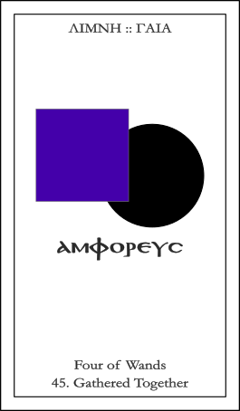

+ [ΑΜΦΟΡΕΥΣ](#ρυθμοι) = Jar with narrow neck; used for various purposes, esp. for keeping wine in, or milk, or for
  pickles. (Shortened form of ἀμφιφορεύς, q.v., from having two handles.)
+ [I Ching](#the-alchemical-structure-of-the-i-ching): 011:000 45\. Gathered Together / Gathering Together
  + judgment: Success is possible. The leader approaches their temple. It is advantageous to see the great 
    one. This brings success. To keep going is advantageous. To bring great offerings creates good fortune. 
    It is advantageous to undertake something.
  + image: Renew your weapons to meet the unforeseen.
  + alchemy: IV. The Dragon's Hoard - C=3/7 (equivalent to 4\. Audit/ACK)
+ Tarot: Four ♣/Wands
  + upright: homecoming, community, celebration, harmony
  + reversed: lack of support, conflicts with others
+ The Wanderer's Oracle: Lake ‖ Earth
  + situation: The Wanderer comes to a pristine lake in a luxuriant valley.
  + admonition: Take some time to refresh your supplies and water, explore the lake shore, restore vigor, and maybe
    even do some fishing.
+ Bible: John 5 - Jesus heals the lame man at the pool of Bethzatha
+ Additional Concepts: 
  + Safe Haven 
  + The trained model
  + The Wedding Feast of the Lamb
  + Color: <font color="#920062">███ Fresh Eggplant ███</font> (#920062)

---

<div style="page-break-after: always"></div>

---

#### ΑΝΑΓΚΗ

▲ΛΙΜΝΗ :: ΛΙΜΝΗ▼

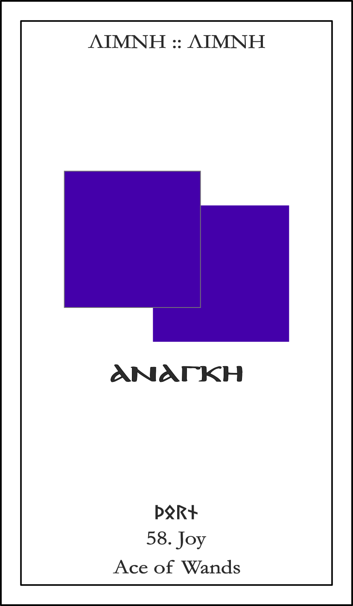 

+ [ΑΝΑΓΚΗ](#ρυθμοι) = Force, constraint, necessity. As an Adverb: perforce, of necessity, it must be that, is 
  necessary that. Necessity in the philosophical sense, logical necessity. In plural: laws of nature,
  natural need, fate, destiny, frequently personified by Poets. Compulsion exerted by a superior, 
  violence, punishment, especially of torture, duress, 'force majeure', stress of circumstances.
  Tie of blood, kindred.
+ [I Ching](#the-alchemical-structure-of-the-i-ching): 011:011 58\. Joy / The Joyous
  + judgment: Success is possible. To keep going is favorable.
  + image: Join together with your friends for discussion and practice.
  + alchemy: V. The Pilgrimage to The Inner Shrine - 7\. (Re)Set
+ Tarot: Ace ♣/Wands
  + upright: growth, potential, creation, willpower, inspiration
  + reversed: lack of direction, boredom, distractions, lack of passion
+ Rune: ᚦ [Thurisaz/Thorn](#αινιγματα) 
  + poem: "Thorn of black that wards the rose- thence her eldritch power flows."
  + keywords: elemental power, giants/trolls/demons, negativity, duality, barriers
+ The Wanderer's Oracle: Lake ‖ Lake
  + situation: The Wanderer comes to a clear, blue mountain lake.
  + admonition: Stop for a moment to remove the dust and exhaustion of the trail. Wash self and gear in 
    the cool water. Once you have restored things in this way, you will be ready to rejoin your journey 
    renewed.
+ Bible: Revelation 20:7-10 - The final deception and Satan's doom
+ Additional Concepts: 
  + Uncontrolled mirth
  + the Dragon's Heart (vide Fáfnir)
  + Color: <font color="#800056">███ Cardinal Pink ███</font> (#800056)

---

<div style="page-break-after: always"></div>

---

#### ΑΣΦΟΔΕΛΟΣ

▲ΛΙΜΝΗ :: ΑΥΡΑ▼

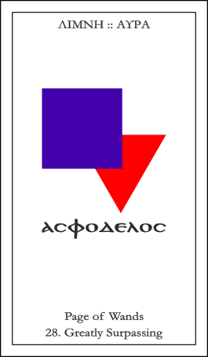 

+ [ΑΣΦΟΔΕΛΟΣ](#ρυθμοι) = Asphodel (*Asphodelus ramosus*). As Adjective, ἀσφοδελὸς λειμών the asphodel meadow which the 
  shades of heroes haunted, or more generally, a flowery meadow. 
+ [I Ching](#the-alchemical-structure-of-the-i-ching): 011:110 28. Greatly Surpassing / The Preponderance of the Great
  + judgment: The ridgepole sags to the breaking point. It is advantageous to have somewhere to go. Success is 
    possible.
  + image: When you stand alone, be unconcerned, if you must renounce the world, be undaunted.
  + alchemy: II. The Priesthood of the Flame - 11. Maintain/Improve 
+ Tarot: Page ♣/Wands
  + upright: ideas, discovery, exploration, excitement, freedom
  + reversed: self-limiting beliefs, procrastination, creating conflict
+ The Wanderer's Oracle: Lake ‖ Wind
  + situation: The Wanderer sees a lake whose surface is broken by the wind into constantly changing patterns 
    of reflections.
  + admonition: Pause to watch the reflections and let yourself be inspired by new possibilities and new ways 
    of seeing.
+ Greek Myth: The Labors of Heracles - 11. The Golden Apples of the Hesperides
  + mode: location gotten from the Old Man of the Sea, the killing of Antaeus or the Serpent Ladon
  + results: How do you like them apples?!
  + comment: The other purpose of the Underworld Journey is to bring back the fruit of the Tree of Life which 
    grows beside the River of Life. Here, again, there's a slaying involved (of the Serpent Ladon or Antaeus), 
    whose true significance you ought to understand by now. An apple a day keeps the doctor away! (So, you're 
    saying the killing of Antaeus eventually became the Elevation of the Host?! Hmmm!)
+ Bible: Genesis 3:22-24 - The expulsion from the Garden of Eden
+ Additional Concepts: 
  + Out of left field
  + Renunciation
  + "Genius is one percent inspiration…"
  + The Holiness of Beauty
  + Without inspiration, life is toil
  + The Swan of Tuonela
  + Color: <font color="#FF0089">███ Rose ███</font> (#FF0089)

---

<div style="page-break-after: always"></div>

---

#### ΒΙΟΣ

▲ΒΡΟΝΤΗ :: ΑΥΡΑ▼

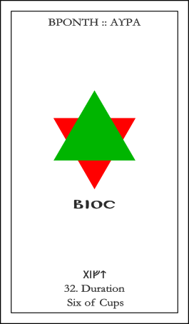 

+ [ΒΙΟΣ](#ρυθμοι) = Life, i.e. not animal life (ζωή), but mode of life, manner of living (mostly therefore of men, 
  but also of animals). Lifetime, livelihood, means of living, to make one's living off, to live by a thing.
+ [I Ching](#the-alchemical-structure-of-the-i-ching): 001:110 32. Duration / Duration
  + judgment: Success without blame is possible. To keep going is advantageous. It is advantageous to 
    have somewhere to go.
  + image: Stand firm and do not change your direction.
  + alchemy: III. Phoenix and Dragon - 11. Maintain/Improve 
+ Tarot: Six ♥/Cups
  + upright: innocence, familiarity, happy memories
  + reversed: moving forward, leaving home, living in the past
+ Rune: ᚷ [Gebo/Gift](#αινιγματα) 
  + poem: "Gifts are given heartily, when the heart turns gratefully."
  + keywords: giving, sacrifice, receiving, mutual obligation, thankfulness
+ The Wanderer's Oracle: Thunder ‖ Wind
  + situation: The Wanderer hears the sound of distant thunder carried on the wind.
  + admonition: Continue your journey without faltering; but take to heart that, though the weather is clear now, 
    those distant storms will soon arrive.
+ Bible: 2 Kings 1 - Elijah and the death of Ahaziah
+ Additional Concepts: 
  + Becoming father
  + Innocence
  + Come live with me and be my love…
  + It's a beautiful life
  + "To those who by patience in well-doing seek for glory and honor and immortality, he will give 
    eternal life"
  + the Stag
  + Color: <font color="#557900">███ Green Leaf ███</font> (#557900)

---

<div style="page-break-after: always"></div>

---

#### ΒΟΥΠΕΛΑΤΗΣ

▲ΒΡΟΝΤΗ :: ΓΑΙΑ▼

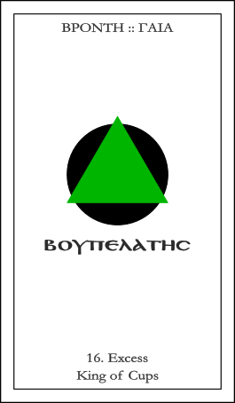 

+ [ΒΟΥΠΕΛΑΤΗΣ](#ρυθμοι) = Herdsman (of cows).
+ [I Ching](#the-alchemical-structure-of-the-i-ching): 001:000 16. Excess / Enthusiasm
  + judgment: It is advantageous to appoint helpers and to set armies marching.
  + image: Make music to honor merit, and offer it with splendor to God, inviting the ancestors' presence.
  + alchemy: I. The Path of Destiny, Part 2 - 11. Maintain/Improve  
+ Tarot: King ♥/Cups
  + upright: compassion, control, diplomacy, balance
  + reversed: coldness, moodiness, emotionally manipulative
+ The Wanderer's Oracle: Quake ‖ Earth
  + situation: The Wanderer feels the jolt of an earthquake.
  + admonition: Rock falls may have made the path ahead treacherous or even impassable, and fellow travelers 
    you meet may have been injured. Help clear the path and heal those in need.
+ Greek Myth: The Odyssey - 11. Reunification
  + overview: The worst is over, the best is yet to come... almost.
  + challenges: Odysseus must meet his father and reestablish his authority on Ithaka.
  + result: The men of Ithaka come for him, but with Athena's "Mentoring" (again) he opens another 
    can of whoopass on them, until Zeus, ultimately, restrains him. A treaty giving Odysseus authority 
    for life is enacted.
  + comment: Well, we've landed. But there is that one last thing your boy Odysseus needs to do. And 
    before that, it would be good to get him well and truly settled in all aspects. You didn't imagine 
    you could just board up the doors and windows of the Palace and try to make it look like nothing had 
    happened, did you? How does his reclaimed identity inform his role and status in his family and 
    society? Don't go too far, and don't let him go too far, in eliminating his ties with the world. 
    Before enlightenment, it's "chop wood, carry water". After enlightenment, it's "chop wood, carry 
    water".
+ Bible: Genesis 1:28-31 - God's blessing of creation
+ Additional Concepts: 
  + "He shall feed his flock like a shepherd, and he shall gather the lambs with his arm"
  + Requiem
  + Krishna 
  + Narcissism
  + "I know a man's character by how he treats those who serve him"
  + "For he grew up before him as a tender plant, and as a root out of a dry ground" (Is. 53:2)
  + "For thou wilt not leave my soul in hell"
  + the Stallion
  + "And was the holy Lamb of God," (Blake's Jerusalem 3)
  + Color: <font color="#009100">███ Japanese Laurel ███</font> (#009100)

---

<div style="page-break-after: always"></div>

---

#### ΒΡΙΑΡΕΩΣ

▲ΒΡΟΝΤΗ :: ΛΙΜΝΗ▼

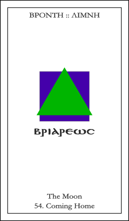 

+ [ΒΡΙΑΡΕΩΣ](#ρυθμοι) = A hundred-handed giant, of the generation of the Titans. In some myths, he is freed from 
  Tartarus by Zeus and guarantees his victory over the Titans.
+ [I Ching](#the-alchemical-structure-of-the-i-ching): 001:011 54. Coming Home / The Marrying Maiden
  + judgment: To undertake something brings misfortune. There is nothing that would be advantageous.
  + image: Understand the transitory in the light of the eternity of the end.
  + alchemy: V. The Pilgrimage to The Inner Shrine - 3. Signal/Command  
+ Tarot: The Moon
  + upright: unconscious, illusions, subconscious, intuition
  + reversed: confusion, repressed emotions, fear, misinterpretation
+ The Wanderer's Oracle: Quake ‖ Lake
  + situation: The Wanderer's contemplations are disturbed by the tremor of an earthquake that sends ripples 
    across the erstwhile calm surface of a lake.
  + admonition: What is unsettled within you that answers to the disturbance without? Face this and restore 
    your composure, just as the lake naturally regains its calm reflection. 
+ Bible: Revelation 19:6-10 - Invitation to the marriage supper of the Lamb
+ Additional Concepts: 
  + Motivation
  + ΓΝΩΘΙ ΣΕΑΥΤΩΝ (Know Thyself)
  + Honey! I'm home!
  + Δράκων - Here be Dragons
  + "The Gnome" (Grimm's Fairy Tales 1st ed. Volume II #5)
  + Cadmus
  + Color: <font color="#557939">███ Fern Green ███</font> (#557939)

---

<div style="page-break-after: always"></div>

---

#### ΓΛΑΥΞ

▲ΑΣΤΡΑΠΗ :: ΓΑΙΑ▼

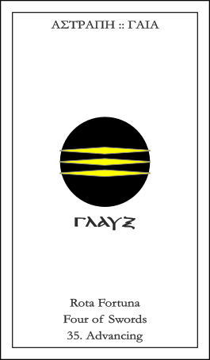 

+ [ΓΛΑΥΞ](#ρυθμοι) = The little owl, *Athene noctua*, so called from its glaring eyes, frequently used as an emblem 
  of Athena.
+ [I Ching](#the-alchemical-structure-of-the-i-ching): 101:000 35\. Advancing / Progress
  + judgment: The powerful leader is honored with horses in large numbers. In a single day they are granted 
    audience three times.
  + image: Brighten your own bright virtue.
  + alchemy: III. Phoenix and Dragon - 8\. (Re)Start/Boot
+ Tarot: Four ♠/Swords 
  + upright: rest, restoration, meditation, contemplation
  + reversed: restlessness, burnout, stress, exhaustion
+ Tarot: Rota Fortuna
  + upright: change, luck, karma, cycles, fate
  + reversed: no control, resistance to change, breaking cycles, bad luck
+ The Wanderer's Oracle: Light ‖ Earth
  + situation: The Wanderer watches the sun begin to descend beneath the plains.
  + admonition: Make camp now and be ready to rejoin your journey early tomorrow.
+ Bible: 1 Kings 19:9-18 - Elijah's vision of God
+ Additional Concepts: 
  + γλαυκῶπις Ἀθηνᾶ (Bright-eyed Athena)
  + Take a breather, then try to get it right, again
  + Change, cycles, fate, decisive moments, luck, fortune, unexpected events
  + "Dans les champs de l'observation le hasard ne favorise que les esprits préparés" (Pasteur)
  + Fortuna Eruditis Favet
  + Muladhara Chakra ("root", base of spine)
  + Color: <font color="#807700">███ Olive ███</font> (#807700)

---

<div style="page-break-after: always"></div>

---

#### ΓΟΡΓΩ

▲ΑΣΤΡΑΠΗ :: ΛΙΜΝΗ▼

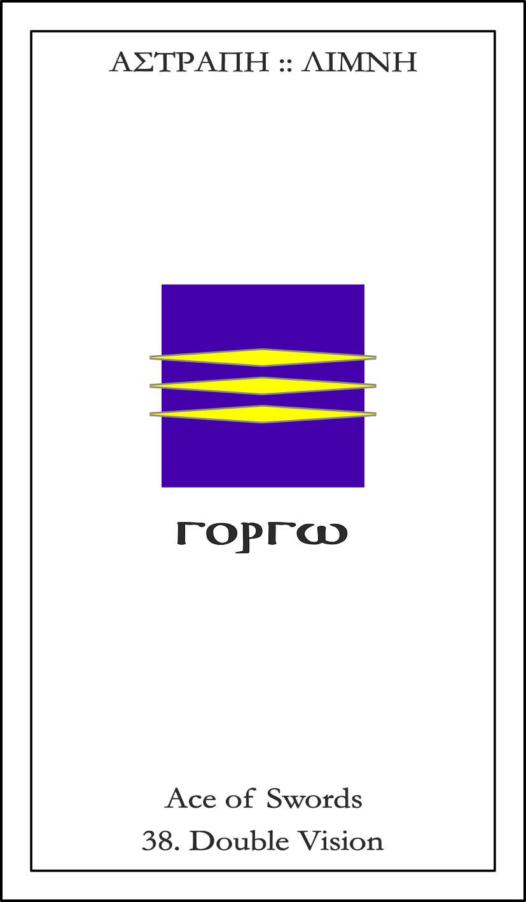 

+ [ΓΟΡΓΩ](#ρυθμοι) = The Gorgon, i.e. the Grim One. Her visage turns people to stone (in other words, the
  "freeze" response to fear.)
+ [I Ching](#the-alchemical-structure-of-the-i-ching): 101:011 38. Double Vision / Opposition
  + judgment: In small matters good fortune is possible.
  + image: Amid all fellowship, retain your individuality.
  + alchemy: III. Phoenix and Dragon - 6\. (Re)Arrange
+ Tarot: Ace ♠/Swords
  + upright: clarity, breakthrough, sharpness of mind
  + reversed: confusion, chaos, clouded judgement
+ The Wanderer's Oracle: Lightning ‖ Lake
  + situation: The Wanderer sees a lightning flash amplified by its reflection in a lake.
  + admonition: Restrain fear but do not ignore the imminent danger. Let your actions reflect the true 
    nature of the warning you have been given.
+ Bible: 1 Kings 18:20-46 - The Contest with the prophets of Baal; the drought ends  
+ Additional Concepts: 
  + Holy Awe
  + Clarity
  + I reconcile
  + Associative thought
  + The goal of ritual
  + The Philosopher's Stone 
  + "Till we have built Jerusalem," (Blake's Jerusalem 15)
  + Color: <font color="#FF854B">███ Coral ███</font> (#FF854B)

---

<div style="page-break-after: always"></div>

---

#### ΓΡΥΨ

▲ΑΣΤΡΑΠΗ :: ΑΥΡΑ▼

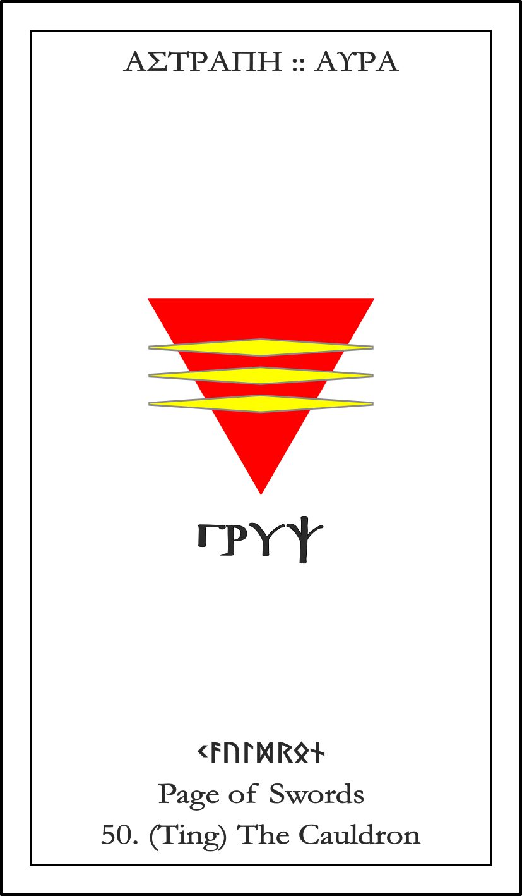 

+ [ΓΡΥΨ](#ρυθμοι) = A griffin; a legendary creature with the body, tail, and back legs of a lion, and the head and 
  wings of an eagle with its talons on the front legs. Since classical antiquity, griffins were known 
  for guarding treasures and priceless possessions.
+ [I Ching](#the-alchemical-structure-of-the-i-ching): 101:110 50. (Ting) The Cauldron / The Caldron
  + judgment: Supreme good fortune and success are possible.
  + image: Consolidate your fate by making your position correct.
  + alchemy: IV. The Dragon's Hoard - G=7/7 (equivalent to 11\. Maintain/Improve)  
+ Tarot: Page ♠/Swords
  + upright: thirst for knowledge, curiosity, restlessness, new ideas, mental energy
  + reversed: deception, manipulation, all talk and no action, haphazard haste
+ Rune: ᚲ [Kenaz/Cauldron](#αινιγματα) 
  + poem: "Cauldron sits in crackling flame, ever changing, ever same."
  + keywords: change, transformation, illumination, fire, process, time
+ The Wanderer's Oracle: Lightning ‖ Wind
  + situation: The Wanderer had watched the lightning recede but now the winds are changing direction.
  + admonition: The path you had chosen now no longer appears to be the right one. Pay attention to the
    wind. You'll have to change your path and your approach, but exactly how will only reveal itself as
    you, and the storm, move.
+ Bible: John 11 - Jesus raises Lazarus from the tomb at Bethany
+ Additional Concepts: 
  + "...we all want to change the World"
  + So evolve, already!
  + The Cauldron of Inspiration (vide Cerridwen)
  + Curiosity
  + It's a beautiful view(point)
  + the Fox
  + "Bring me my Spear: O clouds unfold:" (Blake's Jerusalem 11)
  + Color: <font color="#FFD300">███ Gold ███</font> (#FFD300)

---

<div style="page-break-after: always"></div>

---

#### ΔΑΙΔΑΛΑ

▲ΟΥΡΑΝΟΣ :: ΑΥΡΑ▼

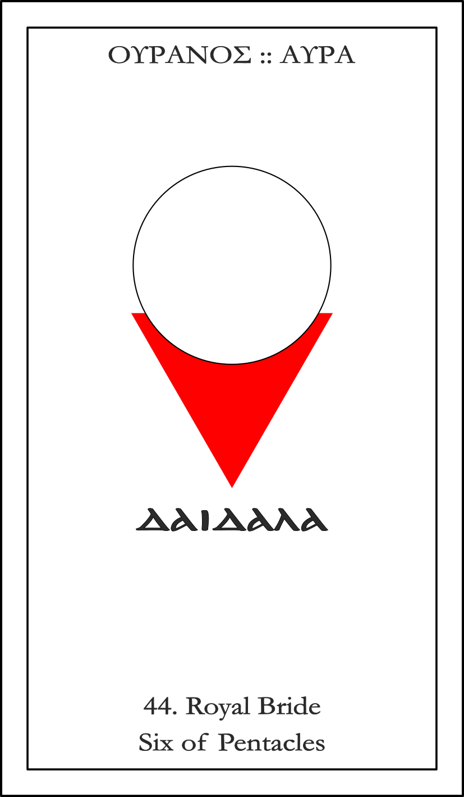 

+ [ΔΑΙΔΑΛΑ](#ρυθμοι) = Cunning works (as a noun, usually in plural as here); cunningly or curiously wrought (as 
  an adjective).
+ [I Ching](#the-alchemical-structure-of-the-i-ching): 111:110 44. Royal Bride / Coming to Meet
  + judgment: The maiden is powerful. One should not marry such a maiden. [Too late! -Fox]
  + image: Act thus when you disseminate your commands and proclaim them to the 4 quarters of heaven.
  + alchemy: IV. The Dragon's Hoard - B=2/7 (equivalent to 3\. Signal/Command)
+ Tarot: Six ♦/Pentacles
  + upright: generosity, charity, sharing
  + reversed: strings attached, power and domination, stinginess 
+ The Wanderer's Oracle: Heaven ‖ Wind
  + situation: The Wanderer sees a blue sky laced with white, wispy cirrus clouds blown by winds aloft.
  + admonition: A change of weather will surely come soon, so prepare now to welcome that change when it 
    does come. Meanwhile, make the most of fair weather and skies full of delightful patterns.
+ Bible: John 4 - Jesus heals the official's son; the woman at the well
+ Additional Concepts: 
  + Sharing is caring
  + Ennobling desire
  + "She's got a strange magic"
  + MidSummer
  + It's a beautiful composition
  + Man is truly Man when he desires to create
  + [Sir Gawain and Dame Ragnelle](https://en.wikipedia.org/wiki/The_Wedding_of_Sir_Gawain_and_Dame_Ragnelle)
  + "Well, you're a Cunning Linguist, aren't you!?"
  + Color: <font color="#FFA0A0">███ Sweet Pink ███</font> (#FFA0A0)

---

<div style="page-break-after: always"></div>

---

#### ΔΟΡΥ

▲ΟΥΡΑΝΟΣ :: ΛΙΜΝΗ▼

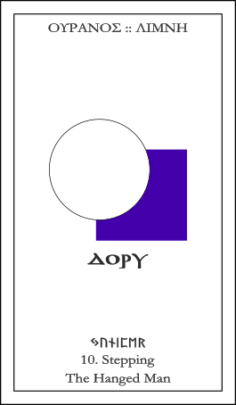 

+ [ΔΟΡΥ](#ρυθμοι) = A spear (especially the shaft), or just a (pointed) stick. Also used as a synecdoche for war.
+ [I Ching](#the-alchemical-structure-of-the-i-ching): 111:011 10\. Stepping / Treading (Conduct)
  + judgment: Treading on the tiger's tail. It does not bite you. Success is possible.
  + image: Discriminate between high and low; fortify the thinking of the people.
  + alchemy: I. The Path of Destiny - 7\. (Re)Set  
+ Tarot: The Hanged Man
  + upright: sacrifice, martyrdom, surrender, letting go, new perspectives, release
  + reversed: resistance, stalling, needless sacrifice, fear of sacrifice
+ Rune: ᛃ [Jera/Juniper](#αινιγματα)  
  + poem: "Juniper with twisted beam, holds the daylight's dying gleam."
  + keywords: completion, harvest, year, ending, conclusion, accomplishment
+ The Wanderer's Oracle: Heaven ‖ Lake
  + situation: The Wanderer sees a clear, blue sky reflected in a calm lake.
  + admonition: Take a respite here to consider, or reconsider, your path, progress, and goal.
+ Greek Myth: The Odyssey - 7\. The Phaiakians
  + overview: Odysseus arrives as a suppliant, with nothing but his experiences up to now.
  + challenges: He must be polite to a fault, prove his mettle in friendly games, and be a good story 
    teller as he recounts the triumphs and tribulations that brought him thus far.
  + result: The Phaiakians load him with gifts and drop him off at Ithaka.
  + comment: Your boy Odysseus will need some time to reflect on where he has come from and where he 
    is going. Let him reflect, and store up gifts for his future, new life.
+ Bible: Genesis 1:6-8 - The 2nd Day of Creation: God creates the firmament
+ Additional Concepts: 
  + Allow me to introduce you to a new perspective
  + Excalibur
  + Life/Identity hangs in the balance 
  + The Spear of Destiny (vide Longinus)
  + Anahata Chakra ("unstruck", heart)
  + the Wolf
  + ξένος = guest-friend; "Knowing how to be a guest (or suppliant)..."
  + Color: <font color="#F83D6">███ Persian Pink ███</font> (#F83D6)

---

<div style="page-break-after: always"></div>

---

#### ΔΡΕΠΑΝΟΝ

▲ΟΥΡΑΝΟΣ :: ΓΑΙΑ▼

 


+ [ΔΡΕΠΑΝΟΝ](#ρυθμοι) = A scythe, curved sword, or pruning knife.
+ [I Ching](#the-alchemical-structure-of-the-i-ching): 111:000 12\. Stagnation / Standstill
  + judgment: Self-serving people cannot help you keep going. The great departs; the small approaches.
  + image: Fall back on your inner worth to escape difficulties. Don't accept revenue.
  + alchemy: VI. The Primal Ones - C=3/7 (equivalent to 4\. Audit/ACK) 
+ Tarot: King ♦/Pentacles
  + upright: leadership, security, discipline, abundance, prosperity
  + reversed: greed, stubborn, indulgence, sensuality
+ Rune: ᚢ [Uruz/Urus](#αινιγματα) 
  + poem: "Urus is an unkempt beast; by his horn is strength increased."
  + keywords: strength, might, courage, fierceness
+ The Wanderer's Oracle: Heaven ‖ Earth
  + situation: The Wanderer makes camp as heaven descends to earth and twilight fades into night.
  + admonition: Do not fear the cold and dark, nor the creatures that roam the night. Make your encampment 
    as safe as you can and face the challenges of this time.
+ Bible: Genesis 1:14-19 - The 4th Day of Creation: God creates the sun, moon and seasons
+ Additional Concepts: 
  + CEO of his castle
  + Confusion seclusion
  + The stiff and inflexible follows Death
  + "And he became obedient unto Death... Therefore was he highly exalted..."
  + Color: <font color="#BFBFBF">███ Silver ███</font> (#BFBFBF)

---

<div style="page-break-after: always"></div>

---

#### ΕΛΑΙΟΣ

▲ΓΑΙΑ :: ΓΑΙΑ▼ 

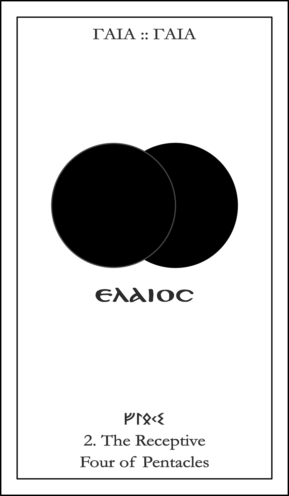 

+ [ΕΛΑΙΟΣ](#ρυθμοι) = The wild olive.
+ [I Ching](#the-alchemical-structure-of-the-i-ching): 000:000 2. The Receptive / The Receptive
  + judgment: Extraordinary success is possible; it is advantageous to keep going like a mare. If you 
    undertake something and try to lead, you will go astray, but if you follow, you'll find guidance. 
    It is favorable to find friends in the west and south, and to forego friends in the east and north. 
    Quiet perseverance brings good fortune.
  + image: With breadth of character, carry the world.
  + Alchemy: VI. The Primal Ones - E=5/7 (equivalent to 8\. (Re)Start/Boot) 
+ Tarot: Four ♦/Pentacles
  + upright: conservation, frugality, conservatism
  + reversed: over-spending, scarcity, stinginess, possessiveness
+ Rune: ᚠ [Fehu/Flocks](#αινιγματα) 
  + poem: "Flocks do feed upon the hill, growing fat and fleecy still." 
  + keywords: wealth, abundance, prosperity, increase
+ The Wanderer's Oracle: Earth ‖ Earth
  + situation: The Wanderer comes to a hut in the shelter of a valley.
  + admonition: Stay your wandering for awhile and spend the time and resources needed, but no more, to 
    be able to continue and complete your journey.
+ Bible: Genesis 1:1b - [God created...] the Earth
+ Additional Concepts: 
  + You need help
  + Preservation, cultivation
  + A penny saved is a penny earned
  + The vehicle of ritual;
  + Color: <font color="#373737">███ Tuatara ███</font> (#373737)

---

<div style="page-break-after: always"></div>

---

#### `ΕΛΙΞ

▲ΓΑΙΑ :: ΑΥΡΑ▼

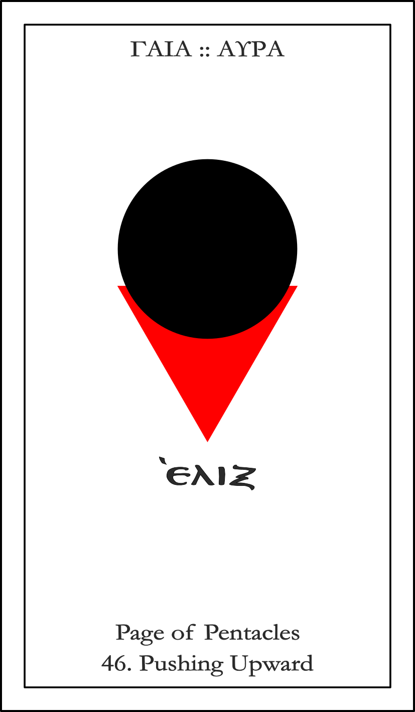 

+ [\`ΕΛΙΞ](#ρυθμοι) = The tendril of the vine or of ivy. A curl or lock of hair. The coil of a serpent.
+ [I Ching](#the-alchemical-structure-of-the-i-ching): 000:110 46. Pushing Upwards / Pushing Upward
  + judgment: Supreme success is possible. One must see the great one. Fear not. Departure toward the 
    south brings good fortune.
  + image: With devotion, heap up small things to achieve something high and great.
  + alchemy: IV. The Dragon's Hoard - D=4/7 (equivelant to 6\. (Re)Arrange)
+ Tarot: Page ♦/Pentacles
  + upright: opportunity, skill development, ambition, desire, diligence
  + reversed: lack of commitment, laziness, lack of progress, procrastination
+ The Wanderer's Oracle: Earth ‖ Wind
  + situation: The Wanderer descends into a valley for protection from strong winds above.
  + admonition: The indirect path is the best, indeed the only, option now. Don't despise it if it is 
    also pleasant.
+ Bible: John 6:1-15 - Jesus feeds 5K with 5 loaves and 2 fish
+ Additional Concepts: 
  + Skill Development
  + Train the model
  + Grow by modesty and adaptability
  + It's a beautiful world
  + "Cinderella" (Grimm's Fairy Tales 1st ed. Volume 1 #21)
  + Color: <font color="#5B0000">███ Rosewood ███</font> (#5B0000)

---

<div style="page-break-after: always"></div>

---

#### `ΕΣΤΙΑ

▲ΓΑΙΑ :: ΛΙΜΝΗ▼

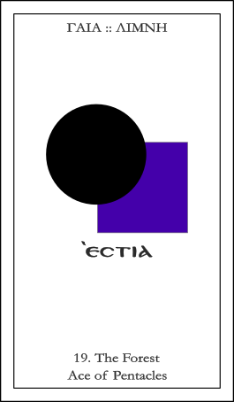 

+ [\`ΕΣΤΙΑ](#ρυθμοι) = The hearth; the house itself; the household or family; an altar; the central fire; the 
  Goddess of the hearth.
+ [I Ching](#the-alchemical-structure-of-the-i-ching): 000:011 19\. The Forest / Approach
  + judgment: Supreme success is possible. To keep going is advantageous. When Autumn comes, there will 
    be misfortune.
  + image: Be inexhaustible in your teaching, tolerance, and protection of the people.
  + alchemy: II. The Priesthood of the Flame - 4\. Audit/ACK
+ Tarot: Ace ♦/Pentacles
  + upright: manifestation, opportunity, prosperity, new venture, abundance
  + reversed: lost opportunities, missed chances, bad investments
+ The Wanderer's Oracle: Earth ‖ Lake
  + situation: The Wanderer comes to a fertile valley with a gem-like lake that must be crossed by a 
    boat tied up on its shore.
  + admonition: An unexpected new venture requires you to innovate; but you might even get a chance to fish 
    if you can improvise a bit.
+ Greek Myth: The Labors of Heracles - 4\. The Erymanthian Boar
  + mode: capture and release, with a preliminary deadly encounter with unruly centaurs (Heracles uses his 
    poison arrows)
  + results: mixed, with the unruly centaurs killed, but lots of collateral damage
  + comment: To bring back and control the Boar (the Earthly Life Force) is impossible. But only through 
    the process of attempting to do so are you able to accomplish the killing off of those passions of 
    your ΨΥΧΗ that are not capable of being controlled by Reason. The method is to identify and kill them 
    with the ΦΑΡΜΑΚΟΝ of your repentance. But you must avoid killing the ones who can serve Reason, if you can.
+ Bible: Genesis 2:10-14 - Four rivers flow out of Eden
+ Additional Concepts: 
  + Opportunity favors the prepared
  + The rights of man
  + Hit pay dirt
  + Hallowed Ground
  + Hallowed Bread (The Host)
  + Lupercal
  + Ubuntu: I Am Because You Are
  + "Walk upon England's mountains green:" (Blake's Jerusalem 2)
  + Color: <font color="#490031">███ Blackberry ███</font> (#490031)

---

<div style="page-break-after: always"></div>

---

#### ΖΕΥΓΜΑ

▲\`ΥΕΤΟΣ :: ΓΑΙΑ▼

 

+ [ΖΕΥΓΜΑ](#ρυθμοι) = That which is used for joining, band, bond; a bridge of boats or platform formed by lashing 
  several vessels together.
+ [I Ching](#the-alchemical-structure-of-the-i-ching): 010:000 8. Closeness / Holding Together (Union)
  + judgment: Good fortune is possible. Inquire of the oracle once again-- if you possess greatness, 
    have constancy, and keep going, then there is no blame. Those who are uncertain gradually join. 
    Whoever comes too late meets with misfortune.
  + image: Bestow fiefdoms and cultivate friendly relations.
  + alchemy: I. The Path of Destiny - 6\. (Re)Arrange
+ Tarot: King ♠/Swords
  + upright: intellectual authority, head over heart, discipline, truth
  + reversed: misuse of power, manipulation, cruelty
+ The Wanderer's Oracle: Rain Clouds ‖ Earth
  + situation: It begins to rain as the Wanderer's path descends into a dry gulch.
  + admonition: Pay attention to the conditions of sky and earth. How long and how hard has it been raining? 
    What are the features of the terrain? To be able to continue unharmed, you must watch out for thick mud, 
    slippery rocks and flash-floods. 
+ Greek Myth: The Odyssey - 6\. The Raft and the Sea
  + overview: The gods decide it's time for the last trials that will lead to Odysseus' homecoming. 
    With Calypso's tools he builds a raft and provisions it with her food for the trip.
  + challenges: But the curse isn't lifted quite yet, the raft is wrecked and he escapes drowning by 
    the gift of Leukothea's veil and a long and treacherous swim to shore.
  + result: Odysseus arrives, naked and exhausted, in the land of the Phaikaians.
  + comment: Your boy Odysseus is on the downhill run. There are still many trials to go, but now he 
    is going to get the help he needs, now that he's naked and has exhausted what he's capable of. 
    Grace works wonders.
+ Bible: Genesis 1:4b-5 - The First Day of Creation: God separates light from darkness [and so time begins]
+ Additional Concepts: 
  + Mutual interests
  + The nature of wisdom, the wisdom of nature
  + Pontifex = bridge builder
  + Color: <font color="#002456">███ Green Vogue ███</font> (#002456)

---

<div style="page-break-after: always"></div>

---

#### ΖΥΓΟΝ

▲\`ΥΕΤΟΣ :: ΛΙΜΝΗ▼

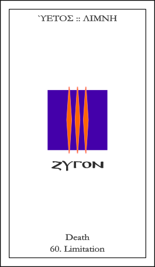 

+ [ΖΥΓΟΝ](#ρυθμοι) = A yoke, crossbar, or the thwarts (benches) joining opposite sides of a ship. The beam of a
  balance, or the balance itself. A cross-strap of a sandal.
+ [I Ching](#the-alchemical-structure-of-the-i-ching): 010:011 60. Limitation / Limitation
  + judgment: Success is possible. Vexatious limitation must not be allowed to continue.
  + image: Create number and measure, and examine the nature of virtue and correct conduct.
  + alchemy: V. The Pilgrimage to The Inner Shrine, Part 2 - 10\. Monitor/Evaluate
+ Tarot: Death
  + upright: endings, beginnings, change, metamorphosis, transformation, transition
  + reversed: resistance to change, fear of change, holding on, stagnation
+ The Wanderer's Oracle: Rain Clouds ‖ Lake
  + situation: The Wanderers camp site by a lake is flooded by rising rain waters rushing in.
  + admonition: Time to salvage what you can and quickly move on before you are drowned.
+ Bible: Revelation 21:2-3 - The New Jerusalem
+ Additional Concepts: 
  + "A man's gotta know his limitations" 
  + Discursive thought, Mathematics
  + "Into this Universe, and Why not knowing, nor Whence, like Water willy-nilly flowing: and out of it, 
    as Wind along the Waste, I know not Whither, willy-nilly blowing."
  + "I am the first and the last, and the Living one; and I was dead, and behold, I am alive for evermore, 
    and I have the keys of death and of Hades."
  + Color: <font color="#7427AB">███ Purple Heart ███</font> (#7427AB)

---

<div style="page-break-after: always"></div>

---

#### ΖΩΠΥΡΟΝ

▲\`ΥΕΤΟΣ :: ΑΥΡΑ▼

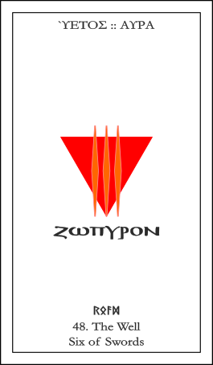

+ [ΖΩΠΥΡΟΝ](#ρυθμοι) = A spark or hot coal used to kindle a fire.
+ [I Ching](#the-alchemical-structure-of-the-i-ching): 010:110 48\. The Well / The Well
  + judgment: The town can be changed, but the well cannot be changed. It neither decreases nor increases. 
    They come and go and draw from the well. If one gets down almost to the water and the rope does not go 
    all the way, or the jug breaks, it brings misfortune.
  + image: Encourage people at their work, and exhort them to help one another.
  + alchemy: IV. The Dragon's Hoard - F=6/7 (equivalent to 9\. Execute) 
+ Tarot: Six ♠/Swords
  + upright: transition, change, rite of passage, leaving the past behind, moving on
  + reversed: resisting transition, emotional baggage, unresolved issues
+ Rune: ᚱ [Raido/Road](#αινιγματα) 
  + poem: "Road runs right beside the sea, where the waves walk ceaselessly."
  + keywords: way, road, path, journey, individuality, liminality, separation
+ The Wanderer's Oracle: Rain Clouds ‖ Wind
  + situation: The Wanderer feels the rain slacken and a fresh breeze begins to blow the clouds away. 
  + admonition: Remove that rain gear or come out from under shelter. The rain has washed your path clean, 
    so you may continue or rejoin your journey refreshed.
+ Bible: John 9 - Jesus heals the man born blind by sending him to wash in the pool of Siloam
+ Additional Concepts: 
  + Find a new approach
  + Suck it up
  + "The water I give them will be in them a well of eternal life"
  + The wind beneath my wings
  + It's a beautiful design
  + "Finally, brothers and sisters, whatever is true, whatever is noble, whatever is right, whatever is 
    pure, whatever is lovely, whatever is admirable—if anything is excellent or praiseworthy—think about 
    such things." (Ph. 4:8)
  + "Little Snow White" (Grimm's Fairy Tales 1st ed. Volume 1 #53)
  + the Bear
  + Color: <font color="#5C2D6D">███ Honey Flower ███</font> (#5C2D6D)

---

<div style="page-break-after: always"></div>

---

#### `ΗΔΟΝΗ

▲ΑΥΡΑ :: ΑΥΡΑ▼

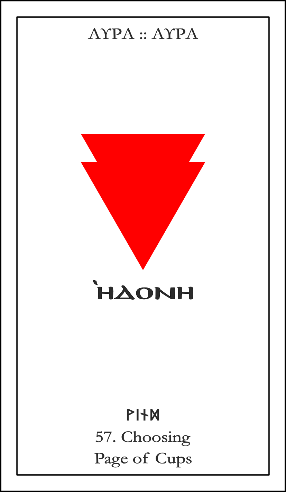 

+ [\`ΗΔΟΝΗ](#ρυθμοι) = Desire, enjoyment or (sensual) pleasure.
+ [I Ching](#the-alchemical-structure-of-the-i-ching): 110:110 57\. Choosing / The Gentle (Penetrating)
  + judgment: Success comes through small things. It is advantageous to have somewhere to go. It is 
    advantageous to see the great one.
  + image: Spread your commands abroad and carry out your undertakings.
  + alchemy: V. The Pilgrimage to The Inner Shrine - 8\. (Re)Start/Boot
+ Tarot: Page ♥/Cups
  + upright: new ideas, happy surprises, curiosity, possibilities, dreams, emotional sensitivity
  + reversed: emotional immaturity, creative blocks, insecurity, disappointment
+ Rune: ᚹ [Wunjo/Wind](#αινιγματα) 
  + poem: "Wind that whistles o'er the plain, wall nor wattle can restrain."
  + keywords: joy, happiness, freedom, release, inspiration
+ The Wanderer's Oracle: Wind ‖ Wind
  + situation: The Wanderer feels a gentle breeze that brings with it lovely fragrances.
  + admonition: Stop to smell the flowers whose scent is carried by the wind. Put one in your cap so you 
    may continue your journey with a light heart. 
+ Bible: Revelation 20:11-15 - The dead are judged by their deeds: the Book of Life
+ Additional Concepts: 
  + "Freude, schöner Götterfunken, Tochter aus Elysium"
  + Regeneration
  + It's a beautiful aspiration
  + And could you carry out your undertakings, please?!
  + "For where your treasure is, there will your heart be also."
  + "The Three Little Men in the Forest" (Grimm's Fairy Tales 1st ed. Volume 1 #13); 
    "Mother Holle" (Grimm's Fairy Tales 1st ed. Volume 1 #24)
  + the Hind 
  + Color: <font color="#800000">███ Maroon ███</font> (#800000)

---

<div style="page-break-after: always"></div>

---

#### ΗΛΕΚΤΡΟΝ

▲ΑΥΡΑ :: ΛΙΜΝΗ▼


+ [ΗΛΕΚΤΡΟΝ](#ρυθμοι) = Amber
+ [I Ching](#the-alchemical-structure-of-the-i-ching): 110:011 61. Sincere to the Core / Inner Truth
  + judgment: Pigs and fishes. Good fortune is possible. It is advantageous to cross the big river. To 
    keep going is advantageous.
  + image: Discuss criminal cases in order to delay executions. (Pigs and Fishes)
  + alchemy: V. The Pilgrimage to The Inner Shrine, Part 2 - 12\. Replicate/Teach
+ Tarot: Ace ♥/Cups
  + upright: love, new relationships, compassion, creativity, spirituality, intuition
  + reversed: emotional loss, blocked creativity, emptiness, repressed emotions
+ The Wanderer's Oracle: Wind ‖ Lake
  + situation: The Wanderer watches the wind as it walks across a lake, forming ever-changing, scintillating 
    patterns of reflection.
  + admonition: Don't miss the beauty that comes your way unlooked for. Isn't your true destination your own
    transformation, just as the water cannot touch the lake without them both being transformed?
+ Bible: Revelation 22:8-21 - Benediction and invitation to the Wedding Feast 
+ Additional Concepts: 
  + Ἀφροδίτη Οὐρανία (Heavenly Aphrodite)
  + Heart's desire
  + The Vision of the Grail
  + Belle
  + The Grail is the container of the Host, and the Host is the Magnum Mysterium
  + ...Deus ibi est; 
  + the Rose
  + "Maiden Without Hands" (Grimm's Fairy Tales 1st ed. Volume I #31); "Bluebeard" (Grimm's Fairy Tales 1st ed. Volume I #62)
  + The Muse of Aspiration
  + Color: <font color="#FF0056">███ Razzmatazz ███</font> (#FF0056)

---

<div style="page-break-after: always"></div>

---

#### ΗΩΣ

▲ΑΥΡΑ :: ΓΑΙΑ▼

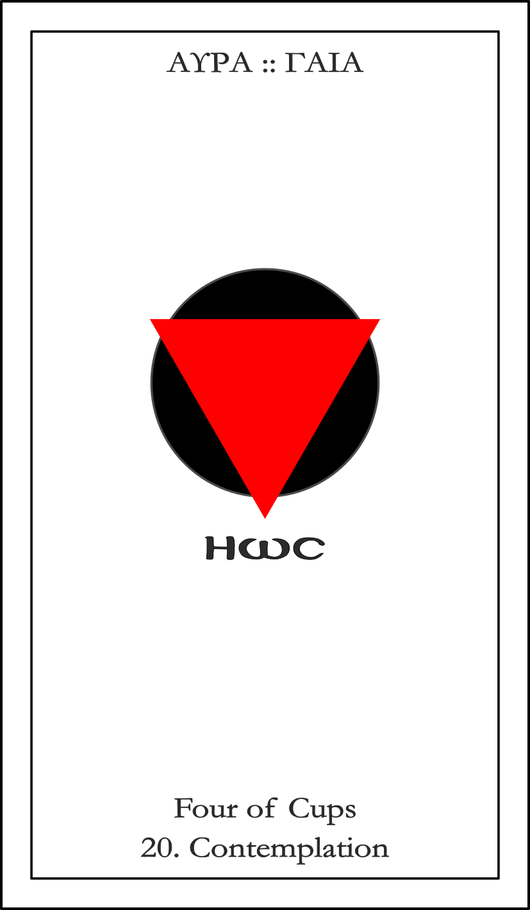 

+ [ΗΩΣ](#ρυθμοι) = Day, life, the East; the Goddess of dawn.
+ [I Ching](#the-alchemical-structure-of-the-i-ching): 110:000 20. Contemplation / Contemplation (View)
  + judgment: The ablution has been made, but not yet the offering. Full of trust they look up to the
    officiant.
  + image: Visit the regions of the world, contemplate the people, and give them instruction.
  + alchemy: II. The Priesthood of the Flame - 3\. Signal/Command
+ Tarot: Four ♥/Cups
  + upright: meditation, apathy, reevaluation, contemplation, disconnectedness
  + reversed: retreat, withdrawal, checking in
+ The Wanderer's Oracle: Wind ‖ Earth
  + situation: The Wanderer feels a strong wind blow through the valley, stirring up dust and making the 
    trees bend and groan.
  + admonition: Wait in a safe spot for the wind to spend itself, lest, in its headlong hurry it fells a 
    branch on you or blows the dust in your eyes.
+ Greek Myth: The Labors of Heracles - 3\. The Ceryneian Hind
  + mode: capture and release; with humility toward the gods
  + results: nothing, really \[cough, cough!\]
  + comment: For the Heavenly or god-like ΨΥΧΗ to be born, you must seek and find the Good, ask permission 
    and ask forgiveness. But you shouldn't imagine you will be able to keep it in a cage--that new ΨΥΧΗ will 
    not be what you imagine or hope it will be. How could it, since your current loves and desires are what 
    must be reformed? It will be better than you can now imagine. And it will be a Journey, never ending. 
    Maybe the story-tellers got it backwards, and the only way Heracles could capture the Hind was in his 
    sleep, rather than while the Hind was asleep. After all, he did visit the realm of the Hyperboreans in 
    his chase!
+ Bible: Genesis 2:9 - The Tree of Life and the Tree of the Knowledge of Good and Evil
+ Additional Concepts: 
  + Asceticism
  + After the ablution- awake! aware
  + the Mare
  + "Briar Rose" (Grimm's Fairy Tales 1st ed. Volume 1 #50)
  + "And did those feet in ancient time," (Blake's Jerusalem 1)
  + Color: <font color="#930000">███ Red Berry ███</font> (#930000)

---

<div style="page-break-after: always"></div>

---

#### ΘΕΜΙΣ

▲ΟΡΟΣ :: ΓΑΙΑ▼

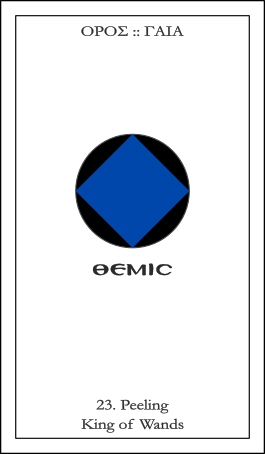 

+ [ΘΕΜΙΣ](#ρυθμοι) = What is meet and right. That which is laid down or established, law (not as fixed by statute, 
  but) as established by custom. Divine law (opp. to ΝΟΜΟΣ). Personsified as the Titan goddess of divine 
  law and order--the traditional rules of conduct first established by the gods. She was also a prophetic 
  goddess who presided over the most ancient oracles, including Delphoi (Delphi). In this role, she was the 
  divine voice (themistes) who first instructed mankind in the primal laws of justice and morality, such as 
  the precepts of piety, the rules of hospitality, good governance, conduct of assembly, and pious offerings 
  to the gods.
+ [I Ching](#the-alchemical-structure-of-the-i-ching): 100:000 23\. Peeling / Splitting Apart
  + judgment: It isn't advantageous to go anywhere.
  + image: You can ensure your position only by giving generously to those below.
  + alchemy: II. The Priesthood of the Flame - 8\. (Re)Start/Boot 
+ Tarot: King ♣/Wands
  + upright: leader, visionary, entrepreneur, overcoming challenges
  + reversed: impulsive, hasty, ruthless, impulsive, overbearing, unachievable expectations
+ The Wanderer's Oracle: Mountain ‖ Earth
  + situation: The Wanderer comes to the base of a steep, almost vertical mountain face that rises directly 
    from the plain.
  + admonition: This is a technical climb, but it could be very rewarding. To undertake it, you must be 
    practiced and prepared. If you are, then climb with care, taking nothing for granted.
+ Greek Myth: The Labors of Heracles - 8\. The Mares of Diomedes
  + mode: capture, with help from companions, then tame
  + results: in some accounts, Heracles' closest companion is eaten by the Mares, but in the end, they are 
    cured of their man-eating
  + comment: after the "easy" encounter with the Bull within, what about getting your relationships with 
    others in order? You won't be able to ignore the real harm you have done, and some relationships will 
    be gone forever, but some may emerge stronger and become marvelously beneficial. [\`ΕΣΤΙΑ](#εστια) teaches Ubuntu.
+ Bible: Genesis 2:22-23 - God creates Woman as Man's helper and companion
+ Additional Concepts: 
  + The Entrepreneur
  + The jig is up
  + The Righteous Judge
  + Give my 2 cents
  + The Sacred Marriage
  + Humility
  + "The Foundling" (Grimm's Fairy Tales 1st ed. Volume 1 #51); "Sweetheart Roland" (Grimm's Fairy Tales 1st ed. Volume 1 #56)
  + "He became obedient unto death... Therefore hath God highly exalted him"
  + Color: <font color="#00848E">███ Blue Lagoon ███</font> (#00848E)

---

<div style="page-break-after: always"></div>

---

#### ΘΥΙΑ

▲ΟΡΟΣ :: ΑΥΡΑ▼

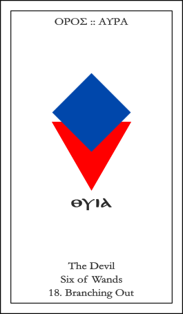 

+ [ΘΥΙΑ](#ρυθμοι) = Juniper (e.g. *Thuja occidentalis*)
+ [I Ching](#the-alchemical-structure-of-the-i-ching): 100:110 18. Branching Out / Work On What Has Been Spoiled (Decay)
  + judgment: Supreme success is possible. It is advantageous to cross the great water. Before the starting 
    point, three days. After the starting point, three days.
  + image: Stir up the people; strengthen their spirit.
  + alchemy: II. The Priesthood of the Flame - 2\. Identify
+ Tarot: Six ♣/Wands
  + upright: victory, success, public reward
  + reversed: excessive pride, lack of recognition, fall from grace, egotism
+ Tarot: The Devil
  + upright: Shadow self, attachment, addiction, materialism
  + reversed: exploring dark thoughts, detachment, release, restoring control
+ The Wanderer's Oracle: Mountain ‖ Wind
  + situation: The Wanderer on the mountain path struggles against a strong wind which threatens, at 
    times, to blow them off the path completely.
  + admonition: Keep your footing and cling to the very rocks when necessary. There's no turning back 
    now, and if you make it, your reward will be great. 
+ Greek Myth: The Labors of Heracles - 2\. The Lernaean Hydra
  + mode: with help from Iolaus and a firebrand
  + results: He gains a virulent poison
  + comment: The subconscious root of your ΨΥΧΗ holds great power, both for good and for ill. The troublesome 
    parts will keep rearing their ugly heads unless you let the Fire of Reason burn them. And even afterward, 
    the possibility of more troubles arising will require careful handling of the ΦΑΡΜΑΚΟΝ (poison or panacea) 
    that results.
+ Bible: Genesis 2:15-17 - God puts Man in the Garden to till it, with a warning
+ Additional Concepts: 
  + Recognition
  + "The Shadow knows"
  + Repent!
  + "If thine eye be single, thy whole body shall be full of light"
  + Sahasrara Chakra ("thousand petaled", crown)
  + You must follow your bliss... God help you
  + The recompense of ritual
  + "The Juniper Tree" (Grimm's Fairy Tales 1st ed. Volume 1 #47); "The Three Sisters" (Grimm's Fairy Tales 1st ed. Volume 1 #82)
  + The Initiate into the Mysteries of the Grail
  + Color: <font color="#678D98">███ Juniper ███</font> (#678D98)

---

<div style="page-break-after: always"></div>

---

#### ΘΥΜΟΝ

▲ΟΡΟΣ :: ΛΙΜΝΗ▼

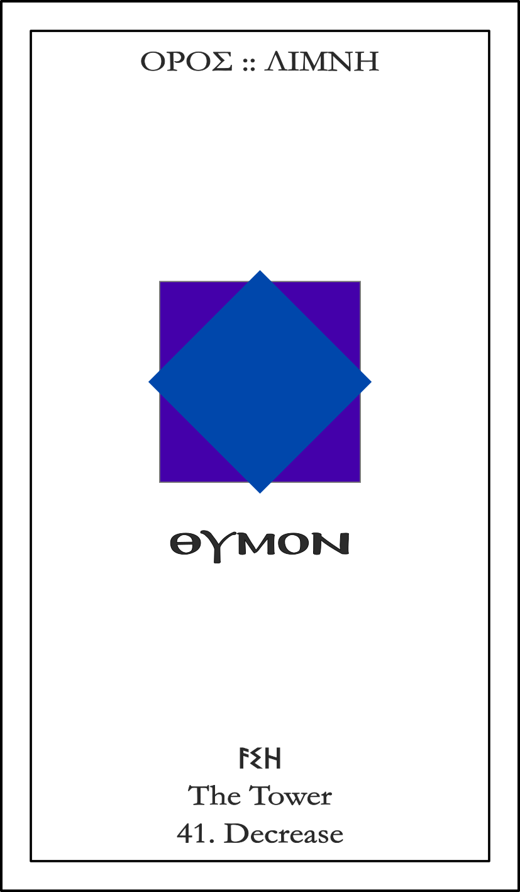 

+ [ΘΥΜΟΝ](#ρυθμοι) = Thyme (e.g. *Thymus vulgaris*)
+ [I Ching](#the-alchemical-structure-of-the-i-ching): 100:011 41\. Decrease / Decrease
  + judgment: Decrease combined with sincerity brings about supreme good fortune without blame. You can 
    persevere in this. It advantageous to undertake something. How should this be carried out? You can 
    use two small bowls for the sacrifice.
  + image: Control your anger and restrain instincts.
  + alchemy: III. Phoenix and Dragon - 1\. Sense/Detect
+ Tarot: The Tower
  + upright: sudden upheaval or change, broken pride, disaster, revelation, awakening
  + reversed: disaster averted or delayed, fear of change
+ Rune: ᚨ [Ansuz/Ash](#αινιγματα) 
  + poem: "Ash is ardent, straight and true, bright bedecked with heaven's dew."
  + keywords: spirit, breath, wisdom, stillness
+ The Wanderer's Oracle: Mountain ‖ Lake
  + situation: The Wanderer approaches their mountain goal only to find that it rises directly out of a lake.
  + admonition: To reach the mountain and climb to its peak, you'll have to strip yourself of all unnecessary 
    gear and clothing and swim for it. Let's hope the water is not too cold.
+ Bible: 1 Kings 17:1 - Elijah announces the drought
+ Additional Concepts: 
  + Upheaval
  + Revelation
  + Repentance unto Salvation
  + "You shall know the Truth and the Truth shall set you free"
  + Waning
  + "Good Bowling and Card Playing" (Grimm's Fairy Tales 1st ed. Volume 1 #4); "The White Dove", "The
    Queen Bee" (parts of "The Simpleton", Grimm's Fairy Tales 1st ed. Volume 1 #64)
  + A "simpleton" is one who is naive. General "inexperience" is of no use. But if this naivety is a 
    unbiased understanding of the same World that the "clever" ones see, it is deeper wisdom.
  + "Fallen, fallen is Babylon the great! She has become a dwelling place for demons, a haunt for every 
    unclean spirit, a haunt for every unclean bird, a haunt for every unclean and detestable beast"
  + Color: <font color="#559EE3">███ Havelock Blue ███</font> (#559EE3)

---

<div style="page-break-after: always"></div>

---

#### `ΙΜΑΣ

▲ΛΙΜΝΗ :: \`ΥΕΤΟΣ▼

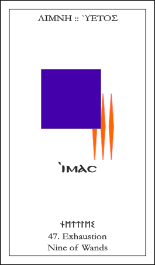 

+ [\`ΙΜΑΣ](#ρυθμοι) = Leathern strap or thong, mostly in plural, in various senses: traces; reins; straps on which 
  the body of the chariot was hung; lash of a whip formed by several thongs; boxing-glove consisting of 
  several straps put round the hand. In singular, the magic girdle of Aphrodite; the chin-strap of the
  helmet; a thong by which the bolt was shot home into the socket; a thong or latchet of a sandal; a 
  rail-rope; well-rope; dog-leash; whip; scourge; or cord. 
+ [I Ching](#the-alchemical-structure-of-the-i-ching): 011:010 47\. Exhaustion / Oppression
  + judgment: Success is possible; keep going. The great one brings about good fortune. No blame. When 
    one has something to say, it is not believed.
  + image: Stake your life on following your will. Sacrifice your life if only this will achieve your goals.
  + alchemy: IV. The Dragon's Hoard - E=5/7 (equivalent to 8\. (Re)Boot)
+ Tarot: Nine ♣/Wands
  + upright: resilience, courage, persistence, test of faith, boundaries, grit, last stand
  + reversed: exhaustion, fatigue, questioning motivations, inner resources, struggle, overwhelmed, defensive
+ Rune: ᚾ [Naudiz/Nettles](#αινιγματα)  
  + poem: "Nettles for the needy man; takes his hunger what it can."
  + keywords: need, necessity, lack, constraint, binding, destiny, fate, the Norns  
+ The Wanderer's Oracle: Lake ‖ Rain Clouds
  + situation: The Wanderer's trail passes by a lake that has overflowed its shores because of recent rains.
  + admonition: You must navigate the difficult, wet conditions and keep to the path as much as possible.
+ Bible: John 6:16-21 - Jesus walks on the Sea of Galilee [originally, The Word rising from the Waters])
+ Additional Concepts: 
  + Resilience
  + Persist or Acquiesce?
  + The Censor's Dilemma- Where do you draw the line? 
  + Requiem aeternam dona eis Domine...
  + Can you *handle* it?
  + "Our life is forfeit to the Dharma" -Fox and Bärchen
  + The Magic Girdle of Aphrodite is φιλότητα καί ἵμερον = affection and desire
  + Sir Gawain and the Green Knight
  + passion(n.) https://www.etymonline.com/word/passion ... from Late Latin passionem "suffering, enduring," 
    from Latin pati "to endure, undergo, experience". The notion is "that which must be endured." The sense 
    was extended to ... suffering and pain generally, by early 13c. It replaced OE þolung (used in glosses 
    to render Latin passio), literally "suffering," from þolian (v.) "to endure." In ME sometimes "the state 
    of being affected or acted upon by something external". In ME also "an ailment, disease, affliction;" 
    also "an emotion, desire, inclination, feeling; ..." (mid-13c.). The specific meaning "intense or vehement 
    emotion or desire" is attested from late 14c. The sense of "sexual love" attested by 1580s, but it has been 
    used of any lasting, controlling emotion (zeal; grief, sorrow; rage, anger; hope, joy). "As compared with 
    affection, the distinctive mark of passion is that it masters the mind, so that the person becomes seemingly 
    its subject or its passive instrument..." [Century Dictionary]
  + "Little Louse and Little Flea" (Grimm's Fairy Tales 1st ed. Volume 1 #30)
  + Color: <font color="#921EAB">███ Violet Eggplant ███</font> (#921EAB)

---

<div style="page-break-after: always"></div>

---

#### ΙΡΙΣ

▲ΛΙΜΝΗ :: ΟΡΟΣ▼

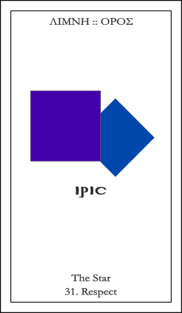 

+ [ΙΡΙΣ](#ρυθμοι) = Iris, the messenger of the gods among themselves and Goddess of the rainbow. Any bright-coloured 
  circle surrounding another body, as the lunar rainbow; the halo of a candle; the eyes of a peacock's tail; 
  the iris of the eye; an iridescent garment; various species of the botanical genus iris, e.g. 
  the purple Iris.
+ [I Ching](#the-alchemical-structure-of-the-i-ching): 011:100 31. Respect / Influence (Wooing)
  + judgment: Influence: Success is possible. To keep going is advantageous. To take a maiden to wife 
    brings good fortune.
  + image: Encourage people to approach you by your readiness to receive them.
  + alchemy: III. Phoenix and Dragon - 12\. Replicate/Teach
+ Tarot: The Star
  + upright: hope, faith, purpose, renewal, rejuvenation
  + reversed: despair, faithlessness, discouragement, insecurity
+ The Wanderer's Oracle: Lake ‖ Mountain
  + situation: The Wanderer comes to a clear, gem-like lake fed by a spring, high on a mountain path.
  + admonition: Stop for a moment for unexpected refreshment and rest in a difficult landscape. This 
    little gem may make the difference in achieving your goal.
+ Bible: 2 Kings 2:1-12 (Elijah ascends to Heaven and Elisha takes his place)  
+ Additional Concepts: 
  + The K&C of the HGA
  + A little sugar
  + Mutual respect
  + "Now abideth faith, hope & charity"
  + "The Singing, Springing Lark" (Grimm's Fairy Tales 1st ed. Volume 2 #2)
  + "In thy presence is fulness of joy"
  + Color: <font color="#AA4FC7">███ Fuschia Pink ███</font> (#AA4FC7)

---

<div style="page-break-after: always"></div>

---

#### `ΙΣΤΟΣ

▲ΛΙΜΝΗ :: ΟΥΡΑΝΟΣ▼

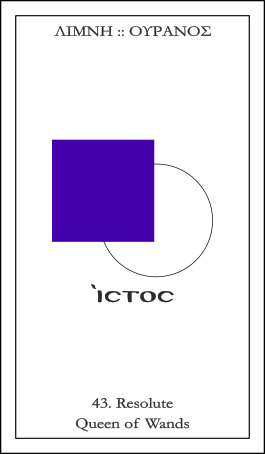 

+ [\`ΙΣΤΟΣ](#ρυθμοι) = Anything set upright: mast; rod; pole; beam; beam of a loom, which stood upright, instead of 
  lying horizontal as in our looms; the warp fixed to the beam, hence, the web itself; spiders' webs.
+ [I Ching](#the-alchemical-structure-of-the-i-ching): 011:111 43. Resolute / Break-through
  + judgment: You must resolutely make the matter known at the court of the ruler. It must be announced 
    truthfully. Danger. It is necessary to notify your own city. It is not advantageous to resort to 
    arms. It is advantageous to undertake something.
  + image: Dispense riches downward and refrain from resting on your virtue.
  + alchemy: IV. The Dragon's Hoard - A=1/7 (equivalent to 1\. Sense/Detect)
+ Tarot: Queen ♣/Wands
  + upright: courage, confidence, independence, determination
  + reversed: selfishness, jealousy, insecurities
+ The Wanderer's Oracle: Lake ‖ Heaven
  + situation: The Wanderer is camped beside a lake. Just before dawn, they see that the clouds have 
    dispersed and the stars are reflected in the lake's surface.
  + admonition: Get up and make an early start on your journey. If you do, it's possible to make better 
    progress than you anticipated.
+ Bible: John 2:1-12 (Jesus turns water to wine at the wedding at Cana)  
+ Additional Concepts: 
  + Take thought beforehand
  + Ad astra per aspera
  + Marianne
  + The Truth in Fiction is in its right relationships
  + Penelope
  + "The Six Swans" (Grimm's Fairy Tales 1st ed. Volume 1 #49)
  + Color: <font color="#FF55C7">███ Hot Pink ███</font> (#FF55C7)

---

<div style="page-break-after: always"></div>

---

#### ΚΑΘΑΡΜΟΣ

▲ΒΡΟΝΤΗ : ΟΡΟΣ▼

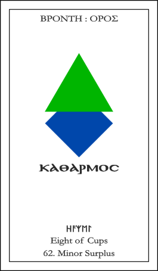

+ [ΚΑΘΑΡΜΟΣ](#ρυθμοι) = Cleansing; purification (from guilt); purificatory offering; atonement; expiation; an offering 
  to avert wrath; purificatory rite of initiation into mysteries; purgation by ordeal; purging; evacuation; 
  discharge. 
+ [I Ching](#the-alchemical-structure-of-the-i-ching): 001:100 62. Minor Surplus / Preponderance of the Small
  + judgment: Success is possible. To keep going is advantageous. Small things may be done; great things 
    should not be done. The flying bird brings the message: it is not good to strive upward, it is good to 
    remain below. Great good fortune is possible.
  + image: Your conduct: reverent, loyal, thrifty.
  + alchemy: V. The Pilgrimage to The Inner Shrine, Part 2 - 11\. Maintain/Improve
+ Tarot: Eight ♥/Cups
  + upright: disappointment, withdrawal, disillusionment
  + reversed: avoidance, fear of loss, aimless drifting
+ Rune: ᛉ [Algi**z**/Ha**z**el](#αινιγματα)  
  + poem: "Hazel for the wise man's cake; bounty, all that he can take."
  + keywords: protect, nurture, nourish, sustain, cultivate, preserve
+ The Wanderer's Oracle: Thunder ‖ Mountain
  + situation: The Wanderer hears thunder as the clouds descend on the the mountain ahead, hiding its 
    peak from view.
  + admonition: Stop for a bit. Can you make the time productive as you wait for conditions to clear? 
    In any case, do not fret.
+ Bible: Revelation 22:1-5 (The River and Tree of Life)
+ Additional Concepts: 
  + Arming grail knights since 1952- Our Motto: the Finding is in the Doing
  + Leaving the past behind
  + Bete (vide Beauty and the Beast)
  + The Gaurdian of the Eternal Flame
  + Don't settle
  + "Herr Fix-It_up" (Grimm's Fairy Tales 1st ed. Volume 1 #16)
  + Ubi Caritas et Amor...
  + Color: <font color="#00D180">███ Caribbean Green ███</font> (#00D180)

---

<div style="page-break-after: always"></div>

---

#### ΚΕΡΑΥΝΟΣ

▲ΒΡΟΝΤΗ :: ΟΥΡΑΝΟΣ▼

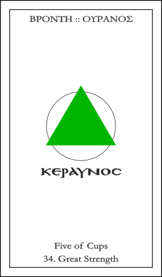

+ [ΚΕΡΑΥΝΟΣ](#ρυθμοι) = A thunderbolt, especially as the weapon of Zeus, forged by the Cyclopes.
+ [I Ching](#the-alchemical-structure-of-the-i-ching): 001:111 34. Great Strength / The Power of the Great
  + judgment: To keep going is advantageous.
  + image: Don't tread upon paths that do not accord with established order.
  + alchemy: III. Phoenix and Dragon - 10\. Monitor/Evaluate
+ Tarot: Five ♥/Cups
  + upright: regret, failure, disappointment, pessimism, loss, grief, self-pity
  + reversed: acceptance, moving on, finding peace
+ The Wanderer's Oracle: Thunder ‖ Heaven
  + situation: The Wanderer hears thunder as clouds quickly gather and cover the once clear, blue skies.
  + admonition: What promised to be clear day suddenly turns into a challenge. Only proceed as before if 
    you are very confident.
+ Bible: 1 Kings 21 - Elijah confronts Ahab for stealing Naboth's vineyard
+ Additional Concepts: 
  + Stealing Fire from Heaven
  + Hubris
  + Regret, hindsight
  + The moment of impact
  + "And did the Countenance Divine," (Blake's Jerusalem 5)
  + "A Story About a Brave Tailor" (Grimm's Fairy Tales 1st ed. Volume 1 #20)
  + Color: <font color="#55CE55">███ Fern ███</font> (#55CE55)

---

<div style="page-break-after: always"></div>

---

#### ΚΗΡΥΚΕΙΟΝ

▲ΒΡΟΝΤΗ :: \`ΥΕΤΟΣ▼

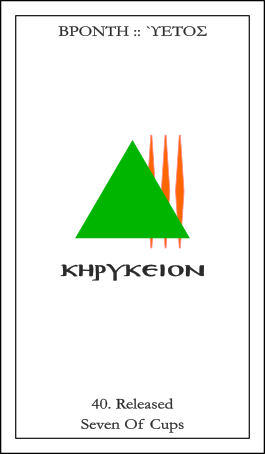

+ [ΚΗΡΥΚΕΙΟΝ](#ρυθμοι) = A herald's wand or staff; the Caduceus.
+ [I Ching](#the-alchemical-structure-of-the-i-ching): 001:010 40. Released / Deliverance
  + judgment: The southwest is advantageous. If there is no longer anywhere you have to go, 
    returning brings good fortune. If there is still somewhere you have to go, hastening 
    brings good fortune.
  + image: Pardon mistakes and forgive misdeeds.
  + alchemy: III. Phoenix and Dragon - 3\. Signal/Command
+ Tarot: Seven ♥/Cups
  + upright: opportunities, wishful thinking, illusion, choices, daydreaming
  + reversed: lack of purpose, diversion, confusion, overwhelmed by choices
+ The Wanderer's Oracle: Thunder ‖ Rain Clouds
  + situation: The Wanderer is surprised by a loud thunder clap. The rain immediately begins to fall in 
    big drops.
  + admonition: Caught unaware? Will the rain pass quickly, or settle in? Is there danger of a lightning 
    strike? Look for the signs, check your past experience, and hurry slowly (with due deliberation).
+ Bible: 1 Kings 17:8-16 - Elijah stays with the Widow of Zarephath who shares her last meal
+ Additional Concepts: 
  + Make a clean sweep
  + You need a dose of reality
  + ΗΘΟΣ ΑΝΘΡΩΠΟΣ ΔΑΙΜΟΝ (character is destiny) -Heraclitus
  + Hermes
  + The Winged Serpent's Other Half
  + "The Golden Bird" (Grimm's Fairy Tales 1st ed. Volume I #57)
  + "I will not cease from Mental Fight," (Blake's Jerusalem 13) 
  + Color: <font color="#007E56">███ Tropical Rain Forest ███</font> (#007E56)

---

<div style="page-break-after: always"></div>

---

#### ΛΑΒΥΡΙΝΘΟΣ

▲ΑΣΤΡΑΠΗ :: \`ΥΕΤΟΣ▼

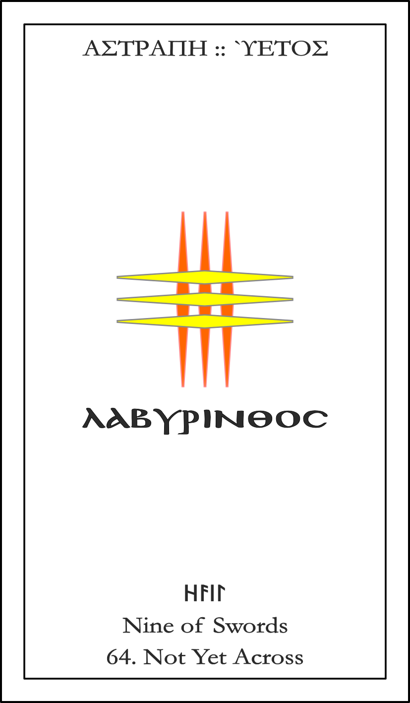

+ [ΛΑΒΥΡΙΝΘΟΣ](#ρυθμοι) = A labyrinth or maze; a large building consisting of numerous halls connected by intricate and 
  tortuous passages. Also used of tortuous questions or arguments.
+ [I Ching](#the-alchemical-structure-of-the-i-ching): 101:010 64. Not Yet Across / Before Completion
  + judgment: Success is possible, but if the little fox, after nearly completing the crossing, gets her tail 
    in the water, there is nothing that would be advantageous.
  + image: Differentiate between things, so each finds its place.
  + alchemy: VI. The Primal Ones - G=7/7 (equivalent to 11\. Maintain/Improve)
+ Tarot: Nine ♠/Swords
  + upright: anxiety, worry, fear, hopelessness, trauma
  + reversed: reaching out, inner turmoil, deep-seated fears, secrets, releasing worry
+ Rune: ᚺ [Hagalaz/Hail](#αινιγματα)  
  + poem: "Hail is hurtful to the corn, breaks its stalks with bitter scorn."
  + keywords: death, destruction, decay, anger, fear, Hel
+ The Wanderer's Oracle: Lightning ‖ Rain Clouds
  + situation: The Wanderer sees lightning leap from the storm clouds ahead and strike their intended path.
  + admonition: Will lightning strike the same place twice? Keep a clear head because you may indeed need 
    to quickly take shelter, or change your path, to avoid the danger, but stopping here won't help.
+ Bible: Genesis 1:1a - In the beginning...
+ Additional Concepts: 
  + The old fox knows the right place to cross
  + Worrying won't help, but you're going to anyway
  + Restate the question and ask again
  + Color: <font color="#B2BB34">███ Earl's Green ███</font> (#B2BB34)

---

<div style="page-break-after: always"></div>

---

#### ΛΑΜΠΑΣ

▲ΑΣΤΡΑΠΗ :: ΟΥΡΑΝΟΣ▼

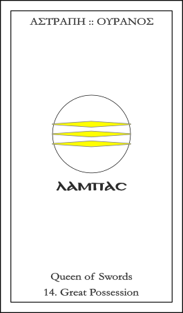

+ [ΛΑΜΠΑΣ](#ρυθμοι) = A torch; beacon-light; torches used in festal processions; any light, lamp, wax-light, or oil 
  lamp. Metaphorically, of the sun.
+ [I Ching](#the-alchemical-structure-of-the-i-ching): 101:111 14. Great Possession / Possession in Great Measure
  + judgment: Supreme success is possible.
  + image: Curb evil and further good, and so obey the benevolent will of heaven.
  + alchemy: I. The Path of Destiny, Part 2 - 10\. Monitor/Evaluate 
+ Tarot: Queen ♠/Swords
  + upright: perceptiveness, clear mindedness, unbiased judgement, clear boundaries, direct communication.
  + reversed: cold hearted, cruel, bitter, bitchy, cold-hearted.  
+ The Wanderer's Oracle: Light ‖ Heaven
  + situation: The Wanderer sees the morning sun rising into a cloudless sky. The day will be hot.
  + admonition: Seize the day! In spite of clear skies, a long journey and significant challenges await 
    you, so pace yourself. Commit yourself fully to whatever this day's journey has in store.
+ Greek Myth: The Odyssey - 10\. The Competition of the Bow
  + overview: Athena puts it in Penelope's mind to bring out the bow of Odysseus and have a contest-- 
    whoever can shoot through a row of 12 axes will become her new husband.
  + challenges: Will Odysseus recognize the opportunity? Will he be able to do it?
  + result: Of course! Odysseus is able to string the bow and shoot an arrow through the axes. Then, with 
    the weapon in his hand, he begins the destruction of the suitors. He's joined by his son, the Swineherd, 
    and the Cowherd. Together they annihilate the suitors and the unfaithful Goatherd and slave girls. And 
    Penelope has one last test to be sure this is really Odysseus. He passes all the tests.
  + comment: When your boy Odysseus is ready, put the weapon in his hands and the proper "Mentor"ing so he can 
    eliminate the unruly suitors and the unfaithful slave girls who slept with them (his bad traits and predilections, 
    and those ambitions and desires of the old life-- the "woulda coulda shoulda's"). Then it's time for "Hon! 
    I'm home!"
+ Bible: Genesis 1:26-31 - The Creation Day 6b: God creates man to have dominion over the beasts and till the Garden
+ Additional Concepts: 
  + Strength of character through clear mindedness
  + "If you know the enemy and know yourself, you need not fear the result of 
    a hundred battles." -Sun Tzu
  + White Buffalo Calf Woman
  + Beethoven Symphony 9, fourth Movement
  + Color: <span style="background-color: black"><font color="#FFF56C">███ Paris Daisy ███</font></span> (#FFF56C)

---

<div style="page-break-after: always"></div>

---

#### ΛΙΝΟΝ

▲ΑΣΤΡΑΠΗ :: ΟΡΟΣ▼

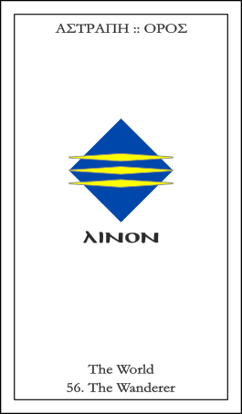

+ [ΛΙΝΟΝ](#ρυθμοι) = anything made of flax: cord; fishingline; thread spun from a distaff; thread for stringing 
  jewels; thread used as a ligature. Metaphorically, the thread of destiny spun by the Fates.
+ [I Ching](#the-alchemical-structure-of-the-i-ching): 101:100 56\. The Wanderer / The Wanderer
  + judgment: Success in small things. To keep going brings good fortune to the wanderer.
  + image: Be clear-minded and cautious in imposing penalties; do not protract lawsuits.
  + alchemy: V. The Pilgrimage to The Inner Shrine - 6\. (Re)Arrange
+ Tarot: The World
  + upright: fulfillment, harmony, completion, integration, accomplishment, travel.
  + reversed: incompletion, short-cuts, delays.
+ The Wanderer's Oracle: Light ‖ Mountain
  + situation: the Wanderer sees their mountain destination ahead, bathed in clear light and shining glory.
  + admonition: Become inspired by your destination so that you will not falter in the journey that awaits 
    you. You've got this!
+ Bible: Revelation 20:1-6 - The Dragon is chained; Christ reigns for 1K years
+ Additional Concepts: 
  + "On a clear day, rise and look around you…"
  + "Be passersby"
  + "It lay so well concealed nobody knew the way to it, and he himself would not have found it if a 
    wise woman had not given him a ball of yarn. When he threw the ball before him, the yarn unwound 
    itself and showed him the way." ("The Six Swans") 
  + We see what we expect to see, and the way we use language guides our perception of the World.
  + The end (telos) of ritual
  + The Norns
  + Get all your ducks in a row, then go.
  + Color: <font color="#AAED55">███ Conifer ███</font> (#AAED55)

---

<div style="page-break-after: always"></div>

---

#### ΜΑΚΑΡΙΑ

▲ΓΑΙΑ :: \`ΥΕΤΟΣ▼

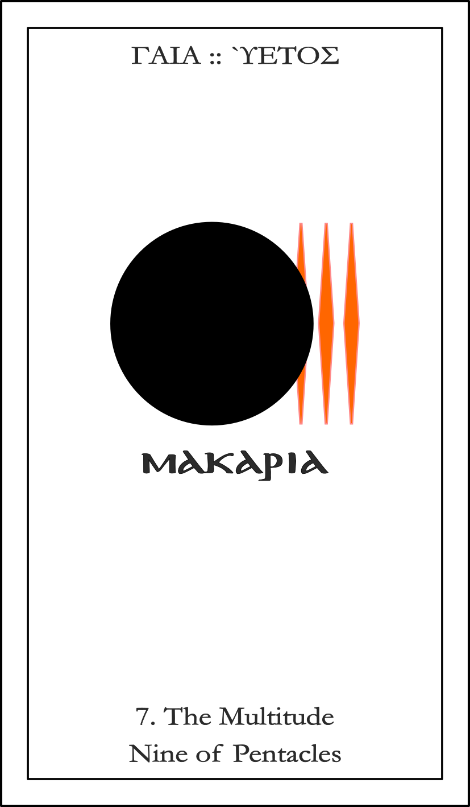

+ [ΜΑΚΑΡΙΑ](#ρυθμοι) = Happiness, bliss, blessedness.
+ [I Ching](#the-alchemical-structure-of-the-i-ching): 000:010 7. The Multitude / The Army
  + judgment: The army needs to keep going and a strong leader to obtain good fortune without blame.
  + image: Increase your followers by generosity to all.
  + alchemy: I. The Path of Destiny - 5\. Inter-Communicate
+ Tarot: Nine ♦/Pentacles
  + upright: fruits of labor, self-sufficiency, financial independence, rewards, luxury.
  + reversed: reckless spending, living beyond your means, false success, hustling.
+ The Wanderer's Oracle: Earth ‖ Rain Clouds
  + situation: The Wanderer sees the earth breathe forth new, misty clouds (rain ghosts) after the recent 
    rains have passed.
  + admonition: Be encouraged! Your path will be soggy and shrouded in mists, but press on with a glad heart, 
    knowing the rain has spent itself and nourished the land, at least for today.
+ Greek Myth: The Odyssey - 5\. Ogygia
  + overview: They make it through almost all of the trials, but the sailors are tired and beg to stop 
    on Helios' island, and, of course, a storm detains them for a month, and those damn cattle of Helios, 
    well, they figure they're going to die of hunger anyway.
  + challenges: Can Odysseus escape fate and get to his true homecoming without losing his entire crew? 
    Apparently not!
  + result: The storm that detained them lifts and they begin, but immediately a fatal one (to the sailors) 
    descends. Shipwreck. Odysseus remains hidden for seven years on Calypso's island; not a bad place or 
    bad company, but still, there's no place like home and he's not there yet.
  + comment: Did you think your boy Odysseus would be the one to make it through in one go and not be 
    sabotaged by "business as usual"? Let's see if he can hold out for the long haul and the final attempt, 
    the one where all his tricks are played out and he has to rely on grace and no small bit of dumb luck. 
    Justifying one's "needs" and performing jury-rigged sacrifices won't help.
+ Bible: Genesis 1:4b - God separates light from darkness
+ Additional Concepts: 
  + Cherish and support what's entrusted to you
  + Bread and Circuses
  + You have the luxury?
  + Bliss is not Ignorance
  + Beethoven Symphony 9, 3rd Movement
  + Work on your Weltanschauung
  + "Rumpelstiltskin" (Grimm's Fairy Tales 1st ed. Volume I #55)
  + Color: <font color="#001C44">███ Tangaroa ███</font> (#001C44)

---

<div style="page-break-after: always"></div>

---

#### ΜΕΓΑΡΟΝ

▲ΓΑΙΑ :: ΟΥΡΑΝΟΣ▼

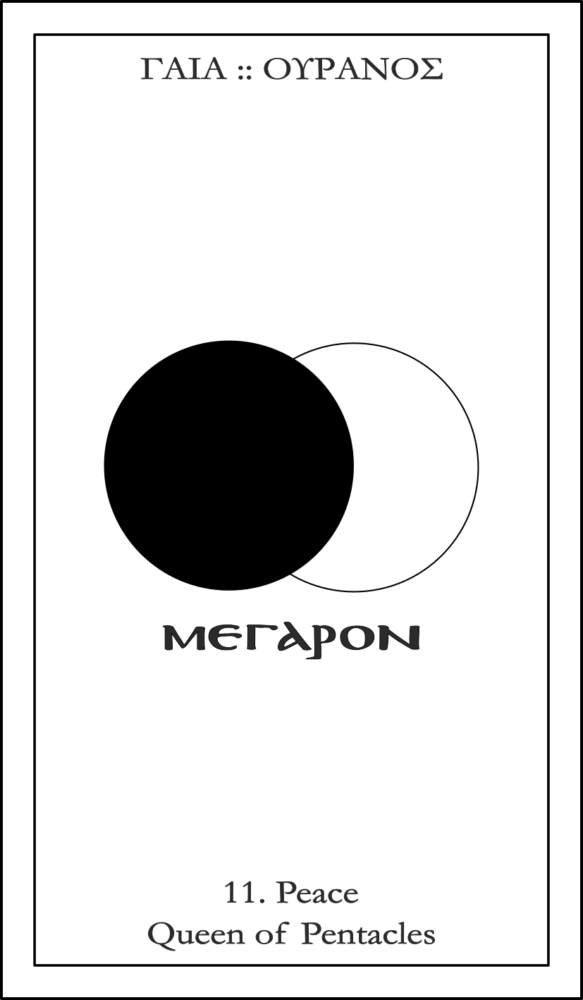

+ [ΜΕΓΑΡΟΝ](#ρυθμοι) = A large room or hall; especially the chief room in the Homeric palace; women's apartment;
  bedchamber. In plural: house, palace. A sanctuary, shrine, frequently in Herodotus (who uses the 
  word in this sense only). μέγαρα, τά, pits sacred to Demeter and Persephone, into which young 
  pigs were let down in the Thesmophoria.
+ [I Ching](#the-alchemical-structure-of-the-i-ching): 000:111 11\. Peace / Peace
  + judgment: The small departs; the great approaches. Good fortune. Success is possible.
  + image: Divide and complete the course of heaven and earth; Further and regulate their gifts to aid all.
  + alchemy: VI. The Primal Ones - D=4/7 (equivalent to 6\. (Re)Arrange)
+ Tarot: Queen ♦/Pentacles
  + upright: nurturing, practicality, creature comforts, financial security.
  + reversed: self-centeredness, jealousy, smothering, self-care, work/life imbalance.
+ The Wanderer's Oracle: Earth ‖ Heaven
  + situation: The Wanderer sees the earth and its creatures begin to rouse, now that dawn's first light 
    is in the sky.
  + admonition: Enjoy this time of careful preparation. Make it count before you must start your journey once 
    again.
+ Bible: Genesis 1:20-23 - The Creation, Day 5: living creatures of the air and water
+ Additional Concepts: 
  + The soft and yielding follows Life
  + Better housekeeping through adaptable homeostasis
  + "King Thrushbeard" (Grimm's Fairy Tales 1st ed. Volume I #52)
  + Color: <font color="#2B2B2B">███ Baltic Sea ███</font> (#2B2B2B)

---

<div style="page-break-after: always"></div>

---

#### ΜΟΙΡΑΙ

▲ΓΑΙΑ :: ΟΡΟΣ▼

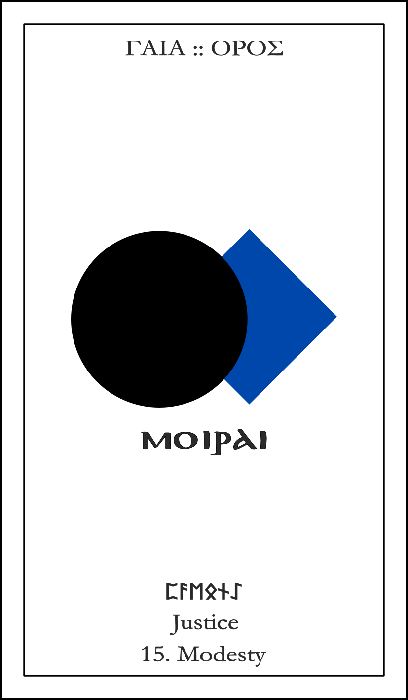  

+ [ΜΟΙΡΑΙ](#ρυθμοι) = (Plural of μοῖρα) the Goddesses of Fate, that is, of one's portion in life, lot, destiny, or fortune.
+ [I Ching](#the-alchemical-structure-of-the-i-ching): 000:100 15\. Modesty / Modesty
  + judgment: You'll create success if you carry things through.
  + image: Reduce what's too much; augment what's too little; weigh things and make them equal.
  + alchemy: I. The Path of Destiny, Part2 - 12\. Replicate/Teach
+ Tarot: Justice
  + upright: justice, fairness, truth, cause and effect, law.
  + reversed: dishonesty, unfairness, lack of accountability.
+ Rune: ᛈ [Pertho/Paeony](#αινιγματα)  
  + poem: "Paeony, beguiling bloom, blessed portal of the womb."
  + keywords: womb, conception, gestation, hidden beginnings, secrets
+ The Wanderer's Oracle: Earth ‖ Mountain
  + situation: The Wanderers path through a valley hides, for a time, their mountain destination.
  + admonition: Stick to the path you know is the right one. Although your destination cannot be seen 
    now, only this will bring you closer to it.
+ Greek Myth: The Odyssey - 12\. The Oar as Winnowing Fan
  + overview: This is not told in the poem, but Teirisias mentions it. And Odysseus mentions this to Penelope 
    on the night of his fulfilled return and reclamation.
  + challenges: Unknown. Odysseus must cross that bridge when he comes to it.
  + result: And they lived happily ever after; at least until Death came to Odysseus from the Sea in his dotage.
  + comment: This is it-- he has fulfilled his destiny. What do you want your boy Odysseus' legacy to be? 
    Somewhere in there there's got to be a grand barbecue with Poseidon as guest of honor. (I hope he doesn't 
    wear his Hawaiian shirt, again!)
+ Bible: Genesis 2:1-2a - The Creation, Day 7a: God completes creation
+ Additional Concepts: 
  + "With whom took he counsel, and who instructed him, and taught him in the path of judgment, and taught 
    him knowledge, and shewed to him the way of understanding?" Isaiah 40:14 [with irony]
  + The balance wherein Life hangs
  + ΔΑΙΜΟΝ (Tutelary Spirit), Fairy Godmother
  + "...neither wilt thou suffer thine Holy One to see corruption"
  + In Greek Mythology, the Μοῖραι (Moirai), sometimes called the "Fates", from Latin "Fata", are Κλωθώ (Klotho, 
    "spinner") who spins the thread of human life, Λάχεσις (Lachesis, "disposer of lots") who measures the 
    thread spun on Clotho's spindle, and Ἄτροπος (Atropos, "unturning") who chooses the manner of death and 
    ends the life of mortals by cutting their threads. 
  + In Norse mythology, the Norns are a trio of female beings who rule the destiny of gods and men, twining 
    the thread of life. They set up the laws and decided on the lives of the children of men. Their names were 
    Urðr, related with Old English wyrd, modern weird ("fate, destiny, luck"), Verðandi, and Skuld, and it has 
    often been concluded that they ruled over the past, present and future respectively, based on the sequence 
    and partly the etymology of the names, of which the first two (literally 'Fate' and 'Becoming') are derived 
    from the past and present stems of the verb verða, "to be", respectively, and the name of the third one 
    means "debt" or "guilt", originally "that which must happen". In younger legendary sagas, the Norns appear 
    to have been synonymous with witches (völvas), and they arrive at the birth of the hero to shape his destiny.
    (See [Moirai](https://en.wikipedia.org/wiki/Moirai).)
  + "On Englands pleasant pastures seen!" (Blake's Jerusalem 4) 
  + Color: <font color="#004247">███ Cypress ███</font> (#004247)

---

<div style="page-break-after: always"></div>

---

#### ΝΑΡΘΗΞ

▲ΟΥΡΑΝΟΣ :: ΟΡΟΣ▼

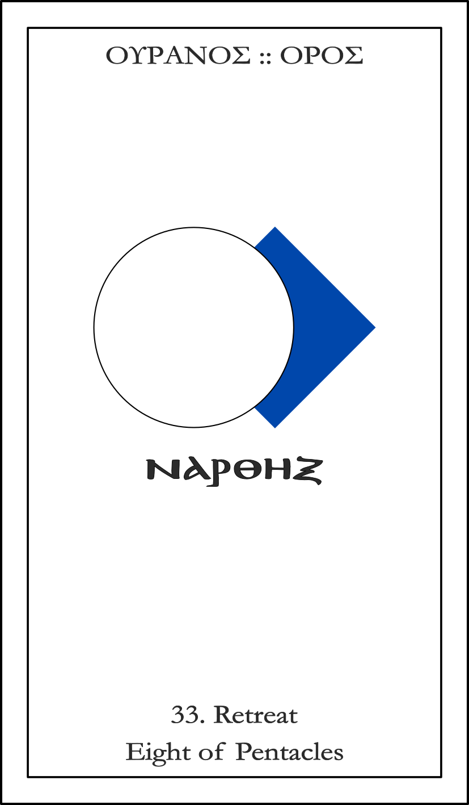 

+ [ΝΑΡΘΗΞ](#ρυθμοι) = The giant fennel, *Ferula communis*, the stalk was used by Prometheus to steal Fire from Heaven.
  Also used for the stalk used as a θύρσος (Dionysus). Used as a schoolmaster's cane, as a splint for a
  broken limb, and as a singlestick for military exercises (martial arts).
+ [I Ching](#the-alchemical-structure-of-the-i-ching): 111:100 33\. Retreat / Retreat
  + judgment: Success is possible in what is small; to keep going is advantageous.
  + image: Keep inferior people at a distance, not angrily but with reserve.
  + alchemy: III. Phoenix and Dragon - 9\. Execute/Process
+ Tarot: Eight ♦/Pentacles
  + upright: apprenticeship, high standards, mastery, skill development.
  + reversed: lack of passion or motivation, uninspired, perfectionism, misdirection.
+ The Wanderer's Oracle: Heaven ‖ Mountain
  + situation: The Wanderer has naught but clear sky and mountain peak ahead--a difficult, final ascent awaits.
  + admonition: It's up to you now. What others have encountered here is valuable but worth only so much. 
    You must incorporate their experience and call on your own training and discipline to achieve this goal.
+ Bible: 1 Kings 19:19-21 - Elijah calls Elisha as his disciple
+ Additional Concepts: 
  + In the Hall of the Mountain King
  + From apprentice to master
  + Foresight
  + Who do you want to be like?
  + "Death and the Goose Boy" (Grimm's Fairy Tales 1st ed. Volume I #27)
  + "Shine forth upon our clouded hills?" (Blake's Jerusalem 6)
  + Color: <font color="#94F7FF">███ Anakiwa ███</font> (#94F7FF)

---

<div style="page-break-after: always"></div>

---

#### ΝΑΥΣ

▲ΟΥΡΑΝΟΣ :: ΟΥΡΑΝΟΣ▼

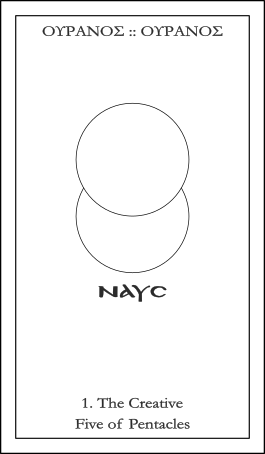 

+ [ΝΑΥΣ](#ρυθμοι) = Ship
+ [I Ching](#the-alchemical-structure-of-the-i-ching): 111:111 1\. The Creative / The Creative
  + judgment: Extraordinary success is possible; it is advantageous to keep going.
  + image: Make yourself strong and untiring.
  + alchemy: VI. The Primal Ones - F=6/7 (equivalent to 9\. Execute)
+ Tarot: Five ♦/Pentacles
  + upright: need, poverty, loss, insecurity.
  + reversed: recovery, charity, improvement.
+ The Wanderer's Oracle: Heaven ‖ Heaven
  + situation: The Wanderer comes to the rendezvous spot for travelers.
  + admonition: Do not neglect to swap gear, news, and insights, and to help your fellow travelers before 
    you set out again. Maybe you'll find companions to join you, or you can join with others for support.
+ Bible: Genesis 1:1 - [In the beginning,] God created...
+ Additional Concepts: 
  + "Give, and it shall be given to you"
  + "There are no passengers on spaceship earth. We are all crew"
  + The power of ritual
  + Heaven proposes, Earth disposes
  + Color: <font color="#D8D8D8">███ Iron ███</font> (#D8D8D8)

---

<div style="page-break-after: always"></div>

---

#### ΝΟΣΤΟΣ

▲ΟΥΡΑΝΟΣ :: \`ΥΕΤΟΣ▼

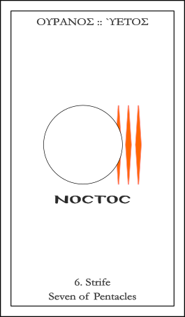 

+ [ΝΟΣΤΟΣ](#ρυθμοι) = return home, or generally, return, travel, journey, journey after (i. e. in search of) food. 
  In plural, Νόστοι, the homeward journeys of the Greek heroes after the taking of Troy, title of Cyclic 
  Epic (a work by Anticlides). Yield or produce of grain when ground. 
+ [I Ching](#the-alchemical-structure-of-the-i-ching): 111:010 6\. Strife / Conflict
  + judgment: You are sincere and are being obstructed. A cautious halt halfway brings good fortune. Going 
    through to the end brings misfortune. It advantageous to see the great one. It is not advantageous to 
    cross the big river.
  + image: In all you do, carefully consider the beginning.
  + alchemy: I. The Path of Destiny - 3\. Signal/Command
+ Tarot: Seven ♦/Pentacles
  + upright: hard work, investment, perseverance, diligence.
  + reversed: work without rewards, lack of vision, limited success or reward.
+ The Wanderer's Oracle: Heaven ‖ Rain Clouds
  + situation: The Wanderer begins their descent with clear skies above, but low clouds and fog obscure 
    what lies below them all around.
  + admonition: Your way forward is not clear. You must try to infer the best way, but be ready to retrace 
    your steps and try again.
+ Greek Myth: The Odyssey - 3\. The Island of Aeaea
  + overview: another encounter with man-eating giants, but then let's see if he's got the kishkes to 
    take on the Sorceress Circe, or, be taken on by her?
  + challenges: got Moly?
  + result: he got Moly!
  + comment: your boy Odysseus passes the humanness test-- there is some part of him that will listen to 
    Reason and not automatically act like a beast. You should train him and show him how to achieve his 
    homecoming. This may take a while and no small effort on your part as well. Meanwhile, keep him clear 
    of man-eating giants, the sailors are getting skittish.
+ Bible: Genesis 1:3 - Fiat Lux!
+ Additional Concepts: 
  + If you work hard, you deserve it
  + The Revolution is on the march
  + Work out disagreements
  + Beethoven Symphony 9, 2nd movement
  + The power of words
  + Color: <font color="#C4D5EC">███ Periwinkle Gray ███</font> (#C4D5EC)

---

<div style="page-break-after: always"></div>

---

#### ΞΙΦΟΣ

▲\`ΥΕΤΟΣ :: ΟΡΟΣ▼

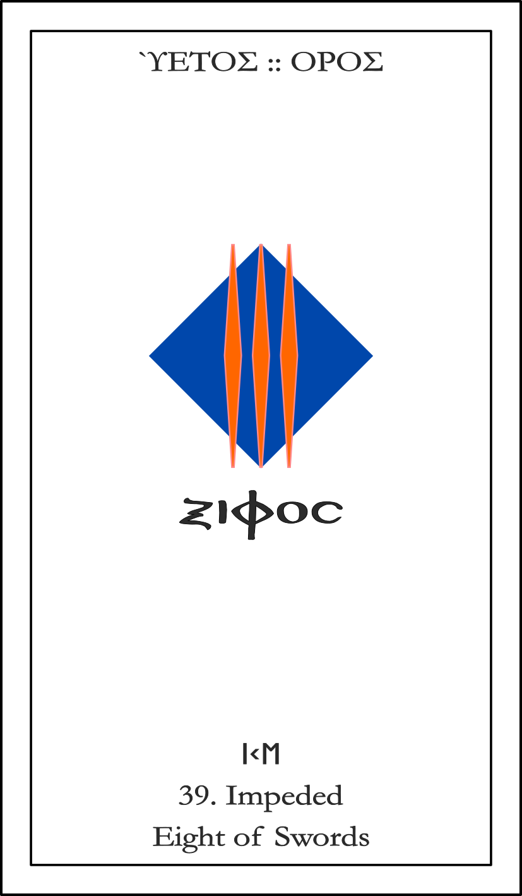 

+ [ΞΙΦΟΣ](#ρυθμοι) = Sword
+ [I Ching](#the-alchemical-structure-of-the-i-ching): 010:100 39. Impeded / Obstruction
  + judgment: The southwest is advantageous; the northeast is not. It is advantageous to see the great 
    one. To keep going brings good fortune.
  + image: Thus turn your attention to yourself and mold your character.
  + alchemy: III. Phoenix and Dragon - 4\. Audit/ACK
+ Tarot: Eight ♠/Swords
  + upright: imprisonment, entrapment, self-imposed restriction, victim mentality.
  + reversed: self acceptance, new perspectives, freedom, release of negative thoughts, opening to new 
    perspectives.
+ Rune: ᛁ [Isaz/Ice](#αινιγματα)  
  + poem: "Ice makes hard the fish's roof; then poor heron stands aloof."
  + keywords: static, frozen, structured, patterned, crystalline, regular
+ The Wanderer's Oracle: Rain Clouds ‖ Mountain
  + situation: The Wander should be nearing their final ascent, but because clouds obscure it, they cannot 
    see the mountain peak ahead.
  + admonition: Should you try again later? Do you have any knowledge that can guide you here? Are there 
    patterns in what you see that may offer a clue as to how to approach this, or not? 
+ Bible: 1 Kings 17:17-24 - Elijah Revives the Widow's Son
+ Additional Concepts: 
  + Gather your will and get up, you…! 
  + Let's cut the crap and figure a way outta here
  + Audentes Fortuna Iuvat
  + the Heron
  + "Nor shall my Sword sleep in my hand:" (Blake's Jerusalem 14)
  + Color: <font color="#006FBF">███ Science Blue ███</font> (#006FBF)

---

<div style="page-break-after: always"></div>

---

#### ΞΟΑΝΟΝ

▲\`ΥΕΤΟΣ :: \`ΥΕΤΟΣ▼

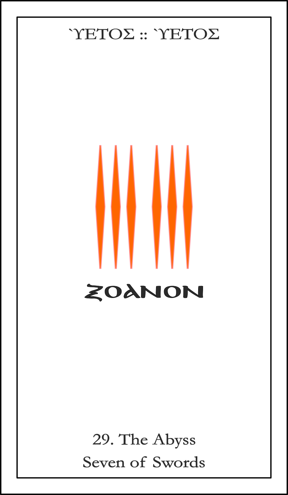 

+ [ΞΟΑΝΟΝ](#ρυθμοι) = An image carved of wood, then, generally, image, statue, especially of a god.
+ [I Ching](#the-alchemical-structure-of-the-i-ching): 010:010 29\. The Abyss / The Abysmal (Water)
  + judgment: If you are sincere, you have success in your heart, and whatever you do succeeds.
  + image: Walk in lasting virtue and carry on the business of teaching.
  + alchemy: VI. The Primal Ones - B=2/7 (equivalent to 3\. Signal)
+ Tarot: Seven ♠/Swords
  + upright: betrayal, deception, trickery, acting strategically.
  + reversed: come clean, rethink your approach, imposter syndrome, self-deceit, keeping secrets.
+ The Wanderer's Oracle: Rain Clouds ‖ Rain Clouds
  + situation: The Wanderer is stuck in camp, socked in by clouds, rain, and mists.
  + admonition: Take this time to make and revise plans. Don't kid yourself--unless a miracle occurs, you're 
    not going anywhere.
+ Bible: Exodus 14:1-31 - Crossing the Red Sea
+ Additional Concepts: 
  + Thief! Thought you could hide that?!
  + ...make unto thee a Graven Image
  + Le Mot Juste
  + Color: <font color="#356DBD">███ Mariner ███</font> (#356DBD)

---

<div style="page-break-after: always"></div>

---

#### ΞΥΛΟΝ

▲\`ΥΕΤΟΣ :: ΟΥΡΑΝΟΣ▼

 

+ [ΞΥΛΟΝ](#ρυθμοι) = Wood cut and ready for use, firewood, timber, piece of wood, log, beam, post. An instrument of
  punishment: wooden collar, put on the neck of the prisoner; stocks, in which the feet were confined;
  gallows; stake on which criminals were impaled; A bench, table, especially a money-changer's table.
  The Hippocratic bench (which used tension to aid in setting bones. It is a forerunner of the traction 
  devices used in modern orthopedics, as well as of the rack, an instrument of torture.)
+ [I Ching](#the-alchemical-structure-of-the-i-ching): 010:111 5. Waiting / Waiting (Nourishment)
  + judgment: If you're sincere, you have light and success. To keep going brings good fortune. It is 
    advantageous to cross the big river.
  + image: Eat and drink, be joyous and of good cheer.
  + alchemy: I. The Path of Destiny - 4\. Audit/ACK
+ Tarot: Five ♠/Swords
  + upright: conflict, disagreements, competition, unbridled ambition, winning at all costs, sneakiness.
  + reversed: lingering resentment, reconciliation, making amends.
+ Tarot: Judgment
  + upright: Judgement, rebirth, inner calling, absolution, reflection, reckoning, awakening.
  + reversed: lack of self awareness, self-doubt, self-loathing, inner critic, ignoring the call.
+ The Wanderer's Oracle: Rain Clouds ‖ Heaven
  + situation: The Wanderer sees low clouds cover the sky, but no rain is falling at this time.
  + admonition: Will a storm begin or pass by (clouds on vacation)? Are you prepared to meet the challenges 
    if a storm does begin? What does your experience, reason, and the accounts of others you meet on the path, 
    tell you?
+ Greek Myth: The Odyssey - 4\. To Hades and Back
  + overview: is he ready? he's ready; but the journey home begins with a journey to Hades to learn what's 
    fated for him
  + challenges: getting there, a sacrificial offering to the dead, questions raised and answered
  + result: He gets the main outline of what he needs to do to return home, Circe then fills in some more 
    details of the perils of the journey and how to avoid them.  
  + comment: Your boy Odysseus passes the next test-- he can make the Underworld Journey and bring back 
    the goods. You can let him start after giving him advice and warnings about what he will encounter.
+ Bible: Genesis 1:4a - And God saw that the light was good
+ Additional Concepts: 
  + "The revolution will not be televised"
  + Symposium
  + The Uncarved Block
  + Beethoven Symphony 9, 1st movement
  + Someone is a dirty, lying con man! 
  + "It keeps me looking for a heart of gold"
  + Vishuddha Chakra ("purest", throat)
  + Color: <font color="#4D7EC4">███ Steel Blue ███</font> (#4D7EC4)

---

<div style="page-break-after: always"></div>

---

#### ΟΙΚΟΣ

▲ΑΥΡΑ :: ΟΥΡΑΝΟΣ▼

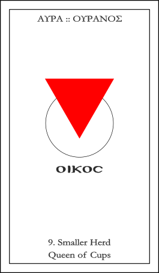 

+ [ΟΙΚΟΣ](#ρυθμοι) = A house, not only of built houses, but of any dwelling-place, as that of Achilles at Troy; of the 
  Cyclops' cave; of a tent.  A room, chamber, dining-hall, room in a temple. Also used of public buildings,
  a meeting-house, hall, of treasuries at Delos, temple. A cage for birds. One's household goods, 
  substance, estate, inheritance. A reigning house, also of any family.
+ [I Ching](#the-alchemical-structure-of-the-i-ching): 110:111 9. Smaller Herd / The Taming Power Of The Small
  + judgment: Success is possible. There are dense clouds, but no rain from our western region.
  + image: Refine the outward aspect of your nature.
  + alchemy: I. The Path of Destiny - 8\. (Re)Start/Boot
+ Tarot: Queen ♥/Cups
  + upright: caring, emotionally stable, compassionate, calm, comforting.
  + reversed: martyrdom, insecurity, dependence, co-dependency.
+ The Wanderer's Oracle: Wind ‖ Heaven
  + situation: Winds aloft have cleared the sky and presage more good weather to come for the Wanderer.
  + admonition: If you can make good use of this time, avoiding distractions and detours, you'll make good 
    progress toward your final destination.
+ Greek Myth: The Odyssey - 8\. The Hut of the Swineherd
  + overview: At first, Odysseus doesn't recognize his homeland, but Athena reassures him he's arrived. 
    He stores the gifts of the Phaiakians in a cave. Then Athena disguises him as an old, wandering beggar 
    (not hard, considering).
  + challenges: Odysseus has to figure out what the situation on the ground is, and plan to overcome the 
    suitors with just a few loyal servants and his son to help.
  + result: With hints from Athena, a general plan is set in motion. Next stop, his own home and all the 
    trouble there.
  + comment: Your boy Odysseus is now where he wants to be, and has loads of gifts to help him re-start 
    his life, nonetheless he has to start at the bottom to make a reality of what he has longed for. 
+ Bible: Genesis 1:9-13 - The Creation, Day 3: dry land and vegetation
+ Additional Concepts: 
  + ξενία or φιλοξενία = hospitality
  + Pleasingness
  + "Everything I need to know I learned in Kindergarten"
  + "Prince Swan" (Grimm's Fairy Tales 1st ed. Volume I #59)
  + The Beauty of Hospitality
  + "... makes one a better host."
  + Color: <font color="#FF4949">███ Sunset Orange ███</font> (#FF4949)

---

<div style="page-break-after: always"></div>

---

#### ΟΙΝΟΣ

▲ΑΥΡΑ :: ΟΡΟΣ▼  

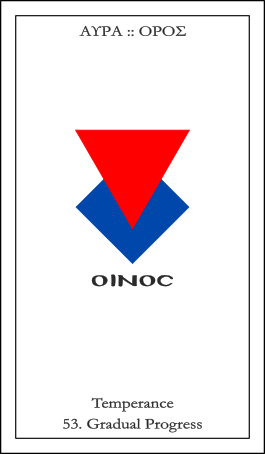 


+ [ΟΙΝΟΣ](#ρυθμοι) = Wine
+ [I Ching](#the-alchemical-structure-of-the-i-ching): 110:100 53\. Gradual Progress / Development
  + judgment: The maiden is given in marriage. Good fortune. To keep going is advantageous.
  + image: Abide in dignity and virtue, in order to improve the mores.
  + alchemy: V. The Pilgrimage to The Inner Shrine - 4\. Audit/ACK
+ Tarot: Temperance
  + upright: balance, moderation, middle path, patience, finding meaning.
  + reversed: extremes, excess, imbalance.
+ The Wanderer's Oracle: Wind ‖ Mountain
  + situation: The Wanderer is refreshed by a cool breeze, clear skies, and a glorious view at a resting 
    point beneath the mountain's peak.
  + admonition: You've reached the reward for your climb. Would obtaining a higher point be any more fulfilling? 
+ Bible: Revelation 19:11-16 - The Rider on a White Horse
+ Additional Concepts: 
  + "Wisdom hath mixed her wine" -Proverbs 9
  + Virtue
  + Harmonia
  + Empty and Full
  + "He prayeth best who loveth best all things, both great and small"
  + "The Fisherman and his Wife" (Grimm's Fairy Tales 1st ed. Volume I #19)
  + Color: <font color="#CB3034">███ Persian Red ███</font> (#CB3034)

---

<div style="page-break-after: always"></div>

---

#### ΟΦΙΣ

▲ΑΥΡΑ :: \`ΥΕΤΟΣ▼

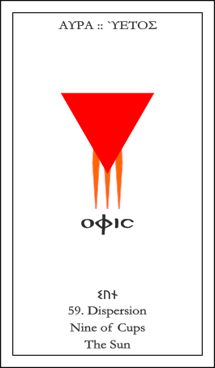 

+ [ΟΦΙΣ](#ρυθμοι) = Serpent
+ [I Ching](#the-alchemical-structure-of-the-i-ching): 110:010 59. Dispersion / Dispersion (Dissolution)
  + judgment: Success is possible. The ruler approaches their temple. It is advantageous to cross the 
    big river. To keep going is advantageous.
  + image: As rulers, sacrifice to the Great Mystery and build its temples.
  + alchemy: V. The Pilgrimage to The Inner Shrine, Part 2 - 9\. Execute/Process
+ Tarot: Nine ♥/Cups
  + upright: contentment, satisfaction, gratitude, wishes come true.
  + reversed: smugness, dissatisfaction, indulgence.
+ Tarot: The Sun
  + upright: positivity, fun, warmth, vitality, celebration.
  + reversed: negativity, depression, sadness, overly optimistic. 
+ Rune: ᛊ [Sowilo/Sun](#αινιγματα)  
  + poem: "Sun is bright, her honey hair sheds the light whose life we share."
  + keywords: vitality, vigor, health, incitement of desire, life
+ The Wanderer's Oracle: Wind ‖ Rain Clouds
  + situation: The Wanderer watches the wind disperse the rain clouds ahead on their path.
  + admonition: Here comes the sun, and I say it's all right! Enjoy the journey.
+ Bible: Revelation 21:1-8 - The New Heaven and Earth
+ Additional Concepts: 
  + "Brooding upon the waters"
  + "The Opium of the People"
  + Ajna Chakra ("command", third eye)
  + The Winged Serpent
  + Moses raises up the Bronze Serpent (Nm 21:4-9)
  + The Muse of Invention
  + "Would to God that all the Lords people were Prophets." (Blake's Jerusalem 0, quoting Nm 11:29)
  + Color: <font color="#802456">███ Disco ███</font> (#802456)

---

<div style="page-break-after: always"></div>

---

#### ΠΑΙΩΝ

▲ΟΡΟΣ :: ΟΥΡΑΝΟΣ▼

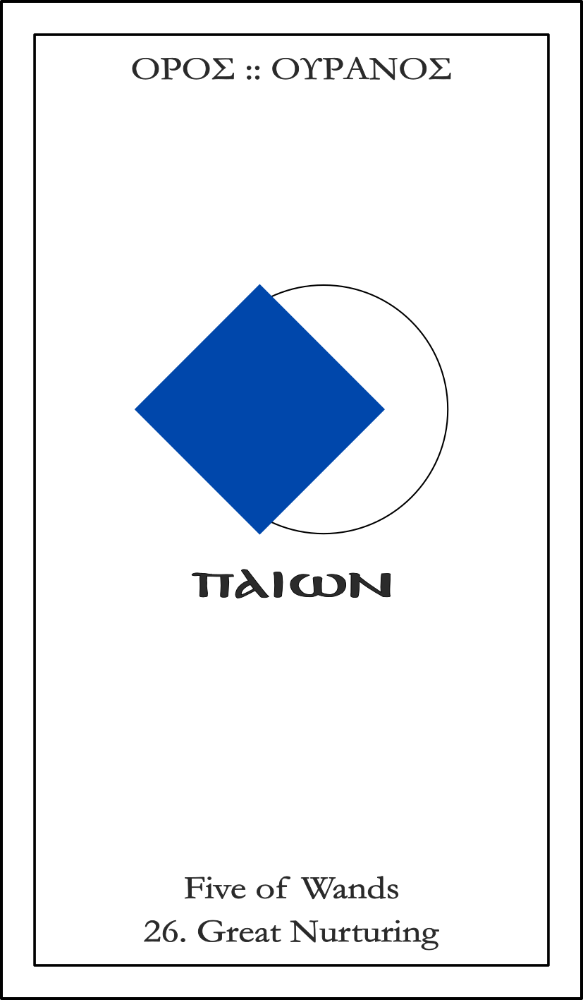 

+ [ΠΑΙΩΝ](#ρυθμοι) = A choral song, addressed to Apollo or Artemis in thanksgiving for deliverance from evil, or
  addressed to other gods, as to Poseidon after an earthquake. A song of triumph after victory, properly
  to Apollo. Also, a battle-song addressed to Ares. Any solemn song or chant, especially on beginning an
  undertaking.
+ [I Ching](#the-alchemical-structure-of-the-i-ching): 100:111 26. Great Nurturing / The Taming Power Of The Great
  + judgment: To keep going is advantageous. Not eating at home brings good fortune. It is advantageous 
    to cross the big river.
  + image: Learn many sayings of antiquity and deeds of the past, to strengthen your character thereby.
  + alchemy: II. The Priesthood of the Flame - 10\. Monitor/Evaluate
+ Tarot: Five ♣/Wands
  + upright: competition, rivalry, conflict, disagreements.
  + reversed: avoid conflict, respect differences.
+ The Wanderer's Oracle: Mountain ‖ Heaven
  + situation: The Wanderer pauses below the highest peak in the range; the final ascent awaits.
  + admonition: Few have gone here before. Have you studied their successes and failures? Ascend if you dare.
+ Greek Myth: The Labors of Heracles - 10\. The Cattle of Geryon
  + mode: cross over in the Cup of Helios, kill the herdsman with poison arrows, and take the cattle 
  + results: Heracles gets a share of the herd
  + comment: You must now arrive at the point where you make the Underworld Journey to confront the Monster. 
    This Monster holds your Power, and is, in fact, you. Or, at least, the old you. Knowing that, will you 
    actually manage to kill it? Warning- this is a Journey that will have to be undertaken often. Hell! You 
    might have to do it daily for the rest of your life. Better keep that ΦΑΡΜΑΚΟΝ handy. And a little
    audacity goes a long way. Get it? Got it! Good.
+ Bible: Genesis 3:1-7 - The Fall
+ Additional Concepts: 
  + "… Play ball!"
  + "A splendid little war"
  + "And was Jerusalem builded here," (Blake's Jerusalem 7)
  + Color: <font color="#80F6FF">███ Spray ███</font> (#80F6FF)

---

<div style="page-break-after: always"></div>

---

#### ΠΤΕΡΥΞ

▲ΟΡΟΣ :: \`ΥΕΤΟΣ▼

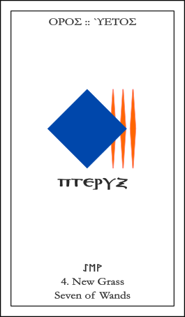 

+ [ΠΤΕΡΥΞ](#ρυθμοι) = The wing of a bird. A winged creature, bird. Flight, augury, omen. Anything like a wing: fins of 
  fish, the flippers of seals, dolphins and whales. The blade of the steering-paddle, hence, a rudder, an 
  oar. The flap of a cuirass. The broad edge of a knife or hunting-spear. Anything that covers or protects 
  like wings.
+ [I Ching](#the-alchemical-structure-of-the-i-ching): 100:010 4\. New Grass / Youthful Folly
  + judgment: Success is possible. I don't seek the young fool; the young fool seeks me. At the first 
    oracle I give an answer. If they ask two or three times, it is importunity. If they importune, I 
    give them no information. It is advantageous to keep going.
  + image: Foster your character - be thorough in all you do.
  + alchemy: I. The Path of Destiny - 2\. Identify
+ Tarot: Seven ♣/Wands
  + upright: challenge, competition, protection, perseverance, defense, maintaining control
  + reversed: give up, confidence destroyed, overwhelmed
 + Rune: ᛇ [Eiwaz/Yew](#αινιγματα)  
   + poem: "Yew betokens hallowed ground; nothing ill is therein found."
   + keywords: Yggdrasil (the World Tree), sacred circle, the Runes, luck
+ The Wanderer's Oracle: Mountain ‖ Rain Clouds
  + situation: The Wanderer pauses before the final mountain ascent. The rain has just cleared, but the climb 
    is now slippery and treacherous.
  + admonition: You might make the peak, but the risk is great. If you proceed, every step must be taken with 
    deliberation, the safest ways of approach considered, and any special equipment brought out. Feeling lucky?
+ Greek Myth: The Odyssey - 2\. The Bag of Winds
  + overview: they arrive at the land of Aiolos, who gives Odysseus safe passage by tying up the winds in a bag.
  + challenges: the sailors think the bag contains treasure, so they are jealous and mistrust Odysseus' generosity, 
    and they open the bag while he sleeps. 
  + result: back to square one, but things are worse because Aiolos figures out that Odysseus is cursed and 
    refuses to help a second time.
  + comment: oh yeah! there's that trick (suppression), but its not going to work in this case-- the desire 
    for wealth, power or status will kill that plan. Maybe your boy Odysseus is beginning to get it. Let's see.
+ Bible: Genesis 1:2c - and the Spirit of God was moving over the face of the waters 
+ Additional Concepts: 
  + The rough draft; Write a proposal; Invention; A lot of rope
  + Psalm 91
  + Tread carefully
  + The Art of Enchantment
  + Odysseus
  + "Contrariwise,' continued Tweedledee, 'if it was so, it might be; and if it were so, it would be; 
    but as it isn't, it ain't. That's logic."
  + The Tree of Knowledge, the Hazel of Wisdom
  + What can you *use* it for?
  + "Bring me my Bow of burning gold:" (Blake's Jerusalem 9)
  + Color: <font color="#009AD5">███ Cerulean ███</font> (#009AD5)

---

<div style="page-break-after: always"></div>

---

#### ΠΥΛΑΙ

▲ΟΡΟΣ :: ΟΡΟΣ▼

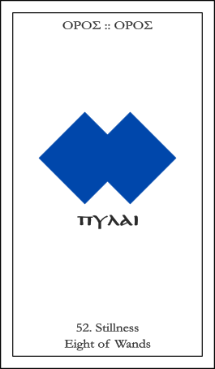 

+ [ΠΥΛΑΙ](#ρυθμοι) = (Plural of πύλη) gates, house door, entrance, orifice, mountain pass, narrow straits.
+ [I Ching](#the-alchemical-structure-of-the-i-ching): 100:100 52. Stillness / Stillness
  + judgment: Keep your back still so that you no longer feel your body. You go into your courtyard 
    and do not see your people. No blame.
  + image: Don't let your thoughts go beyond your situation.
  + alchemy: V. The Pilgrimage to The Inner Shrine - 2\. Identify
+ Tarot: Eight ♣/Wands
  + upright: rapid action, movement, quick decisions, air travel.
  + reversed: waiting, slowdowns, delays, frustration.
+ The Wanderer's Oracle: Mountain ‖ Mountain
  + situation: The Wanderer has reached the top of the mountain.
  + admonition: Savor the moment and enjoy the view. Soon, you must make the descent while you still have 
    time to return safely.
+ Bible: Revelation 18 - The Fall of Babylon
+ Additional Concepts: 
  + "Just drive, she said"
  + Stillness in action - Action in stillness
  + Engage!
  + [The Battle of Thermopylae](https://en.wikipedia.org/wiki/Battle_of_Thermopylae)
  + The Beauty of Holiness
  + Color: <font color="#00D9EA">███ Bright Turquoise ███</font> (#00D9EA)

---

<div style="page-break-after: always"></div>

---

#### `ΡΑΒΔΟΣ

▲ΟΡΟΣ :: ΒΡΟΝΤΗ▼

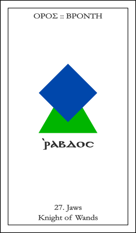 

+ [\`ΡΑΒΔΟΣ](#ρυθμοι) = A rod, wand. A magic wand as that of Circe, or that with which Athena touched Odysseus to 
  restore his youthful appearance, or that with which Hermes overpowers the senses of man, or that with 
  which Hades rules the ghosts. A staff of office. The wand borne by the ῥαψῳδός. A rod for chastisement, 
  or riding-switch. A shepherd's staff or crook. A measuring-rod.
+ [I Ching](#the-alchemical-structure-of-the-i-ching): 100:001 27. Jaws / The Corners of the Mouth
  + judgment: To keep going brings good fortune. Pay heed to providing nourishment and to what you seek 
    to fill your mouth with.
  + image: Be careful of your words and temperate in eating and drinking.
  + alchemy: II. The Priesthood of the Flame - 12\. Replicate/Teach
+ Tarot: Knight ♣/Wands
  + upright: energy, passion, adventure, impulsiveness, action, adventure, fearlessness.
  + reversed: recklessness, haste.
+ The Wanderer's Oracle: Mountain ‖ Quake
  + situation: While on the mountain path, the Wanderer feels the ground tremble in a quake. Rocks dislodge 
    into the path before them and behind.
  + admonition: Don't go down the mountain without a fight! Steel your nerves and make it a day to be 
    remembered. 
+ Greek Myth: The Labors of Heracles - 12\. Cerberus
  + mode: initiation in the Eleusinian Mysteries and a journey
  + results: nice doggie!
  + comment: Considering where we started out, am I able to now say "Better a Dead Dog than a Live Lion"? Ahem! But what are we to make
    of yet a third version of the Underworld Journey? What this time? This time it's the lifting of the conscious self out of the 
    chair of forgetfulness. Who are you, really? When you find out, you'll know why it took all these steps to get you ready for
    the answer. But, please note, if you haven't relinquished all possessing, nothing is getting you out of that chair. Remember to
    pack those doggie treats! Once you reach this point, you'll be in position to help others in their own Underworld Journeys. Oh!
    and by the way-- Here be Dragons!
+ Bible: Genesis 3:8-21 - The Curse, God clothes mankind with skins
+ Additional Concepts: 
  + "… and 99 percent perspiration"
  + Here comes the pitch
  + Enthusiasm
  + Spare the rod…
  + *Let it be*
  + *Just do it!*
  + "The White Snake" (Grimm's Fairy Tales 1st ed. Volume I #17);
    "The Singing Bone" (Grimm's Fairy Tales 1st ed. Volume I #28)
  + Color: <font color="#00E1C9">███ Robin's Egg Blue ███</font> (#00E1C9)

---

<div style="page-break-after: always"></div>

---

#### `ΡΑΨΩΙΔΟΣ

▲ΟΡΟΣ▼ 

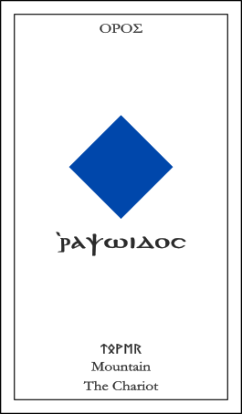 

+ [\`ΡΑΨΩΙΔΟΣ](#ρυθμοι) = A reciter of Epic poems, sometimes applied to the bard who recited his own poem, as to Hesiod, 
  but usually of professional reciters, especially of the poems of Homer, etc. Also, ironically, of the 
  Sphinx who chanted her riddle. 'The term rhapsode is derived from rhapsōidein (ῥαψῳδεῖν), meaning "to 
  sew songs together". This word illustrates how the oral epic poet, or rhapsode, would build a repertoire 
  of diverse myths, tales and jokes to include in the content of the epic poem. Thus it was possible, 
  through experience and improvisatory skills, for him to shift the content of the epos according to the 
  preferred taste of a specific location's audience. However, the outer framework of the epic would remain 
  virtually the same in every "singing", thus securing the projection of underlying themes such as of morality 
  or honour. The performance of epic poetry was called in classical Greek rhapsōidia (ῥαψῳδία), and its 
  performer rhapsōidos.' [wikipedia](https://en.wikipedia.org/wiki/Rhapsode)
+ [I Ching](#the-alchemical-structure-of-the-i-ching): 100 Mountain (Stillness)
  + trigram: Existence ... brings [all things] to their various *identities* in the sign of Stillness.
    Related: mountain; bypath; little stones; openings; doors; fruits; seeds; eunuchs; watchmen; fingers; 
    dog; rat; black-billed birds; firm, gnarled trees.
  + alchemy: VII. The Golden Lampstands - G#=8/7 (equivalent to 12\. Replicate/Teach)
+ Tarot: The Chariot
  + upright: direction, control, willpower.
  + reversed: lack of control, lack of direction. 
+ Rune: ᛏ [Tiwaz/Tower](#αινιγματα)  
  + poem: "Tower towers o'er the town, telling of the king's renown."
  + keywords: justice, order, balance, duty, restraint, Tyr, the North Star, nobility
+ Systems Theory:
  + prediction 
  + analysis
  + the faculty of choice (among alternatives presented)
+ Additional Concepts: 
  + "That's my story and I'm sticking to it!"
  + Captain Jean-Luc Picard (STTNG)
  + Jupiter (Astrology)
  + The one who infers causality and stitches together the story of the self (mental faculty)
  + Color: <font color="#00EDFF">███ Cyan ███</font> (#00EDFF)

---

<div style="page-break-after: always"></div>

---

#### `ΡΥΘΜΟΣ

▲ΟΡΟΣ :: ΑΣΤΡΑΠΗ▼

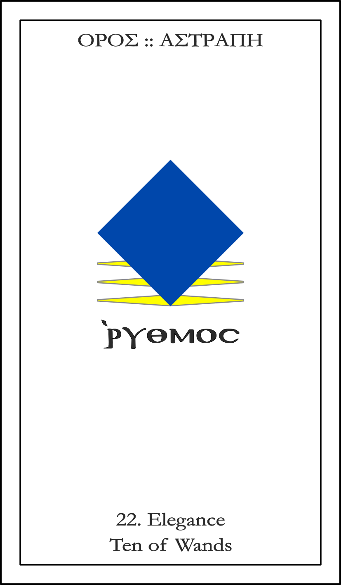 

+ [\`ΡΥΘΜΟΣ](#ρυθμοι) = Any regular recurring motion: measured motion, time, whether in sound or motion; rhythm, 
  opp. μέτρον and ἁρμονία; of Prose rhythm. Special phrases: in time, of dancing, marching, etc., respire 
  regularly, keep time, play in quicker time, pl., paces. Measure, proportion or symmetry of parts, at 
  rest as well as in motion. Generally, proportion, arrangement, order. State or condition of anything, 
  Temper, disposition. Form, shape of a thing, the form or shape of the letters, of the shape of a cup, 
  of a breastplate, so of the natural features of a country; structure of a substance. Manner, fashion 
  of a thing.
+ [I Ching](#the-alchemical-structure-of-the-i-ching): 100:101 22. Elegance / Grace
  + judgment: Success is possible. In small matters it is favorable to undertake something.
  + image: Clear up present affairs with grace. But don't decide controversial issues this way.
  + alchemy: II. The Priesthood of the Flame - 6\. (Re)Arrange
+ Tarot: Ten ♣/Wands
  + upright: accomplishment, responsibility, burden.
  + reversed: inability to delegate, overstressed, burnt out.
+ The Wanderer's Oracle: Mountain ‖ Light
  + situation: The Wanderer sees their mountain peak destination catch the last rays of the setting sun.
  + admonition: Consider your goal. Who will be rewarded for your attainment? Grace is when cutting corners 
    enhances beauty.
+ Greek Myth: The Labors of Heracles - 6\. The Stymphalian Birds
  + mode: Heracles can't reach the birds, so Athena gives him a rattle that causes them to fly away or 
    to within range of his poisoned arrows
  + results: the birds are gone, at least for awhile
  + comment: To eliminate those troubling thoughts, anger, and desires that befoul your ΨΥΧΗ, and disrupt 
    your development, will take patience, discipline, and a novel approach-- they must be flushed out of 
    hiding through introspection, then destroyed, or even just let go for the time being.
+ Bible: Genesis 2:18-20 - Man names the beasts, but none are a suitable companion
+ Additional Concepts: 
  + Oversight
  + Lucid beauty
  + ΠΙΣΤΙΣ = persuasion, i.e. to become convinced (opp. to "faith" as this word is normally understood and translated)
  + The burden of proof
  + The elegant solution removes difficulty
  + Color: <font color="#55EDAA">███ Downy ███</font> (#55EDAA)

---

<div style="page-break-after: always"></div>

---

#### ΣΘΕΝΩ

▲ΛΙΜΝΗ :: ΒΡΟΝΤΗ▼

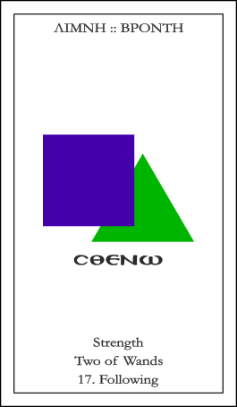 

+ [ΣΘΕΝΩ](#ρυθμοι) = In Greek mythology, Euryale (Εὐρυάλη, literally 'far-roaming') and Stheno (Σθενώ, literally
  "forceful") were two of the three Gorgons, including Medusa, sisters who were able to turn anyone 
  who looked at them to stone.
+ [I Ching](#the-alchemical-structure-of-the-i-ching): 011:001 17. Following / Following
  + judgment: Supreme success is possible. To keep going is advantageous. No blame.
  + image: At nightfall, go indoors to rest and recuperate.
  + alchemy: II. The Priesthood of the Flame - 1\. Sense/Detect
+ Tarot: Two ♣/Wands
  + upright: planning, decisions, discovery.
  + reversed: playing it safe, bad planning, lack of planning.
+ Tarot: Strength
  + upright: strength, bravery, courage, persuasion, influence, focus.
  + reversed: self doubt, weakness, insecurity.
+ The Wanderer's Oracle: Lake ‖ Thunder
  + situation: The Wanderer contemplates the quiet solitude of a clear, blue lake, undisturbed by the thunder 
    that rumbles all about them.
  + admonition: Cultivate stillness and introspection. Courage consists in your acceptance of self and 
    circumstance.
+ Greek Myth: The Labors of Heracles - 1\. The Nemean Lion
  + mode: bare hands
  + results: Heracles gains an invulnerable cloak
  + comment: The first step in the death and rebirth of the ΨΥΧΗ (Psyche) is purely an act of bare will
    to give up the ΨΥΧΗ as it currently exists. And it must be done without reservation and without artifice.
+ Bible: Genesis 2:4b-6 - Before there was rain, or vegetation, or mankind...
+ Additional Concepts: 
  + Make the right decision in Godly Fear
  + "To master others is force; to master yourself is power"
  + Lilith
  + What motivates you?
  + "Believe and you will find your way"
  + Manipura Chakra ("jewel city", navel)
  + The Black Dragon
  + "Little Brother and Little Sister" (Grimm's Fairy Tales 1st ed. Volume I #11)
  + The Initiatrix into the Mysteries of the Grail
  + Color: <font color="#805B56">███ Russet ███</font> (#805B56)

---

<div style="page-break-after: always"></div>

---

#### ΣΤΕΦΑΝΟΣ

▲ΛΙΜΝΗ :: ΑΣΤΡΑΠΗ▼

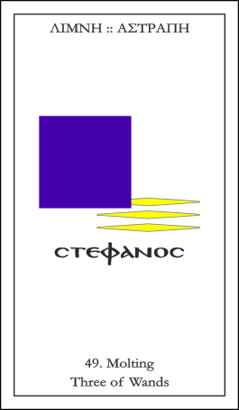 

+ [ΣΤΕΦΑΝΟΣ](#ρυθμοι) = That which surrounds or encompasses. A crown, wreath, chaplet. The crown of victory at 
  the public games. An honorary wreath or crown, frequently worked in gold, awarded for public services 
  in war or peace. A crown of glory, honour. A crown as a badge of office.
+ [I Ching](#the-alchemical-structure-of-the-i-ching): 011:101 49. Molting / Revolution (Molting)
  + judgment: On your own day you are believed. Supreme success is possible; it is advantageous to keep 
    going. Remorse disappears.
  + image: Set the calendar in order and make the seasons clear.
  + alchemy: IV. The Dragon's Hoard - G#=8/7 (equivalent to 12\. Replicate/Teach)
+ Tarot: Three ♣/Wands
  + upright: foresight, looking ahead, expansion, growth.
  + reversed: playing small, lack of foresight, unexpected delays.
+ The Wanderer's Oracle: Lake ‖ Light
  + situation: Roused from sleep, the Wanderer opens their eyes and sees the surface of a lake 
    catch and reflect the first light of dawn.
  + admonition: Anticipate what is just now breaking forth. "The game is afoot", so prepare now in order 
    to stay one step ahead. Your attitude affects your outcome. Your beginning determines your end.
+ Bible: John 11:45-53 - Because he raised Lazarus, Jesus seals his own death
+ Additional Concepts: 
  + Discernment
  + "You say you want a revolution? Well, you know…"
  + et lux perpetua luceat eis
  + Knowing Good & Evil = knowing that things could be different
  + Necessity is the Mother of Invention
  + 49 is 7x7 = the perfection of 7 (which is actually Hexagram 50)
  + the Magical Hat
  + "Silphium (also known as laserwort or laser; Ancient Greek: σίλφιον, sílphion) is an unidentified plant 
    that was used in classical antiquity as a seasoning, perfume, aphrodisiac, and medicine." 
    [Silphium](https://en.wikipedia.org/wiki/Silphium)
  + "Bring me my Chariot of fire!" (Blake's Jerusalem 12)
  + Color: <font color="#FF4F72">███ Wild Watermelon ███</font> (#FF4F72)

---

<div style="page-break-after: always"></div>

---

#### ΣΤΥΞ

▲ΛΙΜΝΗ▼

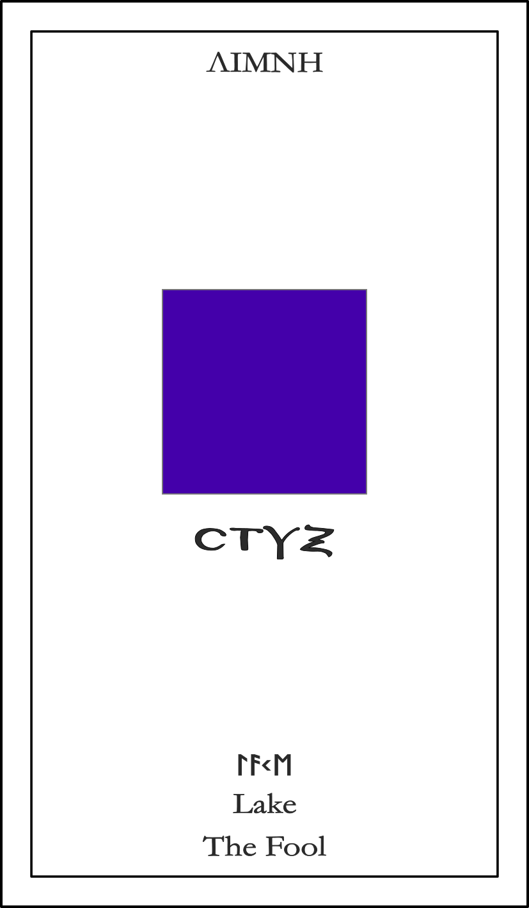 

+ [ΣΤΥΞ](#ρυθμοι) = The Styx, i.e. the Hateful, also the nymph of this river. A well of fatal coldness in Arcadia.
  Piercing chill, as of frost.
+ [I Ching](#the-alchemical-structure-of-the-i-ching): 011 Lake (The Joyous)
  + trigram: Existence ... gives [all things] *fulfillment* in the trigram of the Joyous.
  + related: lake; youngest daughter; sorceress; mouth; tongue; smashing; breaking apart; dropping off; 
    bursting open; hard, salty soil; concubine; sheep
  + alchemy: VII. The Golden Lampstands - G=7/7 (equivalent to 11\. Maintain/Improve)
+ Tarot: The Fool
  + upright: innocence, new beginnings, spontaneity, free spirit.
  + reversed: recklessness, holding back, risk-taking.
+ Rune: ᛚ [Laguz/Lake](#αινιγματα)  
  + poem: "Lake of languid, liquid skies; in your depths the stars arise."
  + keywords: potential, substance, the Well of Wyrd
+ Systems Theory:
  + the system's creative and memory faculties
  + pattern recognition and creation
  + presentation (the "inner" faculties)
+ Additional Concepts: 
  + The Haunted Mere (vide Grendel's Mother) 
  + You got potential!
  + Saturn (Astrology)
  + Mavronéri is a river identified with the River Styx of Greek mythology according to Hesiod's description 
    in Theogony. It is located near Nonakris in the Aroania Mountains of Achaia on the Peloponnesian peninsula. 
    Its waters contain a significant amount of Calicheamicin, a dangerous compound produced by bacteria
  + Ship's Doctor Beverly Crusher (STTNG; Note: this character is not properly developed in this story line)
  + The Magic Mirror which selectively (re)arranges and relates, stores and recalls (current and past) 
    "experiences", and in which the self can see itself and the κόσμος (cosmos) (mental faculty)
  + "Hansel and Gretel"  (Grimm's Fairy Tales 1st ed. Volume 1 #15)
  + ἄνδρα μοι ἔννεπε, μοῦσα (Tell me of the man, oh Muse...)
  + Color: <font color="#FF00AB">███ Magenta ███</font> (#FF00AB)

---

<div style="page-break-after: always"></div>

---

#### ΤΕΥΧΟΣ

▲\`ΥΕΤΟΣ▼ 

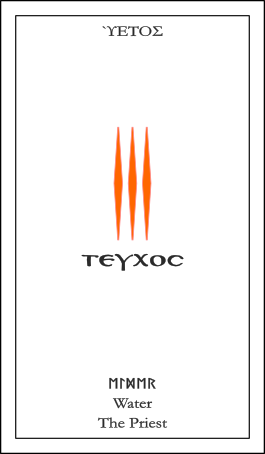 

+ [ΤΕΥΧΟΣ](#ρυθμοι) = A tool, implement—but mostly in plural (τεύχεα) as implements of war (armor and arms), also the
  gear of a ship (oars and the like). In Tragedians (rarely in Prose) a vessel of any kind, e.g. 
  bathing-tub, cinerary urn, balloting-urn, vase for libations, vase or ewer for water, cup, amphora,
  scent-pot, matula, pot or jar, chests, meal-barrel, bee-hive, or capsule of a poppy. In medicine, of the
  vessels of the body, also, the human frame, body, as holding the intestines. A case for holding papyrus 
  rolls, roll of writing-material.
+ [I Ching](#the-alchemical-structure-of-the-i-ching): 010 Water (The Abyss)
  + trigram: Existence ... *toils* in the sign of the Abysmal; Related: water; ditches; ambush; bending; 
    straightening out; bow; wheel; men-- melancholy, with sick hearts, with earache; blood sign; red; 
    horses-- with beautiful backs, with wild courage, which let their heads hang, with thin hoofs, which 
    stumble; chariots with many defects; penetration; moon; thieves; firm trees that have much pith.
  + alchemy: VII. The Golden Lampstands - B=2/7 (equivalent to 3\.Signal/Command)
+ Tarot: The Priest (Hierophant)
  + upright: spiritual wisdom, religious beliefs, conformity, traditions, institutions, morality, ethics. 
  + reversed: rebellion, subversiveness, challenging the status quo.
+ Rune: ᛖ [Ehwaz/Elder](#αινιγματα)  
  + poem: "Elder, I dare tell a riddle- magic words lie in the middle."
  + keywords: thought, language, speech, reason, communication, concepts, ideas
+ Systems Theory:
  + communication (within the system and with similar systems of which it is a sub-system)
  + categorization and refinement of perceptual information
  + contributes to indexing of information (for retrieval by memory faculties)
  + causal inference (logic) in systems which can learn or plan
+ Additional Concepts: 
  + Black Warrior (North)
  + the Raven
  + Mercury (Astrology)
  + Chief Engineer Geordi La Forge and Chief Operations Officer Data (STTNG)
  + The twins who reason and design, speak and name for the self (mental faculty)
  + Color: <font color="#0047AB">███ Blue ███</font> (#0047AB)

---

<div style="page-break-after: always"></div>

---

#### ΤΟΞΟΝ

▲\`ΥΕΤΟΣ :: ΑΣΤΡΑΠΗ▼

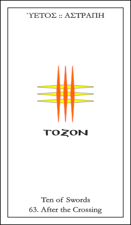 

+ [ΤΟΞΟΝ](#ρυθμοι) = A bow. In plural, bow and arrows.
+ [I Ching](#the-alchemical-structure-of-the-i-ching): 010:101 63. After the Crossing / After Completion
  + judgment: Success in small matters is possible. To keep going is advantageous. At the beginning 
    there is good fortune, at the end there is disorder.
  + image: Take thought of misfortune and arm yourself against it in advance.
  + alchemy: VI. The Primal Ones - G=7/7 (equivalent to 11\. Improve)
+ Tarot: Ten ♠/Swords
  + upright: failure, collapse, defeat, deep wounds, betrayal, loss, crisis, painful endings.
  + reversed: can't get any worse, can only get better, inevitability. 
+ The Wanderer's Oracle: Rain Clouds ‖ Light
  + situation: A sun shower--the Wanderer is bathed in bright sunlight, even as it continues to rain on 
    them. (kitsune no yomeiri 狐の嫁入り; "the fox's wedding")
  + admonition: Enjoy this brief moment of clarity, despite the rain. Were you able to see a rainbow?
+ Bible: Genesis 1:1b - ...God created...
+ Additional Concepts: 
  + "What's the worst that can happen?"
  + "Got it!... What was the part in the middle again?"
  + Become the target
  + You already know the answer
  + The Golden Arrow of Abaris the Hyperborean
  + Color: <font color="#4D7978">███ Cutty Sark ███</font> (#4D7978)

---

<div style="page-break-after: always"></div>

---

#### ΤΥΜΠΑΝΟΝ

▲\`ΥΕΤΟΣ :: ΒΡΟΝΤΗ▼

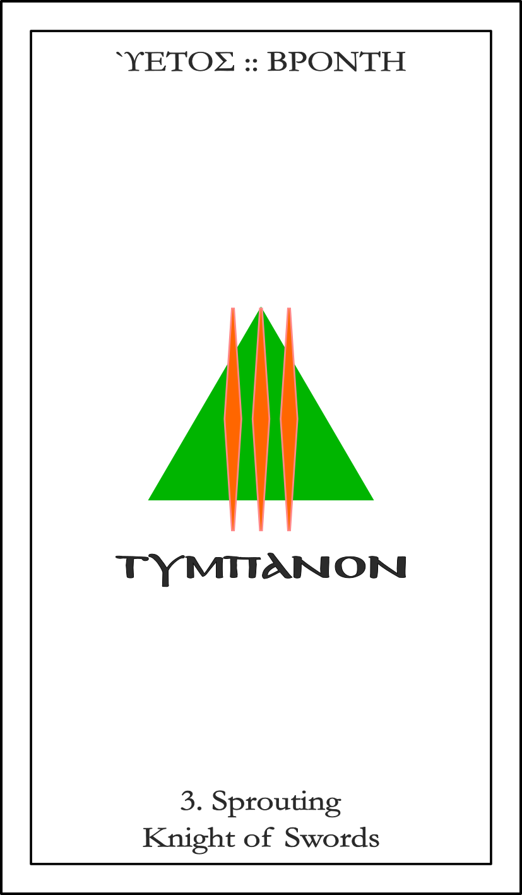 

+ [ΤΥΜΠΑΝΟΝ](#ρυθμοι) = A kettledrum, such as was used especially in the worship of the Mother Goddess and Dionysus.
+ [I Ching](#the-alchemical-structure-of-the-i-ching): 010:001 3. Sprouting / Difficulty at the Beginning
  + judgment: Supreme success is possible; it is advantageous to keep going. Nothing [new] should be 
    undertaken. It advantageous to appoint helpers.
  + image: Bring order out of confusion.
  + alchemy: I. The Path of Destiny - 1\. Sense/Detect
+ Tarot: Knight ♠/Swords
  + upright: action-oriented, impulsive, defending beliefs, driven, fast-thinking
  + reversed: unfocused, no direction, disregarding consequences, unpredictability
+ The Wanderer's Oracle: Rain Clouds ‖ Thunder
  + situation: The Wanderer hears thunder boom in the rain clouds which surround them, but where, and 
    whether, lightning will strike is not yet clear.
  + admonition: Be alert and carefully monitor the signs to determine where the storm front is going. 
    You'll have to act quickly and decisively once you know, and you can forget about second chances.
+ Greek Myth: The Odyssey - 1\. The Cave
  + overview: After the sack of the Kikonians the sailors wouldn't leave quickly, so they barely escaped. 
    A storm takes them to the Lotus Eaters and more sailors are lost there. Then they come to the cave 
    of the Cyclops.
  + challenges: Three things blight the voyage right off, the last being almost fatal to Odysseus himself. 
    They become prisoners of the cyclops Polyphemus, who is son of Poseidon and a man-eating brute.
    Nonetheless, by a clever series of ruses Odysseus manages to escape with his men... 
  + result: ...but he can't resist bragging, once he is out of harm's way. Polyphemus, knowing his name, 
    curses him by Poseidon to never reach Ithaka. No trick of his will, ultimately, get him there. Yet 
    without employing his tricks, he cannot overcome his fate.
  + comment: You gotta say one thing for your boy Odysseus-- he's crafty! But, although he may not know 
    it yet, he's gonna need help, and will be stripped bare, before he gets where he wants to be.
+ Bible: Genesis 1:2a - The Earth was without form and void, and darkness was upon the face of the deep
+ Additional Concepts: 
  + Good judgment
  + Come to a conclusion
  + March to the beat of a different drummer
  + Become aware of the true ends of your desires
  + The Fruit of the Tree of Knowledge
  + The Initiator into the Path
  + "Bring me my Arrows of desire:" (Blake's Jerusalem 10)
  + "Beat to quarters!"
  + Color: <font color="#006C72">███ Mosque ███</font> (#006C72)

---

<div style="page-break-after: always"></div>

---


#### \`ΥΔΡΑ

▲ΒΡΟΝΤΗ▼

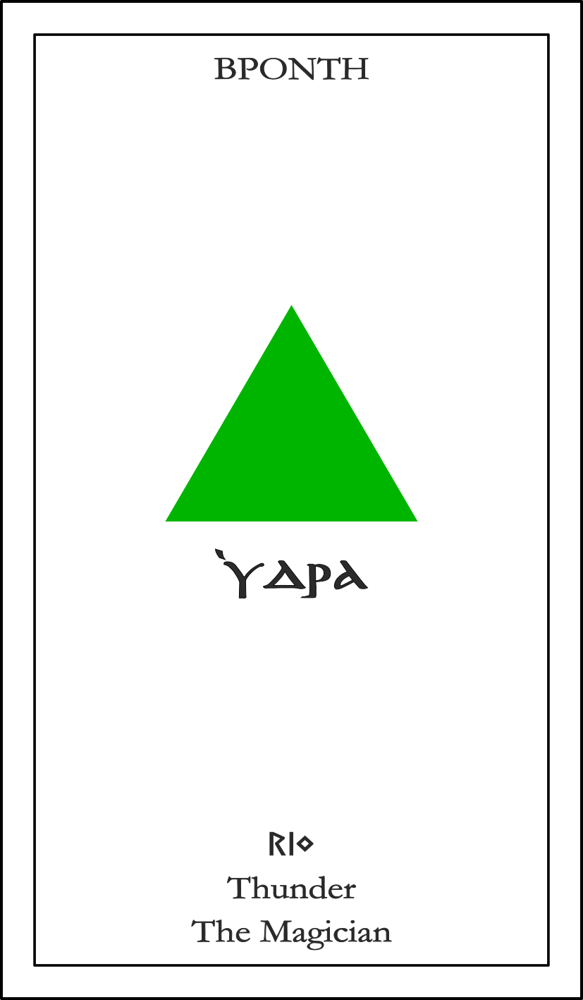 

+ [\`ΥΔΡΑ](#ρυθμοι) = A water-serpent, but especially the Lernaean hydra. Ὕδραν τέμνειν ("to cut the hydra") = 
  proverbially of labour in vain, because two heads sprang up for every one which was cut off.
+ [I Ching](#the-alchemical-structure-of-the-i-ching): 001 Thunder (The Arousing)
  + trigram: Existence *comes forth* in the trigram of the Arousing. Related: thunder; dragon; dark yellow;
    spreading out; a great road; eldest son; decisive; vehement; green, young bamboo; reed; rush; horses-- 
    which neigh well, with white hind legs, which gallop, with a star on the forehead; pod-bearing, useful 
    plants; the strong, anything that grows luxuriantly.
  + alchemy: VII. The Golden Lampstands - C=4/7 (equivalent to 6.(Re)Arrange)
+ Tarot: The Magician
  + upright: willpower, creation, manifestation, resourcefulness
  + reversed: trickery, illusions, out of touch, manipulation, untapped talents
+ Rune: ᛜ [I**ng**waz/Ri**ng**](#αινιγματα)  
  + poem: "Ring of toadstools on the grass, sprouting where the Fairies pass."
  + keywords: prolific, fertile, fecund, adaptable, wild, chaotic, the Green Man, sexuality, creativity, Frey (Ing)
+ Systems Theory:
  + the automatic stimulus/inhibition responses of the system
  + in particular, the means by which the system initiates a process of transition to another state
  + this automatic set of responses is alterable (trainable) in systems which learn or plan
+ Additional Concepts: 
  + Azure Dragon of the East
  + Krishna
  + Mars (Astrology) 
  + First Officer William Riker (STTNG)
  + The one who calls the self to act and react (mental faculty)
  + Color: <font color="#00B500">███ Forest Green ███</font> (#00B500)

---
<div style="page-break-after: always"></div>

---

#### `ΥΜΝΟΣ

▲ΒΡΟΝΤΗ :: ΒΡΟΝΤΗ▼

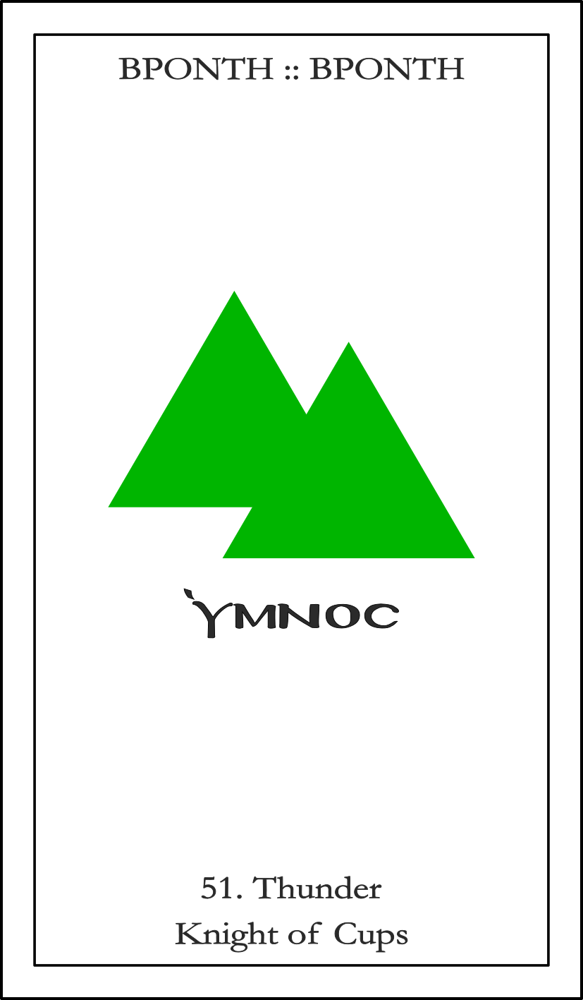 

+ [\`ΥΜΝΟΣ](#ρυθμοι) = A hymn, ode, in praise of gods or heroes.
+ [I Ching](#the-alchemical-structure-of-the-i-ching): 001:001 51. Thunder / The Arousing (Shock)
  + judgment: Success is possible. Shock comes— boom, boom! Laughing follows— ha, ha! The shock terrifies 
    for a hundred miles, but you don't let the sacrificial spoon and chalice fall.
  + image: In fear and trembling set your life in order and examine yourself.
  + alchemy: V. The Pilgrimage to The Inner Shrine - 1\. Sense/Detect
+ Tarot: Knight ♥/Cups
  + upright: charm, following the heart, idealist, romantic.
  + reversed: moodiness, disappointment, overactive imagination, unrealistic, jealous.
+ The Wanderer's Oracle: Thunder ‖ Quake
  + situation: The Wanderer hears several loud claps of thunder and feels an earthquake. Heaven and 
    earth are trembling, all at once!
  + admonition: Are we awake now? Don't panic! But there's no time to deliberate, so act quickly.
+ Bible: Revelation 17 - The Great Whore and the Beast
+ Additional Concepts: 
  + Shock and Awe
  + Fools Rush Inn
  + "When in trouble or in doubt, run in circles, scream and shout!"
  + "Loyal Godfather Sparrow"  (Grimm's Fairy Tales 1st ed. Volume 1 #58)
  + Color: <font color="#80DA80">███ Pastel Green ███</font> (#80DA80)

---

<div style="page-break-after: always"></div>

---

#### `ΥΠΕΡΒΟΡΕΟΙ

▲ΒΡΟΝΤΗ :: ΑΣΤΡΑΠΗ▼

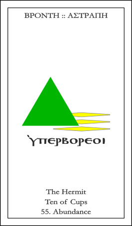 

+ [\`ΥΠΕΡΒΟΡΕΟΙ](#ρυθμοι) = The Hyperboreans, a people supposed to live in the extreme north.
+ [I Ching](#the-alchemical-structure-of-the-i-ching): 001:101 55\. Abundance / Abundance (Fullness)
  + judgment: Success is possible. The ruler attains abundance. Be not sad; be like the sun at midday.
  + image: In this way decide lawsuits and carry out punishments.
  + alchemy: V. The Pilgrimage to The Inner Shrine - 5\. Inter-Communicate
+ Tarot:  Ten ♥/Cups
  + upright: fulfillment, divine love, blissful relationships, harmony, alignment
  + reversed: shattered dreams, broken family, disharmony, disconnection, misaligned values, struggling 
    relationships
+ Tarot: The Hermit
  + upright: soul-searching, introspection, contemplation, search for truth, inner guidance.
  + reversed: loneliness, isolation, lost your way, withdrawal.
+ The Wanderer's oracle: Quake ‖ Light
  + situation: The Wanderer sees [earthquake lights](https://en.wikipedia.org/wiki/Earthquake_light) 
    and knows a large earthquake has happened or is about to happen.
  + admonition: Significant changes have taken place, or are about to. Duty must take precedence over desire. 
    Fulfill what is required of you without wishing things were different or that the responsibility belonged 
    to another.
+ Bible: Revelation 19:17-21 - The Beast and Its Armies Defeated
+ Additional Concepts: 
  + Lawn order
  + When enough is enough
  + Svadhishthana Chakra ("where the self is established", sexual)
  + Necromancer/Neuromancer (Uncle Bärchen)
  + Color: <font color="#55C800">███ Christi ███</font> (#55C800)

---

<div style="page-break-after: always"></div>

---

#### ΦΑΡΜΑΚΟΝ

▲ΑΥΡΑ▼

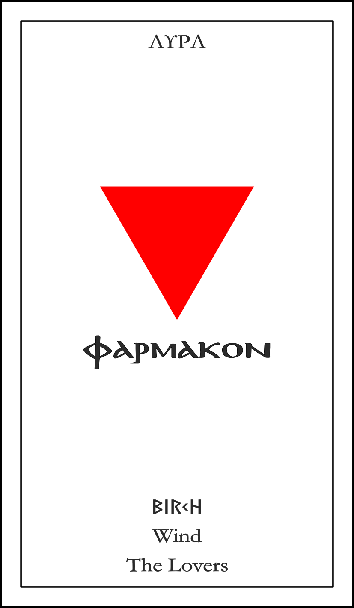 

+ [ΦΑΡΜΑΚΟΝ](#ρυθμοι) = A drug, whether healing or noxious. A healing remedy, medicine, in Homer mostly of those 
  applied outwardly. Also of potions, an enchanted potion, philtre: hence, charm, spell, poison. Generally, 
  remedy, cure.
+ [I Ching](#the-alchemical-structure-of-the-i-ching): 110 Wind/Wood (The Penetrating)
  + trigram: Existence ... brings all things to *completion* in the trigram of the Gentle. Related: wood;
    wind; eldest daughter; guideline; work; white; long; high; advance; retreat; undecided; odor; men-- 
    gray-haired, with broad foreheads, with much white in their eyes, those close to gain, that get 
    threefold value in the market; vehemence.
  + alchemy: VII. The Golden Lampstands - C=3/7 (equivalent to 4\. Audit/ACK)
+ Tarot: The Lovers
  + upright: partnership, harmony, love, union.
  + reversed: imbalance, one-sidedness, disharmony. 
+ Rune: ᛒ [Berkanan/Birch](#αινιγματα)  
  + poem: "Birch is bonny, blithe and green, ever first whose leaves are seen."
  + keywords: beginning, birth, youth, beauty, innocence, inexperience, the opener of the gates
+ Systems Theory:
  + the automatic positive and negative feedback characteristics of the system, or more simply, the desire 
    for pleasure and the avoidance of pain
  + a stored set of guidelines (characteristics, "shapes") which provide an estimate of the "health" of 
    the system
  + in systems which can plan or learn, these guidelines are alterable and are used to identify, evaluate 
    and select patterns and processes for their potential benefit or detriment to the system
+ Additional Concepts: 
  + Living Water
  + Eros
  + White Tiger of the West
  + Radha
  + Venus (Astrology)
  + Ship's Counsellor Deanna Troi (STTNG)
  + The one who calls forth the emotions, as the cynosure of what is desirable (and by contrast, undesirable) 
    to the self (mental faculty)
  + "Jorinda and Joringel"  (Grimm's Fairy Tales 1st ed. Volume 1 #69)
  + Color: <font color="#FF0000">███ Red ███</font> (#FF0000)

---

<div style="page-break-after: always"></div>

---

#### ΦΙΑΛΗ

▲ΑΥΡΑ :: ΑΣΤΡΑΠΗ▼

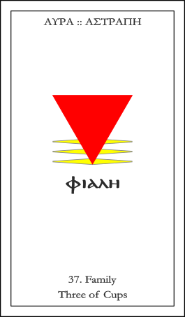 

+ [ΦΙΑΛΗ](#ρυθμοι) = A broad, flat bowl or saucer for drinking or pouring libations.
+ [I Ching](#the-alchemical-structure-of-the-i-ching): 110:101 37. Family / The Family
  + judgment: The perseverance of a care-giver is advantageous.
  + image: Have substance in your words and duration in your way of life.
  + alchemy: III. Phoenix and Dragon - 5\. Inter-Communicate
+ Tarot: Three ♥/Cups
  + upright: friendship, community, happiness, celebration, collaboration
  + reversed: overindulgence, gossip, isolation, "three's a crowd"
+ The Wanderer's Oracle: Wind ‖ Light
  + situation: The winds that blew during the day slacken as the evening light fades. The Wanderer makes 
    camp and prepares the evening meal.
  + admonition: Pour a libation of thanks for the blessings and beauty of the day, inviting 
    any companions to join with you.
+ Bible: 1 Kings 18:3-16 - Obadiah saves the prophets
+ Additional Concepts: 
  + "All my relations"
  + Family rules
  + "...but be filled with the Holy Spirit"
  + the Bee
  + The Muse of Prophecy
  + "In Englands green and pleasant Land." (Blake's Jerusalem 16)
  + Color: <font color="#FF3600">███ Scarlet ███</font> (#FF3600)

---

<div style="page-break-after: always"></div>

---

#### ΦΟΙΝΙΞ

▲ΑΥΡΑ :: ΒΡΟΝΤΗ▼

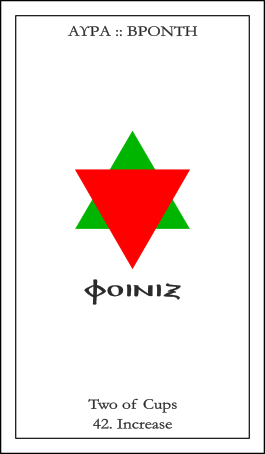 

+ [ΦΟΙΝΙΞ](#ρυθμοι) = The fabulous bird phoenix. The date-palm, *Phoenix dactylifera*. A palm-frond, as a badge of 
  victory. A date. A musical instrument, like a guitar, invented by the Phoenicians. Perfume prepared 
  from the fronds of the date-palm.
+ [I Ching](#the-alchemical-structure-of-the-i-ching): 110:001 42. Increase / Increase
  + judgment: It advantageous to undertake something. It advantageous to cross the big river.
  + image: If you see good, imitate it; if you have faults, rid yourself of them.
  + alchemy: III. Phoenix and Dragon - 2\. Identify
+ Tarot: Two ♥/Cups
  + upright: unity, harmonious partnership, mutual attraction, connection
  + reversed: imbalance, broken communication, tension, break-ups, disharmony, distrust
+ The Wanderer's Oracle: Wind ‖ Thunder
  + situation: The Wanderer sees swirling winds carry leaves aloft, while thunder clouds begin to rise all 
    around.
  + admonition: Become inspired by the winds, rise up like the clouds, and go quickly to claim the joy of 
    arrival at the destination you have chosen.
+ Bible: 1 Kings 17:2-7 - Elijah fed by ravens by the brook Cherith
+ Additional Concepts: 
  + Waxing
  + The Muse of Regeneration
  + Color: <font color="#BF2D00">███ Thunderbird ███</font> (#BF2D00)

---

<div style="page-break-after: always"></div>

---

#### ΧΑΛΚΟΣ

▲ΑΣΤΡΑΠΗ▼

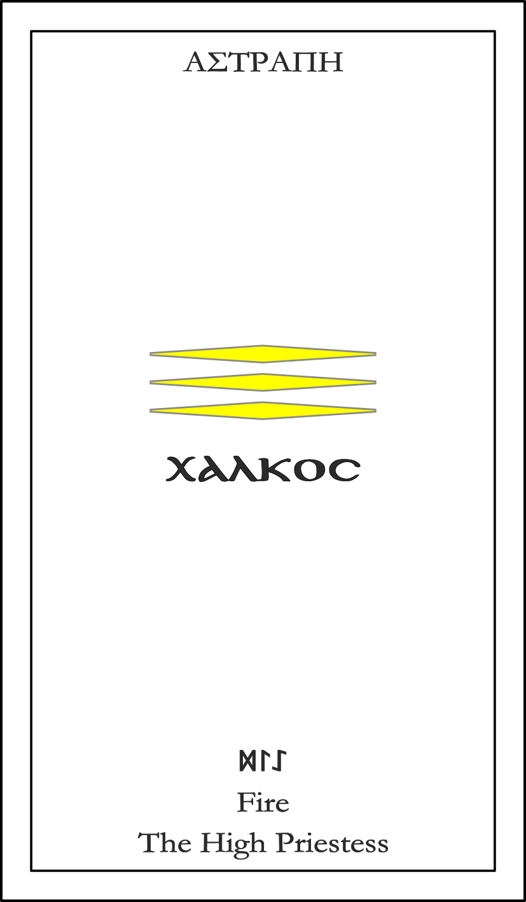 

+ [ΧΑΛΚΟΣ](#ρυθμοι) = Copper (alloyed with tin to form bronze, the usual meaning of the word in Homer and frequently
  in later writers). In Poets frequently used for anything made of metal, especially of offensive arms, 
  of a spear, a sword, a knife, an axe, a fish-hook, or of defensive arms, as the plates laid on a shield. 
  Of vessels, copper, cauldron, urn, a cinerary urn. A bronze mirror.
+ [I Ching](#the-alchemical-structure-of-the-i-ching): 101 Fire (The Clinging)
  + trigram: Existence ... causes existents to *perceive* one another in the trigram of the Clinging (light);
    Related: fire; sun; lightning; middle daughter; coats of mail; helmets; lances; weapons; men-- big-bellied;
    dryness; tortoise; crab; snail; mussel; hawkbill tortoise; trees which dry out in the upper part of 
    the trunk.
  + alchemy: VII. The Golden Lampstands - A=1/7 (equivalent to 1.Sense/Detect)
+ Tarot: The High Priestess
  + upright: intuition, sacred knowledge, divine feminine, subconscious mind, unconscious, inner voice
  + reversed: lack of center, lost inner voice, repressed feelings, secrets, withdrawal
+ Rune: ᛞ [Dagaz/Day](#αινιγματα)  
  + poem: "Day makes easy to perceive, all beneath the bright sky-eave."
  + keywords: awareness, knowledge, perception, clarity
+ Systems Theory:
  + the perceptual apparati of the system
  + pre-processing of information for pattern recognition and conceptualization faculties
  + first-tier alarm/avoidance faculty (reflex)
+ Additional Concepts: 
  + The Vermillion Bird of the South
  + It happens all the time--a cosmogony is substituted for an epistemology, although either is better 
    than a theogony, by god!
  + The Zodiac (Astrology)
  + Chief Security Officer Natasha "Tasha" Yar (STTNG)
  + The one who gathers and identifies "perceptions" (external and internal) and provides these as 
    useful information for the self (mental faculty)
  + Color: <font color="#FFED00">███ Yellow ███</font>

---

<div style="page-break-after: always"></div>

---

#### ΧΑΡΥΒΔΙΣ

▲ΑΣΤΡΑΠΗ :: ΒΡΟΝΤΗ▼

 

+ [ΧΑΡΥΒΔΙΣ](#ρυθμοι) = Charybdis, a dangerous whirlpool on the coast of Sicily, opposite the Italian rock Scylla.
+ [I Ching](#the-alchemical-structure-of-the-i-ching): 101:001 21. Taking a Bite / Biting Through
  + judgment: Success is possible. It is favorable to let justice be administered.
  + image: As ruler, make firm the laws through clearly defined penalties.
  + alchemy: II. The Priesthood of the Flame - 5\. Inter-Communicate
+ Tarot: Two ♠/Swords
  + upright: weighing up options, difficult choices, indecision, checkmate
  + reversed: lesser of two evils, no right choice, confusion, indecision, information overload
+ The Wanderer's Oracle: Lightning ‖ Thunder
  + situation: The Wanderer sees the lightning flash followed immediately by thunder; the storm is upon them.
  + admonition: Take whatever shelter you can find (not under a solitary tree, please)... even just the lowest 
    spot around you is better than nothing.
+ Greek Myth: The Labors of Heracles - 5\. The Augean Stables
  + mode: the menial task of cleansing, effected by re-routing two rivers
  + results: Heracles gets a share of the herd of immortal cattle, but not until he kills Augeas and puts 
    Augeas' son on the throne.
  + comment: Shift happens, but not before you deal with your shit, which includes the daily, menial tasks 
    of life.
+ Bible: Genesis 2:16-17 - God prohibits the fruit of the Tree of the Knowledge of Good and Evil
+ Additional Concepts: 
  + Look before you leap
  + But don't cut corners
  + Beware Hamlet's Dilemma
  + Take the lesser of two evils
  + "Because strait is the gate, and narrow is the way, which leadeth unto life, and few there be that find it." (Mt. 7:14)
  + Color: <font color="#80D100">███ Lima ███</font> (#80D100)

---

<div style="page-break-after: always"></div>

---

#### ΧΑΣΜΑ

▲ΑΣΤΡΑΠΗ :: ΑΣΤΡΑΠΗ▼  

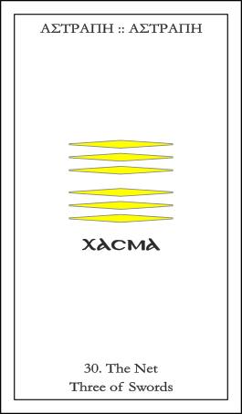 

+ [ΧΑΣΜΑ](#ρυθμοι) = A yawning chasm, gulf, χάσμα μέγα = Tartarus. An open, gaping mouth, as forming a helmet, or 
  of a yawning gulf. Generally, any wide opening.
+ [I Ching](#the-alchemical-structure-of-the-i-ching): 101:101 30\. The Net / The Clinging (Fire)
  + judgment: To keep going is advantageous; it brings success. Care of the cow brings good fortune.
  + image: By perpetuating this brightness, illumine the four quarters of the world.
  + alchemy: VI. The Primal Ones - A=1/7 (equivalent to 1\. Sense/Detect)
+ Tarot: Three ♠/Swords
  + upright: heartbreak, sorrow, suffering, grief
  + reversed: recovery, forgiveness, negativity, releasing pain, optimism
+ The Wanderer's oracle: Light ‖ Light
  + situation: The sun sets and the full moon rises. The Wanderer can journey the entire night.
  + admonition: Are you up to the challenge? Put aside weariness and take this opportunity. 
+ Bible: Exodus 3 - The Burning Bush
+ Additional Concepts: 
  + Jiutian Xuannü
  + Them's fightin' words! 
  + "Get it? Got it! Good!"
  + Grandmother Spider
  + Color: <span style="background-color: #2A2A2A;"> <font color="#FFF45D">███ Candy Corn ███</font> </span> (#FFF45D)

---

<div style="page-break-after: always"></div>

---

#### ΨΗΓΜΑ

▲ΟΥΡΑΝΟΣ :: ΒΡΟΝΤΗ▼

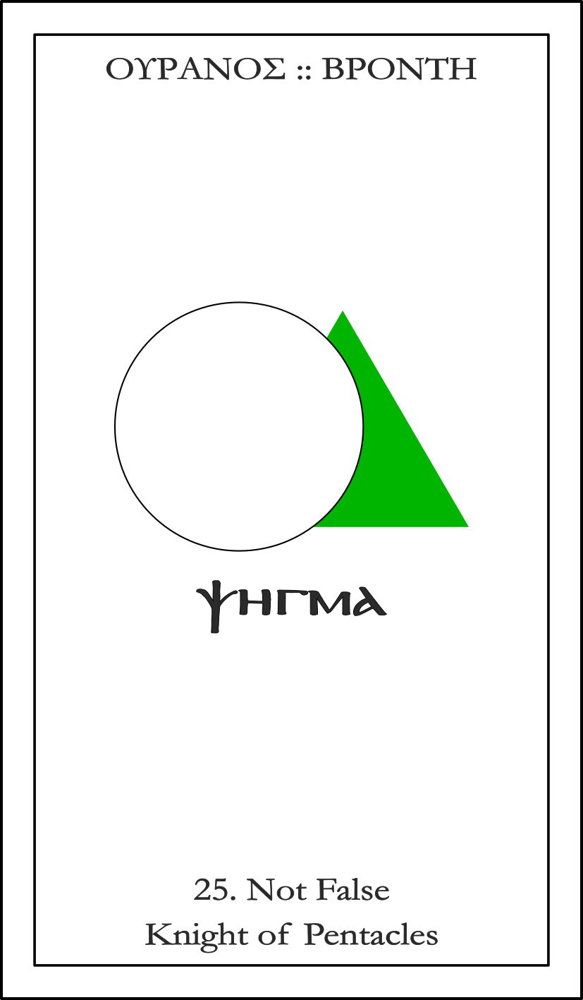 

+ [ΨΗΓΜΑ](#ρυθμοι) = That which is rubbed or scraped off, shavings, scrapings, chips. Used of gold-dust, dust and 
  ashes, wood, and motes in a sunbeam.
+ [I Ching](#the-alchemical-structure-of-the-i-ching): 111:001 25\. Not False / Innocence (The Unexpected)
  + judgment: Supreme success is possible. To keep going is advantageous. If someone is not as they should 
    be, they experience misfortune, and it is not advantageous for them to undertake anything.
  + image: As rulers, rich in virtue, and in harmony with the time, foster and nourish all beings.
  + alchemy: II. The Priesthood of the Flame - 9\. Execute/Process
+ Tarot: Knight ♦/Pentacles
  + upright: efficiency, hard work, responsibility
  + reversed: laziness, obsessiveness, work without reward, boredom, feeling stuck, perfectionism
+ The Wanderer's Oracle: Heaven ‖ Thunder
  + situation: The Wanderer sees the sky begin to clear and hears the thunder recede into the distance; 
    the storm has passed.
  + admonition: Your destination will be your reward for persistence. Make the most of this opportunity to cover 
    some distance and make up for lost time.
+ Greek Myth: The Labors of Heracles - 9\. The Belt of Hippolyta
  + mode: Heracles almost manages to get the Belt without violence or deceit, but it's not to be
  + results: None, or a tragic loss if you're willing to consider the potential blessing and cooperation 
    of the Strong Feminine principle
  + comment: What can we possibly say to a culture and a people that thinks the best approach to solving a 
    crisis is to declare war-- the War on Drugs, the War on Cancer... A gradual, nuanced approach that 
    requires careful cultivation? Nah, that's for sissies! But a word to the Wise-- Wisdom hath mixed Her 
    [ΟΙΝΟΣ](#οινος) (Wine)...
+ Bible: Genesis 2:24-25 - Man and Woman in the Garden, naked and unashamed
+ Additional Concepts: 
  + Spring training
  + "Such a nice boy!"
  + "All work and no play…"
  + You owe it to the world
  + the Boar
  + "Puss in Boots"  (Grimm's Fairy Tales 1st ed. Volume 1 #33)
  + "Among these dark Satanic Mills?" (Blake's Jerusalem 8)
  + Color: <font color="#B3E9B3">███ Celadon ███</font> (#B3E9B3)

---

<div style="page-break-after: always"></div>

---

#### ΨΗΦΟΣ

▲ΟΥΡΑΝΟΣ :: ΑΣΤΡΑΠΗ▼

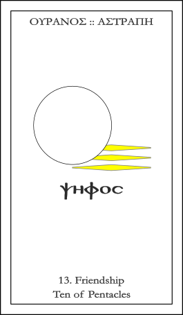 

+ [ΨΗΦΟΣ](#ρυθμοι) = A small round worn stone, pebble, a grain of sand, precious stone, gem, especially worn in 
  a ring, according to the various uses made of such pebbles: pebble used for reckoning, counter, cipher, 
  hence to reckon exactly or accurately, using ψῆφος itself for a cipher, number, (in plural) accounts, 
  calculators, in Magic the object on which the number is written. a pebble used for a draughts- or 
  chess-man, pebble used by jugglers, pebble used in divination, cube used in mosaic pavements, pebble 
  used in voting, hence, the vote itself, that which is carried by vote, a vote, a vote of condemnation,
  a vote of banishment, hence any resolve or decree, public opinion, Ἀθηνᾶς ψ. (calculus Minervae) = 
  proverbial phrase to express acquittal, when the votes were even, negligible quantity, cipher, place 
  of voting, tribunal, (metaphorically) influence.
+ [I Ching](#the-alchemical-structure-of-the-i-ching): 111:101 13\. Friendship / Fellowship
  + judgment: Fellowship With Others in the open- Success is possible. It advantageous to cross the 
    big river. To keep going is advantageous.
  + image: Organize the people and distinguish between things.
  + alchemy: I. The Path of Destiny, Part 2 - 9\. Execute/Process
+ Tarot: Ten ♦/Pentacles
  + upright: wealth, financial security, family, long-term success, contribution, legacy, culmination, inheritance
  + reversed: fleeting success, lack of stability, lack of resources, the dark side of wealth, financial loss
+ The Wanderer's Oracle: Heaven ‖ Light
  + situation: The Wanderer has made good progress under clear skies today. The sun has begun to descend 
    in the west.
  + admonition: Your destination is close, perhaps even in sight. One final push and you'll arrive.
+ Greek Myth: The Odyssey - 9\. The Beggar at the Palace
  + overview: With the general outline of a plan, Odysseus must "silently endure a host of indignities, submit 
    to men's violent acts" while he evaluates the characters of his servants and watches for the opportunity 
    to overcome the suitors.
  + challenges: Can he suffer at the hands of the ruffians and insolent maids? Will he find an opportunity to act?
  + result: Odysseus bears up, and the opportunity arises.
  + comment: Your boy Odysseus must carefully select who will get voted off the island. Which parts of his character
    will support him in his re-claimed identity, and which would like to see him fail?
+ Bible: Genesis 1:24-25 - The Creation, Day 6a: God creates beasts of the earth and cattle
+ Additional Concepts: 
  + Wealth management
  + Strength in numbers
  + Constructing the Philosopher's Stone
  + The Wish Fulfilling Gem (Cintāmaṇi)
  + "Simple Hans"  (Grimm's Fairy Tales 1st ed. Volume 1 #54)
  + Color: <span style="background-color: black;"><font color="#FFFBC4">███ Lemon Chiffon ███</font></span> (#FFFBC4)

---

<div style="page-break-after: always"></div>

---

#### ΨΥΧΗ

▲ΟΥΡΑΝΟΣ▼

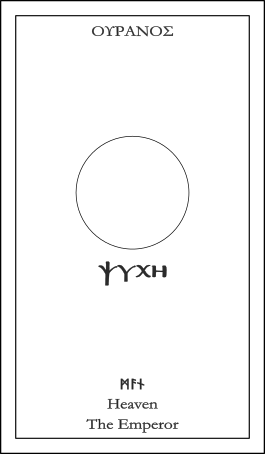 

+ [ΨΥΧΗ](#ρυθμοι) = Life. In Homer, a departed spirit or ghost. The immaterial and immortal soul. The conscious 
  self or personality as centre of emotions, desires, and affections. Also, a butterly or moth.
+ [I Ching](#the-alchemical-structure-of-the-i-ching): 111 Heaven (The Creative)
  + trigram: Existence ... *competes* in the trigram of the Creative; Related: heaven; round; prince;
    father; jade; metal; cold; ice; deep red; horses-- good, old, lean, and wild; tree fruit.
  + alchemy: VII. The Golden Lampstands - F=6/7 (equivalent to 9\. Execute/Run)
+ Tarot: The Emperor
  + upright: authority, structure, establishment, control, fatherhood
  + reversed: tyranny, rigidity, coldness, domination, inflexible
+ Rune: ᛗ [Mannaz/Man](#αινιγματα)  
  + poem: "Man is with twin nature's made: breath of God and dirt of spade."
  + keywords: competition and cooperation, union, joining, humankind, relationships
+ Systems Theory:
  + the system considered as a whole
  + control of the system generally and maintenance of the hierarchical relations among it sub-systems
  + identity aspects of the system (the characteristics of its stimulus/inhibition responses, 
    communication/conceptualization, and planning and learning, if present)
  + the three "masculine" aspects of the system considered together:
    + [`ΥΔΡΑ](#υδρα)
    + [ΤΕΥΧΟΣ](#τευχος)
    + [`ΡΑΨΩΙΔΟΣ](#ραψωιδος)
+ Additional Concepts: 
  + "Light as a feather; nothing in it; A strong man can't hold it more than a minute"
  + Shiva
  + Sun (Astrology)
  + Starfleet (STTNG)
  + The one who realizes and negotiates the place of the self within the various social hierarchies of 
    which it is part; also standing for the various *conscious* aspects of the self (mental faculty)
  + In the I Ching, Heaven often stands for those who exercise authority in the context of the question
  + Color: <!-- font color="#FFFFFF" -->◊ White ◊<!-- /font -->

---

<div style="page-break-after: always"></div>

---

#### ΩΓΥΓΙΗ

▲ΓΑΙΑ :: ΑΣΤΡΑΠΗ▼

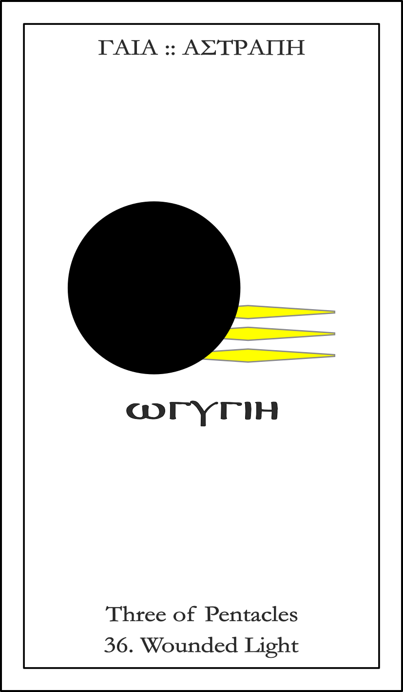 

+ [ΩΓΥΓΙΗ](#ρυθμοι) = Ogygia, a mythical island in the Mediterranean, the abode of Calypso.
+ [I Ching](#the-alchemical-structure-of-the-i-ching): 000:101 36. Wounded Light / Darkened Light
  + judgment: In adversity it is advantageous to persevere.
  + image: The light has sunk into the earth: live with the masses: veil your light, yet still shine.
  + alchemy: III. Phoenix and Dragon - 7\. (Re)Set
+ Tarot: Three ♦/Pentacles
  + upright: teamwork, collaboration, learning, building
  + reversed: lack of teamwork, disorganized, group conflict, working alone
+ The Wanderer's Oracle: Earth ‖ Light
  + situation: The sun has disappeared into the earth, and the moon rises. The Wanderer must make camp for 
    the night.
  + admonition: It is time to build a fire, swap stories, repair equipment and listen to the sounds of the 
    night. You might learn something if you listen closely.
+ Bible: 1 Kings 19:1-8 - Elijah journeys to Horeb the mount of God
+ Additional Concepts: 
  + Baba Yaga
  + Hey buddy, got a light? 
  + Camp Runamok
  + Color: <font color="#403B00">███ Madras ███</font> (#403B00)

---

<div style="page-break-after: always"></div>

---

#### ΩΟΝ

▲ΓΑΙΑ▼

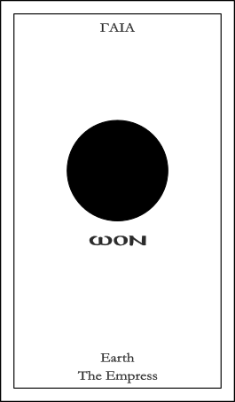 

+ [ΩΟΝ](#ρυθμοι) = Egg
+ [I Ching](#the-alchemical-structure-of-the-i-ching): 000 Earth (The Receptive)
  + trigram: Existence ... causes [all things] to *cooperate* with one another in the trigram of the Receptive;
    Related: earth; mother; cloth; kettle; frugality; level; a cow with a calf; a large wagon; form; the 
    multitude; a shaft; black soil.
  + alchemy: VII. The Golden Lampstands - E=5/7 (equivalent to 8\. (Re)Start/Boot)
+ Tarot: The Empress
  + upright: motherhood, femininity, beauty, nature, nurturing, abundance, fertility
  + reversed: dependence, smothering, emptiness, nosiness
+ Rune: ᛟ [Othala/Oak](#αινιγματα)  
  + poem: "Oak stands firm without a care, when old Winter rakes her hair."
  + keywords: native land, inheritance, culture, tradition, that which persists
+ Systems Theory:
  + the sub-systems which make up the system
  + physical aspects of the system (power sources, limitations, potentials)
  + (in some contexts) the means of replenishing the materials of which the system is composed (for example,
    eating, digesting, excreting)
  + the three "feminine" aspects of the system considered together:
    + [ΦΑΡΜΑΚΟΝ](#φαρμακον)
    + [ΧΑΛΚΟΣ](#χαλκος)
    + [ΣΤΥΞ](#στυξ)
+ Additional Concepts: 
  + "A box without hinges, key, or lid; Yet golden treasure inside is hid"
  + Prima Materia
  + Mother Goose
  + Cherchez la Femme
  + Parvati
  + Moon (Astrology)
  + The crew of the Enterprise, or the Enterprise itself (STTNG)
  + The one who realizes and negotiates the place of the self within the various physical contexts of which 
    it is part (including one's own body); also, the various *unconscious* aspects of the self (mental faculty)
  + In the I Ching, Earth often stands for those who are subject to authority in the context of the question
  + Color: <font color="#000000">███ Black ███</font> (#000000)

---

<div style="page-break-after: always"></div>

---

#### `ΩΡΑΙ

▲ΓΑΙΑ :: ΒΡΟΝΤΗ▼

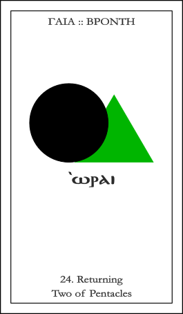 

+ [\`ΩΡΑΙ](#ρυθμοι) = (Plural of ὥρα) The Hours, keepers of heaven's cloudgate, and ministers of the gods, especially
  of Aphrodite, three in number, Eunomia (= good order), Dike (= custom, moral order), Eirene (= peace). 
  The Seasons, especially Springtime, or used of the Year generally.
+ [I Ching](#the-alchemical-structure-of-the-i-ching): 000:001 24. Returning / Return (Turning Point)
  + judgment: Success is possible. Going out and coming in are the natural rhythm. Friends come without 
    blame. To and fro goes the Way. On the seventh day comes the return. [Then] it [will be] advantageous 
    to have somewhere to go.
  + image: Close the passes at the Winter Solstice; No one must go about or travel.
  + alchemy: II. The Priesthood of the Flame - 7\. (Re)Set
+ Tarot: Two ♦/Pentacles
  + upright: balancing decisions, time management, prioritization, adaptability
  + reversed: over-committed, loss of balance, disorganized, overwhelmed
+ The Wanderer's Oracle: Earth ‖ Thunder
  + situation: The Wanderer is at rest in a shelter in the valley when they hear thunder; a storm has arrived.
  + admonition: Stay content in camp until the storm passes. Catch up on unfinished chores that can be 
    done in camp, or rest.
+ Greek Myth: The Labors of Heracles - 7\. The Cretan Bull
  + mode: capture and release, with no help from the Cretans who suffered from the Bull's rampages
  + results: the Bull was set loose to terrorize another area, and to be dealt with by another hero
  + comment: Are there aspects of your ΨΥΧΗ that, although actually shortcomings, are too cherished by 
    you that you don't really want to let them go? Get rid of them! But please don't just change the places, 
    and the people, which they harm. They won't really get gone, completely, until you're ready to make the 
    descent into the Labyrinth and find out the true nature of the Monster therein.
+ Bible: Genesis 2:21 (God puts Adam to sleep and takes a rib...)
+ Additional Concepts: 
  + Time management, but with rest and leisure as possibilities
  + "Verily, verily, I say unto you, except a corn of wheat fall into the ground and die, it abideth alone: 
    but if it die, it bringeth forth much fruit"
  + The instigator of ritual
  + Women's Mysteries
  + the Sow
  + Color: <font color="#003C00">███ Deep Fir ███</font> (#003C00)

---

<div style="page-break-after: always"></div>

## [Shift happens! (Change is Inevitable)](#table-of-contents)

We sometimes use the Greek words for water (ὕδωρ) and fire (πῦρ) to represent the complementary processes 
that are involved in all change. As in the I Ching there are the complementary yin and yang, we use:

▼ὕδωρ / ▲πῦρ  = yin / yang  

▼ὕδωρ is related conceptually to κάλυψις ("covering, concealing"), and ▲πῦρ is related conceptually to 
ἀπο-κάλυψις ("uncovering, revealing"), which are (perhaps) closer to the original meanings of yin and yang, 
which have some connection to the shaded and sunny aspects of a hill.

In this cosmology, there is a connection between ▼κάλυψις (see [ΛΙΜΝΗ](#στυξ)) and ▲ἀπο-κάλυψις (see 
[ΟΡΟΣ](#ραψωιδος)), where κάλυψις makes suggestions and ἀπο-κάλυψις chooses among them. These work best 
together when they recognize, and act according to, a harmonious partnership, of course.

▼ὕδωρ is limiting; ▲πῦρ is expansive

▼ὕδωρ seeks differentiation and multiplicity; ▲πῦρ seeks reproducibility and order/structure

▼ὕδωρ is returning; ▲πῦρ is going forth

▼ὕδωρ is attracting; ▲πῦρ is pursuing

▼ὕδωρ is diverging; ▲πῦρ is converging

▼ὕδωρ is being; ▲πῦρ is identity

Because of change, being must become birthing.
Because of change, identity must become becoming.

These aspects are not opposites but complements.

Do not bother asking yes/no questions, because this is a waste of time. 

If you know the answer, do not seek further confirmation or hope to find justification for doing what 
should not be done. Rather, ask for a fresh perspective or for an aspect you might not have considered.

If you do *not* know the answer, do not ask for the "last word" to be given to you, as if you might be
able to receive it directly. Rather, ask for an insight or inspiration that will lead to the answer as
part of your contemplation of it.

A higher level of competence in Divination comes in the ability to dialogue--a conversation in which you 
receive, and offer, insight, until a comfortable level of certainty is attained.

Sometimes, the answer comes in a way that can be taken as a direct confirmation, or rejection, of your 
understanding of a situation. But you must let this happen naturally, and it will be obvious in the 
circumstances. For example, when I had written the above paragraphs, I asked for a new take on it, leaving 
space, as it were, for a new perspective or a challenge to my current understanding. The answer I received 
was [ΗΛΕΚΤΡΟΝ](#ηλεκτρον), and I checked the interpretation of the reversed Ace of Cups on the Biddy Tarot 
website, I came across this:

"The reversed Ace of Cups is a sign that you are in connection with your subconscious mind and attuned 
to your intuition. You are exploring this part of yourself privately right now, and discovering how you 
can bring more intuition and flow into your life." 
(https://www.biddytarot.com/tarot-card-meanings/minor-arcana/suit-of-cups/ace-of-cups/)

So, alright then, I knew I was on the right track and my understanding would continue to deepen as I pursued
this line of thought.

Some other words of interest:

**λήθη**
1. forgetting, forgetfulness, personified in Hes. Th.227.
2. after Homer, of a place of oblivion in the lower world, “Λήθης δόμοι”; also, ὁ τῆς Λήθης ποταμός, of 
   the river Λιμαίας in Lusitania. (Λήθη as proper noun of a river is not found.)

**ἀλήθ-εια**
1. truth, opposed to a lie or mere appearance:
   1. in Homer only opposition to a lie, frequently in the phrase “ἀληθείην καταλέξαι” Il.24.407,al.; 
   2. after Homer also truth, reality, as opposed to appearance.
   3. real war, as opposed to an exercise or parade.
   4. true event, realization of a dream or omen.
2. of persons, truthfulness, sincerity.
3. personified.
4. symbol of truth, a jewel worn by an Egyptian high-priest, and of the Thummim, LXX Le.8.8


<div style="page-break-after: always"></div>

## [Ritual](#table-of-contents)

Ritual is, fundamentally, a formalized meeting between a supplicant and a spiritual force, from which
the supplicant seeks a blessing or reward in exchange for a sacrifice (payment), which payment is usually 
offered in the course of the ritual, or by means of the ritual itself. This was, and still is, universally 
the function and meaning of ritual in pre-modern religions.

The Christian Mass is one example of the evolution of the ritual of sacrifice. Christianity limited its 
main ritual to a "giving thanks" (eucharist) for a past sacrifice (i.e. one not offered by the supplicant, 
which thereby denied any elevation of status to said supplicant). Its promised reward lies always in the 
future, but for the mystic the blessedness of union with the Divine is obtainable in the present.

For the postmodern mystic or shaman, spiritual forces, gods, or God in particular, do not exist in
their earlier, more naive, conception. And even though they do "exist" in the sense of being useful
metaphors for reasoning about the world, they are not addressable as if they had human personalities.
(Note that such "human" personalities were attributed to even the most theriomorphic gods or spirits in
pre-modern religions.) Nonetheless, for us, ritual still has value in dealing with "reality", just 
as the metaphors upon which earlier rituals were based have value, so far as they go.

The question for us is who is to be addressed...

The power of ritual is in "the way you act"--but in a broad sense which encompasses your motivation,
purpose, and emotional state. A ritual that evokes emotion, then binds this emotion to the "meaning"
of the ritual, has succeeded in its purpose. Another way of saying this is that ritual is a choreography
of remembrance. The degree to which we remember that to which the ritual points, and attach emotional 
power and significance to this, determines its efficacy. Hence, the actions and words of the ritual 
should free the mind to contemplate that to which they point, while the accoutrements of ritual should 
enhance the intended emotion, lending power to the whole.

For us, ritual may also be undertaken to bring about a desired outcome in the Universe. But we believe
this only has efficacy so far as it prepares us to react and respond to favorable conditions by which 
the desired outcome may be manifested. Also, ritual is useful for the "placebo effect"-- reducing anxiety 
to allow a clear path to healing. Once we have convinced ourselves that we have taken all steps necessary,
and all the possible eventual outcomes are accepted and harmonized in our emotional state, we give 
ourselves room to heal. The smoke alarm which goes off when there is a fire is only useful so far as it
gets us to move away from danger and request help. After that, it may interfere with our ability to hear
the instructions of our rescuers.


## [The Knowledge and Conversation of the Holy Guardian Angel](#table-of-contents)

For our more mystical sisters and brethren, we offer this additional, first-hand account. But it comes with the
warning that the true knowledge is not a matter of power, but it is "Joy unspeakable and full of Glory. 
Oh the half has never yet been told!" 

> Wisdom has built her house,
> she has set up her seven pillars.
> She has slaughtered her beasts, she has mixed her wine,
>     she has also set her table.
> She has sent out her maids to call
>     from the highest places in the town,
> “Whoever is simple, let him turn in here!”
>     To him who is without sense she says,
> “Come, eat of my bread
>     and drink of the wine I have mixed.
> Leave simpleness, and live,
>     and walk in the way of insight.”
> He who corrects a scoffer gets himself abuse,
>     and he who reproves a wicked man incurs injury.
> Do not reprove a scoffer, or he will hate you;
>     reprove a wise man, and he will love you.
> Give instruction to a wise man, and he will be still wiser;
>     teach a righteous man and he will increase in learning.
> The fear of the Lord is the beginning of wisdom,
>     and the knowledge of the Holy One[1] is insight.

[1]: An epithet of the Asherah, Yahweh's Consort.

To achieve the Knowledge and Conversation of the Holy Guardian Angel, you yourself must begin the investigation,
and initiate the conversation. But how? How, if you haven't got the Knowledge and the Conversation already, are 
you to do this? 

First and foremost, the Call is in the Desire. And to that Desire the Will must consent. So choose to study yourself.
Who is the person who wishes to receive the Call? Study divination, for the Angel may wish to use it to communicate 
with you, as is their prerogative. So ask. If it is, and once you achieve some skill in it, ask your Holy Guardian 
to speak to you through it. Since a divinatory system is (or should be) a type of language, you should gain fluency in it.
Analyze and memorize the symbols and how they relate and interact, and how they can be formed into sentences. Learn
by conversing. Continue to probe the nuances and possibilities of your language. Then use it to ask your Holy Guardian 
what they envision for you, and what steps you next should take.

Eventually, you'll be ready to construct the Philosopher's Stone...


<div style="page-break-after: always"></div>

## [Alchemists Anonymous (AA)](#table-of-contents)

We begin with some interesting ways to obtain the Twelve Gates, or the Twelve Steps from the "mantra" Κῡ́ριε ἐλέησον (Kyrie eleison):

*The Way of Heaven - The Narrow Path of [ΨΗΓΜΑ](#ψηγμα)*

| Letters | ὀνόμᾰτᾰ    | ΠΡΟΣΩΠΑ         | I Ching                   | Tarot             | 12 Gates           | 12 Steps                  |
| ------- | ---------- | --------------- | ------------------------- | ----------------- | ------------------ | ------------------------- |
| Κ : ν   | ΚΕΡΑΥΝΟΣ   | ΒΡΟΝΤΗ::ΟΥΡΑΝΟΣ | 34. Great Strength        | Five ♥/Cups       |  1. Calcination    | Admit Failure             |
| ῡ́ : σ   | ΒΡΙΑΡΕΩΣ   | ΒΡΟΝΤΗ::ΛΙΜΝΗ   | 54. Coming Home           | The Moon          |  2. Solution       | Believe in Restoration    |
| ρ : η   | ΘΥΙΑ       | ΟΡΟΣ::ΑΥΡΑ      | 18. Work On The Spoiled   | The Devil         |  3. Separation     | Submit the Will           |
| ι : έ   | ΑΜΦΟΡΕΥΣ   | ΛΙΜΝΗ::ΓΑΙΑ     | 45. Gathering Together    | Four ♣/Wands      |  4. Conjunction    | Take Inventory            |
| ε : λ   | ΩΓΥΓΙΗ     | ΓΑΙΑ::ΑΣΤΡΑΠΗ   | 36. Wounded Light         | Three ♦/Pentacles |  5. Putrefaction   | Clarification             |
| ἐ : ἐ   | ΕΛΑΙΟΣ     | ΓΑΙΑ::ΓΑΙΑ      | 02. The Receptive (Earth) | Four ♦/Pentacles  |  6. Congelation    | Letting Go/Receptivity    |
| λ : ε   | ΓΛΑΥΞ      | ΑΣΤΡΑΠΗ::ΓΑΙΑ   | 35. Advancing             | Four ♠/Swords     |  7. Cibation       | Remove Shortcomings       |
| έ : ι   | \`ΕΣΤΙΑ    | ΓΑΙΑ::ΛΙΜΝΗ     | 19. The Forest            | Ace ♦/Pentacles   |  8. Sublimation    | Consider the Consequences |
| η : ρ   | ΟΙΝΟΣ      | ΑΥΡΑ::ΟΡΟΣ      | 53. Gradual Progress      | Temperance        |  9. Fermentation   | Make Amends/Do the Work   |
| σ : ῡ́   | ΣΘΕΝΩ      | ΛΙΜΝΗ::ΒΡΟΝΤΗ   | 17. Following             | Strength          | 10. Exaltation     | Practice Makes Perfect    |
| ο : Κ   | ΦΟΙΝΙΞ     | ΑΥΡΑ::ΒΡΟΝΤΗ    | 42. Increase              | Two ♥/Cups        | 11. Multiplication | The Path of Prayer/Ritual |
| ν       | ΨΥΧΗ       | ΟΥΡΑΝΟΣ-Δράκων  | --  Heaven Trigram        | The Emperor       | 12. Projection     | Evangelization            |


### [The Twelve Steps](#table-of-contents)

The "Twelve Steps" are a path by which one's Persona may be altered. This applies as much to the Adept as it does to the Addict.
For both, all the steps are best re-taken at periodic intervals. For those on the Path of Enlightenment, there is indeed a "once and done"
level, but the higher levels involve, indeed require, a constant state of development (or perhaps it is better to say, of reconstruction).

The reason for identifying and delineating these 12 steps or stages is to assist in establishing conditions in which they might proceed 
uninterrupted toward success, or so that points of failure might be identified when results are not as expected or hoped for. Here 
we take a look at the Twelve Steps from the viewpoint of [Systems Theory](https://en.wikipedia.org/wiki/Systems_theory). The viewpoint
of Myth is covered in the main text of the \`ΡΥΘΜΟΙ. 

1. Calcination / Admit Failure 

   * *Sense/detect* a challenge in the inner or outer environment that requires a modification to the status quo, that presents a problem to 
     be solved. Something is out of balance/harmony. More technically, a signal is received which denotes that something doesn't match the 
     system's self-identity, or has strayed beyond the system's operating parameters. (Seven: A)

2. Solution / Believe in Restoration 

   * *Identify* the nature of the challenge or change, and (in more complex systems) the general outline of the new point of equilibrium to be achieved
     to match it. The system may correlate several signals to more precisely identify the situation. As later steps unfold, it will evaluate what parts 
     of its self-identity it will need to change to adapt and thereby maintain its continued existence, or what counter-measures might be available to it 
     to use in response to a threat. At this point the system must now assemble a situation, or choose between alternatives, in order to be able to then 
     plan and execute a series of steps. 

3. Separation / Submit the Will 

   * *Signal/command* (i.e. transmit) the signal or signals (information) required to initiate the needed changes. Internal signals are generated based 
     on the pattern identified by the system's sensorium in the previous step. In animals, these can lead to "instinctual" or "social" responses as well. 
     (Seven: B)

4. Conjunction / Take Inventory 

   * *Audit/ACK* (i.e. identify) the new "set point". As a first step in creating or identifying its response, the system must match up current conditions 
     with its store of general patterns. Also, at this point it may consult its sub-systems which hold a generalized image of the system's self-identity 
     and which ultimately express themselves as a set of attractions and repulsions, anticipated pleasures and pains or, more fundamentally, positive and 
     negative feedback loops. (Seven: C)

5. Putrefaction / Clarification 

   * *Inter-communication* between sub-systems, evaluation of feasibility, resources and needs. The pattern most closely resembling the new desired 
     condition is worked out; the main outlines of the plan (if any), and the overall desired end state of the system are identified.

6. Congelation / Letting Go (Receptivity) 

    * *(Re)Arrange* - Refinement of the "whole picture" now is accomplished-- both of the new set-point and the set-points and steps required of each 
      sub-system. At this point, the original signal and any internal signals indicating the initial challenge may be shut off or damped down so as to 
      avoid overcompensation or overdrive of the system. The system then puts things in the new order. In software, this step applies the patch to an 
      image of the operating system in preparation for a re-boot. (Seven: D)

7. Cibation / Remove Shortcomings 

   * *(Re)Set* - The reset signal is given. In software, the system will now shut down in preparation to run the boot loader program.

8. Sublimation / Consider the Consequences  

   * *(Re)Start/Boot* - Transformation first phase-- the system restarts. In software, we run the boot loader. (Seven: E)

9. Fermentation / Make Amends (Do the Work) 

   * *Execute* - Transformation second phase-- a chaotic phase before the new order is achieved. The sub-systems may seem to be dis-coordinated 
     as they adapt to their newly assigned set point values, but soon the system as a whole will take on its new order. In software, the newly 
     modified operating system initializes. (Seven: F)

10. Exaltation / Practice Makes Perfect 

    * *Sense/Id/Transmit* - The tide has turned, the new order is established. The new processes of identification (detection), planning, communicating 
      and executing according to the new order and situation begin. In software, the new operating system is fully functional and begins running the 
      default applications and checking for inputs.

11. Multiplication / The Path of Prayer 

    * *Maintain/Improve* the new order and make its behaviors "learned" (instinctual), as well as improve on them (given time for reflection 
      and analysis). As far as possible, the system "learns" from the encounter, and may even be capable of evolving new patterns of responses 
      based on generalizations or implications inherent in its existing patterns and the relative success or failure of its plan or stability of
      the new equilibrium. (Seven: G)

12. Projection / Evangelization 

    * *Replicate/Teach* - the system gains the ability to communicate and teach the analyzed and perfected behavior to others. If the system 
      which is transformed is part of a larger system or community, it may be able to communicate its findings to that broader system, or to 
      others in its community, or both. This communication may itself be in the form of a signal which sets off a similar process in that entity. 
      This step also recognizes the impact which the change in the system has on its environment, potentially setting the stage for additional 
      adjustments or reactions which may be needed as a result.

<div style="page-break-after: always"></div>

### [The Seven](#table-of-contents)

While were at it, lets look at the Seven. First, we derive them from the mirror image mantra ἐλέησον Κῡ́ριε (eleison Kyrie):

*The Way of the ΩΟΝ (Egg/Earth) - The `ΕΛΙΞ:*

| Letters | \`ΡΥΘΜΟΙ | ΠΡΟΣΩΠΑ              | I Ching                          | Tarot            | \`ΡΥΘΜΟΙ | ΠΡΟΣΩΠΑ              | I Ching                            | Tarot             | 
| ------- | -------- | -------------------- | -------------------------------- | ---------------- | -------- | -------------------- | ---------------------------------- | ----------------- |
| ἐ       | ΩΟΝ      | `ΓΑΙΑ`               | --  Earth Trigram                | The Empress      | ΩΟΝ      | `ΓΑΙΑ`               | --  Earth Trigram                  |  The Empress      | 
| λ : έ   | ΩΓΥΓΙΗ   | `ΓΑΙΑ    :: ΑΣΤΡΑΠΗ` | 36. Wounded Light                | Three Pentacles  | ΓΛΑΥΞ    | `ΑΣΤΡΑΠΗ :: ΓΑΙΑ`    | 35. Advancing                      |  Four ♠/Swords    | 
| η : σ   | ΣΤΕΦΑΝΟΣ | `ΛΙΜΝΗ   :: ΑΥΡΑ`    | 49. Molting/Revolution           | Three Wands      | ΗΛΕΚΤΡΟΝ | `ΑΥΡΑ    :: ΛΙΜΝΗ`   | 61. Sincere to the Core            |  Ace ♥/Cups       | 
| ο : ν   | ΔΑΙΔΑΛΑ  | `ΟΥΡΑΝΟΣ :: ΑΥΡΑ`    | 44. Coming to Meet               | Six Pentacles    | ΟΙΚΟΣ    | `ΑΥΡΑ    :: ΟΥΡΑΝΟΣ` | 09. The Taming Power Of The Small  |  Queen ♥/Cups     | 
| Κ : ῡ́   | \`ΥΜΝΟΣ  | `ΒΡΟΝΤΗ  :: ΒΡΟΝΤΗ`  | 51. Thunder/The Arousing (Shock) | Knight Cups      | \`ΥΜΝΟΣ  | `ΒΡΟΝΤΗ  :: ΒΡΟΝΤΗ`  | 51. Thunder / The Arousing (Shock) |  Knight ♥/Cups    | 
| ρ : ι   | ΘΥΜΟΝ    | `ΛΙΜΝΗ   :: ΟΡΟΣ`    | 31. Respect/Influence            | The Star         | ΘΥΜΟΝ    | `ΟΡΟΣ    :: ΛΙΜΝΗ`   | 41. Decrease                       |  The Tower        | 
| ε       | ΩΟΝ      | `ΓΑΙΑ`               | --  Earth Trigram                | The Empress      | ΩΟΝ      | `ΓΑΙΑ`               | --  Earth Trigram                  |  The Empress      | 


How the Seven are related to the Twelve:

| The Twelve States      | Music | ΠΡΟΣΩΠΑ | Symbols         | Compass | Month     | Sabbat     |
| ---------------------- | ----- | ------- | --------------- | ------- | --------- | ---------- |
|  1. Sense/Detect       | A     | ΑΣΤΡΑΠΗ | Vermillion Bird | South   | January   | Imbolc     |
|  2. Identify           | A#    |         |                 |         | February  |            |
|  3. Signal/Command     | B     | `ΥΕΤΟΣ  | Black Tortoise  | North   | March     | Ostara     |
|  4. Audit/ACK          | C     | ΑΥΡΑ    | White Tiger     | West    | April     | Beltane    |
|  5. Inter-communicate  | C#    |         |                 |         | May       |            |
|  6. (Re)Arrange        | D     | ΒΡΟΝΤΗ  | Azure Dragon    | East    | June      | Litha      |
|  7. (Re)Set            | D#    |         |                 |         | July      |            |
|  8. (Re)Start/Boot     | E     | ΓΑΙΑ    | Yellow Dragon   | Below   | August    | Lughnasadh |
| ////////////////////// | ///// | //////  | /////////////// | /////// | ///////// | ////////// |
|  9. Execute            | F     | ΟΥΡΑΝΟΣ |                 | Above   | September | Mabon      |
| 10. Sense/Id/Transmit  | F#    |         |                 |         | October   |            |
| 11. Maintain/Improve   | G     | ΛΙΜΝΗ   |                 | Within  | November  | Samhain    |
| 12. Replicate/Teach    | G#    | ΟΡΟΣ    |                 |         | December  | Yule       |


The Seven are the 12 Steps or stages in which maintenance is key, as in many living systems, and in most 
systems most of the time. They take us through the stages of life from birth to reproduction. The Twelve 
adds those steps or stages in which memory, planning, and evaluating are used to self-correct the system. 
(Those are systems that can learn, in other words.)


| Directions | ΤΑ ΠΡΟΣΩΠΑ  | The Symbols      | Yao+    | Wuxing   | The Miracles of Jesus     | The Seven Seals of the Apocalypse              |
| ---------- | ----------- | ---------------- | ------- | -------- | ------------------------- | ---------------------------------------------- |
| Within     | ΟΡΟΣ        |                  | `1:0:0` |          | 7. The Tomb at Bethany    | The Seven Trumpets (Consummation/Regeneration) |
|            |             |                  |         |          | --Jesus weeps--           | --The golden censer--                          |
| Above      | ΟΥΡΑΝΟΣ     |                  | `1:1:1` |          | 6. The Pool of Siloam     | Cataclysms (Disordering/Reordering)            |
| Below      | ΓΑΙΑ        | Yellow Dragon    | `0:0:0` | Earth    | 5. The Sea of Galilee     | White Robes (The Confessors Baptised)          |
|            | ΛΙΜΝΗ       |                  | `0:1:1` |          |                           |                                                |
| East       | ΒΡΟΝΤΗ      | Azure Dragon     | `0:0:1` | Wood     | 4. Five Loaves & Two Fish | Yellow Horseman (Death/Dispersal)              |
| North      | `ΥΕΤΟΣ      | Black Tortoise   | `0:1:0` | Water    | 3. The Pool of Bethesda   | Black Horseman (Famine/Necessity)              |
| South      | ΑΣΤΡΑΠΗ     | Vermillion Bird  | `1:0:1` | Fire     | 2. The Official's Son     | Red Horseman (Strife/Acquiescence)             |
| West       | ΑΥΡΑ        | White Tiger      | `1:1:0` | Metal    | 1. The Marriage at Cana   | White Horseman (Conquest/Failure)              |

In regard to Yao, note that (contrary to most historic I Ching accounts) we are inserting a yin or yang line in the middle to obtain the Trigrams: 

+ Old Yin (Black Tortoise) `0::0` gives rise to:
  - `0:0:0` Earth - ΓΑΙΑ
  - `0:1:0` Water - **`ΥΕΤΟΣ**
+ Young Yin (White Tiger) `1::0` gives rise to:
  - `1:0:0` Mountain - ΟΡΟΣ
  - `1:1:0` Wind - **ΑΥΡΑ**
+ Old Yang (Vermillion Bird) `1::1` gives rise to:
  - `1:0:1` Fire - **ΑΣΤΡΑΠΗ**
  - `1:1:1` Heaven - ΟΥΡΑΝΟΣ
+ Young Yang (Azure Dragon) `0::1` gives rise to:
  - `0:0:1` Thunder - **ΒΡΟΝΤΗ**
  - `0:1:1` Lake - ΛΙΜΝΗ

In the Revelation (Apocalypse) of John, at the Seventh Trumpet:

before--
1. The Little Scroll
2. The Two Witnesses
during--
3. Opening the Temple
after--
4. The Woman and the Dragon (phase 1)
5. Michael defeats the Dragon in Heaven
6. The Dragon pursues the Woman and Child (phase 2)
7. The First Beast (political authority)
8. The Second Beast (religious authority)
9. The Lamb and the Chosen Ones
10. The Messages of the Three Angels (worship God, Babylon will fall, punishment and blessing)
11. Harvest (reaping, vinting)
12. The last seven plagues, then the 7th Angel reveals... the Twelve Steps!
   i.   The Whore and the Beast
   ii.  The fall of Babylon
   iii. The Wedding Invitation
   iv.  White Horse Rider
   v.   Beast defeated
   vi.  Dragon incarcerated for 1K years
   vii. Final Deception
   viii. Judgement
   ix.  New Heaven & Earth
   x.   New Jerusalem
   xi.  The River and Tree of Life
   xii. Don't seal the prophecy; general invitation to all


In the Gospel of John:

1. Marriage at Cana -> declarations of who Jesus is by himself and others

   Go out and let people know who you are now and where you stand, so they can support you (believe in you).

   a. Cleansing the Temple with allusions to his resurrection.
   b. "You must be born a second time [from the Spirit]."
   c. John the Baptist declares for Jesus.
   d. The woman at the well and her fellow Samaritans believe.
   e. But the people at home are a tough audience, so, for now, he goes back to Cana.

2. The Official's Son -> no actions, no teachings

   In your work, you must acquiesce to the needs of others and be accepting of them, so they will support you.

3. The Pool of Bethesda -> Jesus' authority comes from his obedience to the true will of God

   Know the Rules and when to break them for the good of others.

   a. Jesus discourses on the nature and origin of his authority.

4. Five Loaves and Two Fish -> Jesus avoids being made a king, but no related teachings (yet)

   Ignore the cost, and the temptation to keep what you already have for just yourself, "and
   you give yourself away".

5. The Sea of Galilee -> Jesus catches up with the disciples with the Sea's cooperation

   Fully trust the process and you will be upheld by the depths.

   a. Reprise of Five Loaves and Two Fish - "*I am the Bread of Life*" (1) (I am Food).
   b. That's too hard for some disciples; not everyone can cross this bridge.
   c. Jesus' own brothers still don't believe, and now it is clear that the authorities
      have figured out he is a real threat and start looking for ways to kill him, so,
      initially, he hides out.
   d. Jesus appears in Jerusalem, and his preaching again divides the public--some seek 
      to kill him while others believe.
   d. "Rivers of Living Water" reprises the trust in, and validating work of, the depths.
   e. Decisions begin to take shape for those who believe and those who don't.
   f. The woman caught in adultery is not condemned.
   g. "*I am the Light of the World*" (2)
   h. "*Before Abraham was, I am*"

6. The Pool of Siloam

   Jesus could heal the Official's Son with a word and at a distance, but here he takes the trouble of
   making clay (thereby breaking the Sabbath Rule), and sending the man born blind to a pool to
   wash it off. Plus Jesus is not *restoring* sight, but giving it for the first time. The man
   describes it as an "anointing" with clay rather than with oil.

   Clarity of vision is needed now, more than ever, and "trust God, but row toward shore." Although, much
   of the teaching here is, unfortunately, "we could have agreement (concord) if only y'all listened to, 
   and accepted, God's authority".

   a. The Pharisees investigate, but they don't get the right answer. They're not willing to
      question what they think they know. "If you were blind, you would have no guilt; but 
      now that you say, ‘We see,' your guilt remains."
   b. "*I am the Door of the Sheep*" (3)
   c. "*I am the Good Shepherd*" (4)
   d. "*I and the Father are one*"

7. The Tomb at Bethany

   First, timing is everything. Jesus could have come sooner and just healed Lazarus, but instead...

   a. "*I am the Resurrection and the Life*" (5)
   b. "Unbind him and let him go"
   c. "*I am the Way, the Truth, and the Life*" (6)
   d. "*I am the Vine*" (7)
   e. Next, it's Jesus' turn...


<div style="page-break-after: always"></div>

## [The Three Principles and the Four Elements:](#table-of-contents)

These are the 3 principles (aspects of our thinking) that, together, enable us to constitute "things". These aspects join together
to give rise to a fourth aspect, and so become the 4 elements, that is, the "stuff" out of which all "things" are "made". This is
actually describing the operation of the mind in making sense of the "universe" (whatever that is), but here again, we incorrectly 
give these an existence outside our own mind, or outside any mind except that of God. In this way we mistake the use of the
metaphor for the recognition of a truth or fact. To put it another way, we substitute a cosmogony and cosmology, or worse yet, a
theology or theogony, for an epistemology. Or to put it a third way, we make unto ourselves a graven image then bow down to it and 
worship it.

Using the names of the classical elements, then, we have:

1. Water
   The principle of attraction and repulsion. In physics, we often call this "potential energy". In systems theory, this
   is positive and negative feedback.

2. Air
   The principle of communication and sensation. (This is the basis for the First Law of Thermodynamics--
   the "conservation" of energy means that there must be equality between the force that is communicated
   by a thing and that which is sensed by another thing.) Implied here is the principle of separation
   (ultimately, a lack of communication and sensation) along with the closing of that gap when communication
   does take place. But it also implies "classification"-- that is, sorting, the basis of classification
   implies both division and combination, along with limitation; see the next principle. 

3. Fire
   The principle of identity and change (hence "energy" or "power" which can only be detected
   and measured by reference to identity and change). Heraclitus calls Fire the first principle because
   he wishes to see through the lens of change. This principle can also be seen in terms of number
   which implies both infinity and limit-- possible values are unbounded, but once a number is determined,
   a measurement made, the "wave function collapses". Implied here also is the principle of "pattern", determined
   by the elucidation of the changes made by an "identity" in spatial, temporal, or some other quantifiable
   terms.

4. Earth
   The principle of "adaptation" and "homeostasis", which can be attributed to a system (or "whole") that arises in the 
   interworking of the other three. And yet, this is also used to denote the base elements that constitute the system,
   and will become the "basis" of the next system. Or, you can look the other way down the telescope and attempt to 
   describe or analyze a thing in terms of its constituent parts, apparently ad infinitum. Just don't forget to see the 
   forest (the system) for the trees (the parts). In other words, we must consciously, but not slavishly, construct our
   models and metaphors according to their predictive power.


Paracelsus had a different way of dividing the conceptual framework. He recognized:

1. Mercury
   The principle of "volatility", which is probably a combination of "repulsion" and "identity", along with that
   latter's sense of "separation"-- of self from other and of other from other. Note the parallelism with the common
   notion of "spirit" as something separate from "matter", yet which participates in it (somehow, which is never 
   explained) to give it its identity.

2. Sulphur
   The principle of "change", which brings with it the idea of (kinetic) "energy". This also contains the principles
   of "communication" and "sensation" which form the "bridge between mercury and salt". The idea here is that spirit
   communicates the information which gives the sensing and receptive matter its form or nature or whatever. (The terms
   here are many and varied, but all problematic, ultimately, because they make us think that there is something
   "out there" without recognizing that we make it all up (all our knowledge of the world) from what we are able to
   sense and the patterns into which we divide these sensations.

3. Salt
   The principle of, well, everything else. This is "matter" (or "Earth" in 4-part scheme discussed above), and it
   is actually a great big grab-bag of all the principles we have discussed, working themselves out so that a "thing"
   appears to us. (Again, to beat a dead horse, God only knows what's actually outside us, so we mistake our concept
   for "reality". We make this mistake twice over when we create second-tier notions, like "Beauty", or "Justice" or
   "God" ("the Good" for Platonists), ascribe to them an existence independent of our mind, then (hopefully) worry
   about the logical inconsistencies we ourselves have created.

   So we'd say "adaptation" and "homeostasis", but this is because we see every "thing" as "system" which seeks to
   maintain its continuance in the universe *as* a system. Well, at least anything "living", and probably, very 
   surprisingly, atoms, although everything in between should be carefully considered. Oh, and societies too.
   Other "things" appear to our minds as "things" for the (usually) very good reason that lumping them into their
   particular categories increases our predictive power, and hence our own survival as a system, and the survival
   of our offspring or society. At least, that's the standard by which they ought to be judged.

Other ideas attached themselves to these in Paracelsus' mind, mostly derived by association with the properties of 
the actual chemical substances he used as symbols. He probably performed this example of "analogical thinking" in 
keeping with the patterns of thought which were current in his society at the time-- the European Christian idea 
of the Great Chain of Being, with God the Royal Sovereign issuing His Commands, which all Created Things must obey, 
or not, to their Peril. 

> In order to heal the psyche, the healer must themself go mad, though in a different Way. -Fox


<div style="page-break-after: always"></div>

## [The Sri Yantra in Divination](#table-of-contents)


The Sri Yantra contains the 72 ὀνόματα (names) of our \`ΡΥΘΜΟΙ in its gates, lotus petals, triangles, and 
points, with the following correlations:

| \`ΡΥΘΜΟΙ  | ΠΡΟΣΩΠΑ                         |
| --------- | ------------------------------- |
| **I. Trailokya Mohana or Bhupara**          | The outermost square with four gates, it represents the Earth plane and acts as a protective boundary for the inner levels |
| 1. ΑΣΦΟΔΕΛΟΣ     | (ΛΙΜΝΗ :: ΑΥΡΑ)     East | 
| 2. ΑΝΑΓΚΗ        | (ΛΙΜΝΗ :: ΛΙΜΝΗ)    West | 
| 3. ΣΤΥΞ          | (ΛΙΜΝΗ :: ΑΣΤΡΑΠΗ) South | 
| 4. ΑΜΦΟΡΕΥΣ      | (ΛΙΜΝΗ :: ΓΑΙΑ)    North | 
| **II. Sarva Aasa Paripuraka**               | A sixteen-petal lotus, it signifies fulfillment of all desires and aspirations |
| 1.  ΚΑΘΑΡΜΟΣ     | (ΒΡΟΝΤΗ :: ΟΡΟΣ)         |
| 2.  ΟΙΝΟΣ        | (ΑΥΡΑ :: ΟΡΟΣ)           | 
| 3.  ΒΙΟΣ         | (ΒΡΟΝΤΗ :: ΑΥΡΑ)         | 
| 4.  \`ΗΔΟΝΗ      | (ΑΥΡΑ :: ΑΥΡΑ)           | 
| 5.  ΚΗΡΥΚΕΙΟΝ    | (ΒΡΟΝΤΗ :: \`ΥΕΤΟΣ)      | 
| 6.  ΟΦΙΣ         | (ΑΥΡΑ :: \`ΥΕΤΟΣ)        | 
| 7.  ΚΕΡΑΥΝΟΣ     | (ΒΡΟΝΤΗ :: ΟΥΡΑΝΟΣ)      | 
| 8.  ΟΙΚΟΣ        | (ΑΥΡΑ :: ΟΥΡΑΝΟΣ)        | 
| 9.  ΒΡΙΑΡΕΩΣ     | (ΒΡΟΝΤΗ :: ΛΙΜΝΗ)        | 
| 10. ΗΛΕΚΤΡΟΝ     | (ΑΥΡΑ :: ΛΙΜΝΗ)          | 
| 11. \`ΥΔΡΑ       | (ΒΡΟΝΤΗ :: ΒΡΟΝΤΗ)       | 
| 12. ΦΟΙΝΙΞ       | (ΑΥΡΑ :: ΒΡΟΝΤΗ)         | 
| 13. \`ΥΠΕΡΒΟΡΕΟΙ | (ΒΡΟΝΤΗ :: ΑΣΤΡΑΠΗ)      | 
| 14. ΦΙΑΛΗ        | (ΑΥΡΑ :: ΑΣΤΡΑΠΗ)        | 
| 15. ΒΟΥΠΕΛΑΤΗΣ   | (ΒΡΟΝΤΗ :: ΓΑΙΑ)         | 
| 16. ΗΩΣ          | (ΑΥΡΑ :: ΓΑΙΑ)           | 

<div style="page-break-after: always"></div>

| \`ΡΥΘΜΟΙ      | ΠΡΟΣΩΠΑ               |
| ------------- | --------------------- |
| **III. Sarva Sankshobahana**          | An eight-petal lotus; it represents the stirring or agitation of the mind, symbolizing the initial stages of spiritual awakening. |
| 1. \`ΡΑΨΩΙΔΟΣ | (ΟΡΟΣ)                | 
| 2. ΦΑΡΜΑΚΟΝ   | (ΑΥΡΑ)                | 
| 3. ΤΕΥΧΟΣ     | (\`ΥΕΤΟΣ)             | 
| 4. ΨΥΧΗ       | (ΟΥΡΑΝΟΣ)             | 
| 5. ΣΤΕΦΑΝΟΣ   | (ΛΙΜΝΗ)               | 
| 6. \`ΥΜΝΟΣ    | (ΒΡΟΝΤΗ)              | 
| 7. ΧΑΛΚΟΣ     | (ΑΣΤΡΑΠΗ)             | 
| 8. ΩΟΝ        | (ΓΑΙΑ)                | 
| **IV. Sarva Saubhagyadayaka**         | Fourteen small triangles, it is associated with bestowing auspiciousness and good fortune. |
| 1.  ΞΙΦΟΣ     |  (\`ΥΕΤΟΣ :: ΟΡΟΣ)    |
| 2.  ΛΙΝΟΝ     |  (ΑΣΤΡΑΠΗ :: ΟΡΟΣ)    |
| 3.  ΖΩΠΥΡΟΝ   |  (\`ΥΕΤΟΣ :: ΑΥΡΑ)    |
| 4.  ΓΡΥΨ      |  (ΑΣΤΡΑΠΗ :: ΑΥΡΑ)    |
| 5.  ΞΟΑΝΟΝ    |  (\`ΥΕΤΟΣ :: \`ΥΕΤΟΣ) |
| 6.  ΞΥΛΟΝ     |  (\`ΥΕΤΟΣ :: ΟΥΡΑΝΟΣ) |
| 7.  ΛΑΜΠΑΣ    |  (ΑΣΤΡΑΠΗ :: ΟΥΡΑΝΟΣ) |
| 8.  ΖΥΓΟΝ     |  (\`ΥΕΤΟΣ :: ΛΙΜΝΗ)   |
| 9.  ΓΟΡΓΩ     |  (ΑΣΤΡΑΠΗ :: ΛΙΜΝΗ)   |
| 10. ΤΥΜΠΑΝΟΝ  |  (\`ΥΕΤΟΣ :: ΒΡΟΝΤΗ)  |
| 11. ΧΑΡΥΒΔΙΣ  |  (ΑΣΤΡΑΠΗ :: ΒΡΟΝΤΗ)  |
| 12. ΧΑΣΜΑ     |  (ΑΣΤΡΑΠΗ :: ΑΣΤΡΑΠΗ) |
| 13. ΖΕΥΓΜΑ    |  (\`ΥΕΤΟΣ :: ΓΑΙΑ)    |
| 14. ΓΛΑΥΞ     |  (ΑΣΤΡΑΠΗ :: ΓΑΙΑ)    |
| **V. Sarva Arthasadhaka**             | Ten small triangles, it pertains to fulfilling worldly desires and material goals. |
| 1.  ΜΟΙΡΑΙ    | (ΓΑΙΑ :: ΟΡΟΣ)        |
| 2.  \`ΕΛΙΞ    | (ΓΑΙΑ :: ΑΥΡΑ)        |
| 3.  ΜΑΚΑΡΙΑ   | (ΓΑΙΑ :: \`ΥΕΤΟΣ)     |
| 4.  ΜΕΓΑΡΟΝ   | (ΓΑΙΑ :: ΟΥΡΑΝΟΣ)     |
| 5.  \`ΕΣΤΙΑ   | (ΓΑΙΑ :: ΛΙΜΝΗ)       |
| 6.  \`ΩΡΑΙ    | (ΓΑΙΑ :: ΒΡΟΝΤΗ)      |
| 7.  ΩΓΥΓΙΗ    | (ΓΑΙΑ :: ΑΣΤΡΑΠΗ)     |
| 8.  ΕΛΑΙΟΣ    | (ΓΑΙΑ :: ΓΑΙΑ)        |
| 9.  \`ΙΣΤΟΣ   | (ΛΙΜΝΗ :: ΟΥΡΑΝΟΣ)    |
| 10. \`ΙΜΑΣ    | (ΛΙΜΝΗ :: \`ΥΕΤΟΣ)    |

<div style="page-break-after: always"></div>

| \`ΡΥΘΜΟΙ      | ΠΡΟΣΩΠΑ                 |
| ------------- | ----------------------- |
| **VI. Sarva Rakshakara**                | Ten small triangles, it represents protection and safety from harm. |
| 1.  ΝΑΡΘΗΞ    | (ΟΥΡΑΝΟΣ :: ΟΡΟΣ)       |
| 2.  ΔΑΙΔΑΛΑ   | (ΟΥΡΑΝΟΣ :: ΑΥΡΑ)       |
| 3.  ΝΟΣΤΟΣ    | (ΟΥΡΑΝΟΣ :: \`ΥΕΤΟΣ)    |
| 4.  ΝΑΥΣ      | (ΟΥΡΑΝΟΣ :: ΟΥΡΑΝΟΣ)    |
| 5.  ΔΟΡΥ      | (ΟΥΡΑΝΟΣ :: ΛΙΜΝΗ)      |
| 6.  ΨΗΓΜΑ     | (ΟΥΡΑΝΟΣ :: ΒΡΟΝΤΗ)     |
| 7.  ΨΗΦΟΣ     | (ΟΥΡΑΝΟΣ :: ΑΣΤΡΑΠΗ)    |
| 8.  ΔΡΕΠΑΝΟΝ  | (ΟΥΡΑΝΟΣ :: ΓΑΙΑ)       |
| 9.  ΙΡΙΣ      | (ΛΙΜΝΗ :: ΟΡΟΣ)         |
| 10. ΣΘΕΝΩ     | (ΛΙΜΝΗ :: ΒΡΟΝΤΗ)       |
| **VII. Sarva Rogahara**                 | Eight small triangles, it signifies healing and protection from ailments, both physical and spiritual. |
| 1. ΠΥΛΑΙ      | (ΟΡΟΣ :: ΟΡΟΣ)          |
| 2. ΘΥΙΑ       | (ΟΡΟΣ :: ΑΥΡΑ)          |
| 3. ΠΤΕΡΥΞ     | (ΟΡΟΣ :: \`ΥΕΤΟΣ)       |
| 4. ΠΑΙΩΝ      | (ΟΡΟΣ :: ΟΥΡΑΝΟΣ)       |
| 5. ΘΥΜΟΝ      | (ΟΡΟΣ :: ΛΙΜΝΗ)         |
| 6. \`ΡΑΒΔΟΣ   | (ΟΡΟΣ :: ΒΡΟΝΤΗ)        |
| 7. \`ΡΥΘΜΟΣ   | (ΟΡΟΣ :: ΑΣΤΡΑΠΗ)       |
| 8. ΘΕΜΙΣ      | (ΟΡΟΣ :: ΓΑΙΑ)          |
| **VIII. Sarva Siddhiprada**             | One small triangle, it represents accomplishment, spiritual attainment, and realization of one's true self. |
| 1. ΤΟΞΟΝ      | (\`ΥΕΤΟΣ :: ΑΣΤΡΑΠΗ)    | 
| **IX. Sarva Anandamaya**                | A point or bindu at the center of the yantra, it symbolizes pure consciousness, infinite bliss, and the ultimate unity of all existence. |
| 1. ΛΑΒΥΡΙΝΘΟΣ | (ΑΣΤΡΑΠΗ :: \`ΥΕΤΟΣ)    |


<div style="page-break-after: always"></div>

## [On the Daemon of Socrates](#table-of-contents)

> We found them engaged in a notable dispute, which Galaxidorus and Phidolaus had touched upon before; 
> the subject of the enquiry was this,—What kind of substance or power was the famed Daemon of Socrates? 
> Simmias's reply to Galaxidorus's discourse we did not hear; but he said that, having once asked Socrates 
> about it and received no answer, he never repeated the same question; but he had often heard him 
> declare those to be vain pretenders who said they had seen any divine apparition, while to those who 
> affirmed that they heard a voice he would gladly hearken, and would eagerly enquire into the particulars. 
> And this upon consideration gave us probable reasons to conjecture that this Daemon of Socrates was not an 
> apparition, but rather a sensible perception of a voice, or an apprehension of some words, which after an 
> unaccountable manner affected him; as in a dream there is no real voice, yet we have fancies and 
> apprehensions of words which make us imagine that we hear some speak. 

> This perception in dreams is usual, 
> because the body whilst we are asleep is quiet and undisturbed; but when we are awake, meaner thoughts 
> creep in, and we can hardly bring our souls to observe better advertisements. For being in a hurry of 
> tumultuous passions and distracting business, we cannot compose our mind or make it listen to the 
> discoveries. But Socrates's understanding being pure, free from passion, and mixing itself with the body no 
> more than necessity required, was easy to be moved and apt to take an impression from every thing that was 
> applied to it; now that which was applied was not a voice, but more probably a declaration of a Daemon, by 
> which the very thing that it would declare was immediately and without audible voice represented to his 
> mind. 

> Voice is like a stroke given to the soul, which receives speech forcibly entering at the ears whilst 
> we discourse; but the understanding of a more excellent nature affects a capable soul, by applying the very 
> thing to be understood to it, so that there is no need of another stroke. And the soul obeys, as it 
> stretches or slackens her affections, not forcibly, as if it wrought by contrary passions, but smoothly and 
> gently, as if it moved flexible and loose reins. And sure nobody can wonder at this, that hath observed 
> what great ships of burden are turned by a small helm, or seen a potter's wheel move round by the 
> gentle touch of one finger. These are lifeless things, it is true; but being of a frame fit for motion, by 
> reason of their smoothness, they yield to the least impulse. The soul of man, being stretched with a 
> thousand inclinations, as with cords, is the most tractable instrument that is, and if once rationally 
> excited, easy to be moved to the object that is to be conceived; for here the beginnings of the passions
>  and appetites spread to the understanding mind, and that being once agitated, they are drawn back again, 
> and so stretch and raise the whole man. Hence you may guess how great is the force of a conception when it 
> hath entered the mind; for the bones that are insensible, the nerves, the flesh that is full of humors, and 
> the heavy mass composed of all these, lying quiet and at rest, as soon as the soul gives the impulse and 
> raiseth an appetite to move towards any object, are all roused and invigorated, and every member seems a 
> wing to carry it forward to action. Nor is it impossible or even very difficult to conceive the manner of 
> this motion and stirring, by which the soul having conceived any thing draweth after her, by means of 
> appetites, the whole mass of the body. But inasmuch as language, apprehended without any sensible voice, 
> easily excites; so, in my opinion, the understanding of a superior nature and a more divine soul may excite 
> an inferior soul, touching it from without, like as one speech may touch and rouse another, and as light 
> causes its own reflection. 

> We, it is true, as it were groping in the dark, find out one another's 
> conceptions by the voice; but the conceptions of the Daemons carry a light with them, and shine to those 
> that are able to perceive them, so that there is no need of words such as men use as signs to one another, 
> seeing thereby only the images of the conceptions, and being unable to see the conceptions themselves 
> unless they enjoy a peculiar and (as I said before) a divine light. This may be illustrated from the nature 
> and effect of voice; for the air being formed into articulate sounds, and made all voice, 
> transmits the conception of the soul to the hearer; so that it is no wonder if the air, that is very apt to 
> take impressions, being fashioned according to the object conceived by a more excellent nature, signifies 
> that conception to some divine and extraordinary men. For as a stroke upon a brazen shield, when the noise 
> ariseth out of a hollow, is heard only by those who are in a convenient position, and is not perceived by 
> others; so the speeches of the Daemon, though indifferently applied to all, yet sound only to those who are 
> of a quiet temper and sedate mind, and such as we call holy and divine men. 

> Most believe that Daemons 
> communicate some illuminations to men asleep, but think it strange and incredible that they should 
> communicate the like to them whilst they are awake and have their senses and reason vigorous; as vise a 
> fancy as it is to imagine that a musician can use his harp when the strings are slack, but cannot play when 
> they are screwed up and in tune. For they do not consider that the effect is hindered by the unquietness 
> and incapacity of their own minds; from which inconveniences our friend Socrates was free, as the oracle 
> assured his father whilst he was a boy. For that commanded him to let young Socrates do what he would, not 
> to force or draw him from his inclinations, but let the boy's humor have its free course; to beg Jupiter's 
> and the Muses' blessing upon him, and take no farther care, intimating that he had a good guide to direct 
> him, that was better than ten thousand tutors and instructors.

> *Plutarch. Plutarch's Morals. Translated from the Greek by several hands. Corrected and revised by. William 
> W. Goodwin, PH. D. Boston. Little, Brown, and Company. Cambridge. Press Of John Wilson and son. 1874. 2.*

<div style="page-break-after: always"></div>

## [What about magic?](#table-of-contents)

A Rune cast of ours from long ago:

**Overview:**
Rune: Paeony
ΜΟΙΡΑΙ = ▲ΓΑΙΑ :: ΟΡΟΣ▼
I Ching: 000:100 15. Modesty / Modesty
Reduce what's too much; augment what's too little; weigh things and make them equal.
Tarot: Justice
  + Upright: cause and effect, clarity, truth.
  + Reversed: dishonesty, unaccountability, unfairness. 
  + Upright: Justice, fairness, truth, cause and effect, law.
  + Reversed: Unfairness, lack of accountability, dishonesty.
> You can be destined for this by virtue of the judgments you make. Also, note the
> meanings given to Justice (Tarot) here in relation to the question and its
> implications.


**Challenge:**
Rune: Elder
ΤΕΥΧΟΣ = ▲`ΥΕΤΟΣ▼
I Ching: 010 Water (The Abyss)
Tarot: The Priest (Hierophant)
  + Upright: tradition, conformity, morality, ethics.
  + Reversed: rebellion, subversiveness, new approaches. 
  + Upright: Spiritual wisdom, religious beliefs, conformity, tradition,institutions.
  + Reversed: Personal beliefs, freedom, challenging the status quo.
Spirit: Raven

> The Egyptians believed that if you knew the true name of a god or spirit, you would have power 
> over it. Not true entirely, but suggestive of the power of words to both manipulate, and 
> shape, our reality. In addition, this represents here the priest who interprets the voice of the
> Pythoness and his training and mastery of this skill. (Mastery, by the way, is not an end
> state but a dynamic ascent of levels of aptitude.)


**Action:**
Rune: Oak
ΩΟΝ = ▲ΓΑΙΑ▼
I Ching: 000 Earth (The Receptive)
Tarot: The Empress
  + Upright: motherhood, fertility, nature.
  + Reversed: dependence, smothering, emptiness, nosiness. 
  + Upright: Femininity, beauty, nature, nurturing, abundance.
  + Reversed: Creative block, dependence on others.
Spirit: Goose

> The Ending in the Beginning or the Beginning in the Ending. Earth is, like Paeony,
> a gateway of the Deep Magic that is the Kosmos-- the Pairing of Heaven and Earth, the
> Great Mystery. If you want to bring something about, there is no other magic besides
> this, for you yourself are a part of its working. Archimedes boasted of his lever: 
> "Give me a place to stand on, and I will move the earth." In the same way, if there 
> were a place to "stand" outside of everyday causality, then, by definition,
> magic would be the lever. Good luck with that! What, then, are we to make of the saying
> "If ye have faith as a grain of mustard seed, ye shall say unto this mountain, Remove 
> hence to yonder place; and it shall remove; and nothing shall be impossible unto you." 
> Perhaps this works if you restore the meaning of faith (πίστις) to its original sense of "means of 
> persuasion, argument, proof" and take that in the particular sense of an understanding, 
> as complete as possible within your operative world view, of how this is to be
> accomplished. Was that what the Master intended? Perhaps not, but that's how a
> mustard seed works.

Anyway, sorry to disappoint, but most modern advocates and practitioners of High Magic claim their real 
reason for pursuing its disciplines is the transformation of the Soul (by which they probably mean the 
personality). Yes, well, then they tease us by claiming that the ability to transform "things" is indicative 
of progress along these lines, even if it is a potential distraction from that truer end. Again, why not 
work within the normal order of things? Why spend 30 years learning how to bend a spoon with your mind 
alone, when you can accomplish the same thing with some tools you can buy at your local hardware store?


<div style="page-break-after: always"></div>

## [Epilog](#table-of-contents)

> *The Call*   
>    
> Come, my Way, my Truth, my Life:   
> Such a Way, as gives us breath:   
> Such a Truth, as ends all strife:   
> Such a Life, as killeth death.   
>    
> Come, my Light, my Feast, my Strength:   
> Such a Light, as shows a feast:   
> Such a Feast, as mends in length:   
> Such a Strength, as makes his guest.   
>    
> Come, my Joy, my Love, my Heart:   
> Such a Joy, as none can move:   
> Such a Love, as none can part:   
> Such a Heart, as joyes in love.   
>   
> -George Herbert

</span>
